## 网络知识

最具代表性大规模网络知识获取的 工作包括DBpedia、Freebase、KnowItAll、WikiTaxonomy和YAGO，以及BabelNet、ConceptNet、 DeepDive、NELL、Probase、Wikidata、XLORE、[http://Zhishi.me](https://link.zhihu.com/?target=http%3A//Zhishi.me)、CNDBpedia 等。这些知识图谱 遵循 RDF 数据模型，包含数以千万级或者亿级规模的实体，以及数十亿或百亿事实（即属 性值和与其他实体的关系），并且这些实体被组织在成千上万的由语义体现的客观世界的概 念结构中。

# 相关技术概述

【NLP笔记】知识图谱相关技术概述 - 三和厂妹的文章 - 知乎 https://zhuanlan.zhihu.com/p/153392625

## 一. 概念扫盲

### **知识图谱**：

一种靠关系和属性来表达实体的形式。这个定义非常的confuse，如”桌子是你眼前看到的那个桌子么？它其实是有四条腿支撑一个平面稳定的一个装置决定了它是桌子“， Google知识图谱的宣传语“things not strings”给出了知识图谱的精髓，即：**字符串背后隐含的对象或事物，这个对象是靠关系和属性支撑决定了这是实体是它而非别的实体**。

### **语义网络：**

语义网络和知识图谱非常相似，语义网络更侧重于描述概念与概念之间的关系，而知识图谱则更偏重于描述实体之间的关联，那这里又有问题了，实体和概念到底指什么？

### 实体

结论是：万物（概念也是）都是实体。但是在具体范围和背景下，你关注的东西就算实体。「的」这种副词算实体么？你关注这个字的时候就算。

实体比**命名实体**范围更广：**命名实体指**人名、机构名、地名以及其他所有以名称为标识的实体，更广泛的命名实体还包括数字、日期、货币、地址等等。但是实体呢？ 

维基百科中解释指**客观存在并可相互区别的事物。**

词典里的解释是**：**旧哲学中使用的一个概念，指能够独立存在的、作为万物本源的东西。唯心主义把它解释为精神，旧唯物主义把它解释为某种物质。

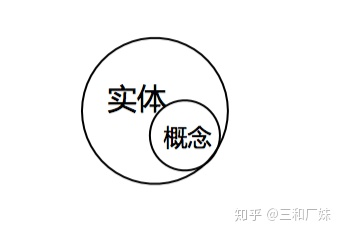

**概念：** 有的知识图谱是将概率从实体中区分了出来，做区分时：实体就是实实在在客观存在并可相互区别的事物，如微软的知识图谱，比如说 Spanish  Artists（西班牙艺术家）就是 Concepts（概念）， Picasso（毕加索）就是 Entities（实体）。

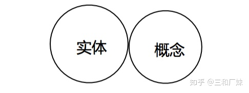

### 本体

**本体：**本体是用于描述事物的本质的，维基百科里面对于计算机科学领域当中的本体给出的定义是这样的，即：对于特定领域真实存在的实体的类型、属性，以及它们之间的相互关系的一种定义。当将实体与概念区分开时，本体相当于一个类，而实体是一个对象，如「歌手」-「发行」-「专辑」是「歌手」「专辑」是本体，那么「周杰伦」-「发行」-「七里香」 ，「周杰伦」「七里香」就是实体，这其实是**schema** 的定义。在信息抽取中，我们一般预先用shema定义好我们要抽取哪些信息，安利一个开源本体编辑工具Protégé在大规模shema时非常方便编辑管理。

**语义网络实质：**  语义网络更侧重于描述概念与概念之间的关系，它其实算知识图谱的一个子集。如Hownet就是一个语义网络。语义网络非常的「语言学」，它的优势在于有概率语言模型难以捕捉到的语义知识，如在概率语言模型中，「身高」和「体重」的语义非常接近，因为他们出现的场景非常相似，但是在语义网络中这是两个完全不同的东西，语义网络的知识由我们的先验知识总结而来，更符合我们的直觉。

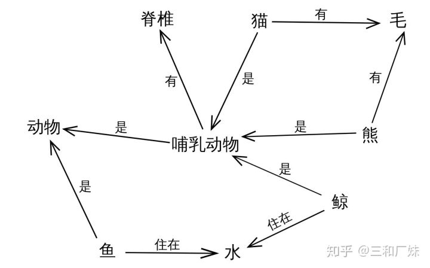

**知识图谱的意义**：

这种靠关系和属性来表达实体的形式，核心是是一个包含了**语义先验的数据库**，这种数据库的组织数据的形式是一张拓扑图，这种图的表达方式有利于我们的「区分」和「联系」和「推断」。

**知识图谱的形式化表达：**

知识图谱是由一些相互连接的实体和他们的属性构成的。表示为一个**SPO**三元组(Subject-Predicate-Object)，常用用**RDF** (Resource Description Framework) 形式化地表示这种三元关系。所有的实体都能这样表达，抽象程度可以很高，好的知识图谱能非常合适的根据场景控制粒度，所有的属性直指实质。

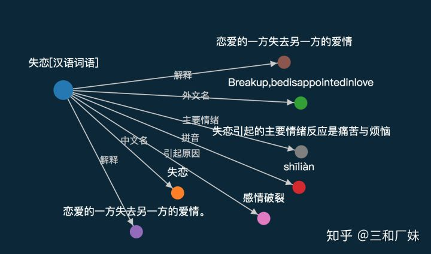

## 二. 分类 && 构建 

**【有哪几种知识图谱？**】

1. 常识知识图谱 | 领域知识图谱

- 比较在乎的 Relation 包括 isA Relation、isPropertyOf Relation

\2. 百科全书知识图谱

-  预定义一些谓词，比如说 DayOfbirth、LocatedIn、SpouseOf 

常识知识图谱，一般挖掘的是这些词之间的语义联系，是一些非常稳固的常识性先验知识，如「阿司匹林」-「消炎药」，非常在意准确性；对于百科知识图谱，一般会在意实体和实体之间的事实，如「王菲」-「妻子」-「李亚鹏」则需要经常更新；更实用的分法是：**领域知识图谱**和**百科知识图谱**，比如医疗知识图谱，药品知识图谱，这种垂直领域的知识图谱通常数据来源和应用领域都比较专业和固定，而百科知识图谱更像一个大杂烩。

【**知识图谱架构**】

**模式层：**

模式层最重要的工作概括为确定数据结构：哪些实体，实体类型，关系，关系类型，属性，属性类型，确定表示的粒度。

Schema属于模式层，用来规范KG的领域与描述对象，即**知识图谱数据结构的描述受schema规范和约束**。其实就是用来描述本体层(Ontology)。为知识图谱设计Schema相当于为其建立本体(Ontology)，标准的KG包括如下几部分，概念和实体是并列关系，

- 概念和概念层次
- 属性和属性值类型
- 关系
- 关系定义域概念集
- 关系值域概念集
- 在额外添加规则（Rules）或公理（Axioms）来表示模式层更复杂的约束关系

 更常用的图谱模式中，概念作为实体的一部分，定义更加的抽象：

- 领域
- 类型
- 主题

每个领域（Domain）有若干类型（Type），每个类型包含多个实体且和多个属性关联（Topic）。在垂直领域的知识图谱，你就只需要定义实体类型，关系类型，属性类型。

**数据层**：

数据层的水很深，技术栈很长很深，每一个点看起来都有点小众，仔细一查又有大量的分散的方法，又无法确定是否真的实践有用，非常的让人头秃。简单概况数据层的工作：

1. 「数据获取」结构化数据能否直接使用，半结构化数据如何转换，非结构化数据如何**信息抽取**。
2. 「清洗整理」单位，格式等的同义，知识缺失时其他标签填充，为缺失的属性构造抽取器，可以利用上下位等概念，或者其他机器学习深度学习方法，单源数据**属性融合，**多源数据的**知识融合**：**实体对齐**，**关系对齐，实体消岐**，**实体链接**等。

\3. 「数据库」**图数据库**的选择，存储方式的选择，索引等的设置。

\4. 「知识更新」：可以周期性更新，实体的拓展，监控热词更新，关键词搜索引擎的更新。

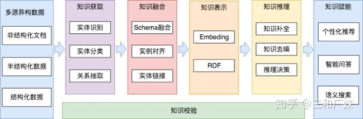

## 构建KG的核心技术 && 常用方法介绍

**「实体识别」**大家更常指的是NER命名实体识别，指识别文本中具有特定意义的实体，主要包括人名、地名、机构名、专有名词等，以及时间、数量、货币、比例数值等文字。但是前面定义中也讨论过了，实体远远不止命名实体。

  一般用序列标注问题来处理实体识别。传统的实体识别方法以统计模型如HMM、CRF等为主导，随着深度学习的兴起，DNN+CRF的结构非常的通用，DNN部分可以使用一些主流的特征抽取器如Bi-LSTM, Bert等，这种模型在数据不至于太糟的情况下，轻易就能有90%+的效果。

**「实体对齐**」具有不同标识实体（ID标识符）却代表真实世界中同一对象的那些实体，并将这些实体归并为一个具有全局唯一标识的实体对象添加到知识图谱中，即同一个实质不同的名字，需要将这些本质相同的东西归并。

**「成对实体对齐**」只考虑实体和各自属性，不考虑实体所在网络的结构，不考虑相似的传播，逻辑就是”相似的相似也相似“这种，而「协同对齐|集体对齐」考虑不同实体间的相互关系。其实不管是传统方法还是深度学习方法，都是在考虑相似性，「成对实体对齐」只考虑实体及其属性相似程度，「集体对齐」考虑了关系结构的相似性。比如有基于表层特征，扩展特征，网络特征等计算相似性方法。

- **传统方法基于概率模型做分类**，问题可以抽象为两个实体<匹配，不匹配>分类问题,  可以对属性通过贝叶斯加权等等，然后基于加权后属性相似性评分，基于代价优化，通过一个总体代价公式和贝叶斯公式产生一个最优化决策规则。(所有的实体一一对应计算，实体量大的时候计算两也是不可想象，但是聚类也是要一个个算啊)

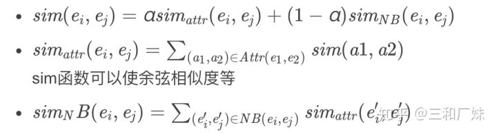

- **基于机器学习的方法**：

- - 把属性当成特征，使用SVM等传统分类或聚类方法，（但是存在需要各实体属性类型一致，所以只针对与专业领域实体强一致才具备应用这种方法条件）还有一些基于LDA，CRF等的模型 。

- **基于Embedding的方法**

- - 重点介绍Embedding的方法， Embedding的方法不止在实体对齐中常用，在做图推理时也经常被使用。

1. Trans-E[[1\]](https://zhuanlan.zhihu.com/p/153392625#ref_1) 系列

G是知识库，当中的实体和关系表达为 ![[公式]](Element.assets/equation) ，以JSE为目标函数， ![[公式]](Element.assets/equation-20200902171928745) 是实体中的关系， ![[公式]](Element.assets/equation-20200902171928818) 作为关系的负例， ![[公式]](Element.assets/equation-20200902171928768) 随机替换为 ![[公式]](Element.assets/equation-20200902171928747) 中的其他 ![[公式]](Element.assets/equation-20200902171928759) 或 ![[公式]](Element.assets/equation-20200902171928742) , 目标函数有点像SVM中的合页函数， ![[公式]](Element.assets/equation-20200902171928785) 比 ![[公式]](Element.assets/equation-20200902171928786) 小时没有损失，![[公式]](https://www.zhihu.com/equation?tex=f%28t_r%29) 比 ![[公式]](https://www.zhihu.com/equation?tex=f%27%28t_r%29) 大时损失才有效，因此目标函数的学习方向是 **有效关系的距离尽可能小，无效关系的距离尽可能大**

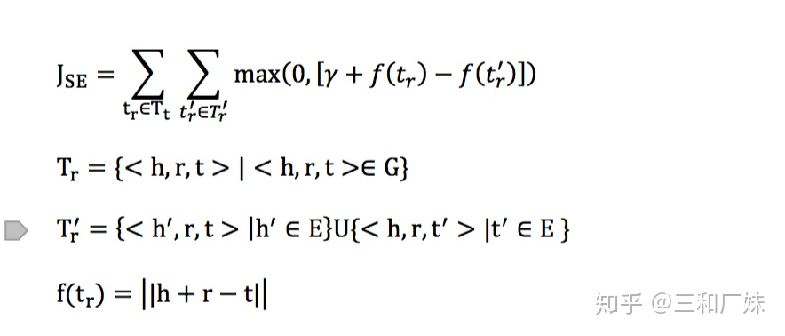

Trans-E 的问题在于只适合处理一对一关系，对**一对多关系不友好**，如（中国科学院大学，地点，北京）和（颐和园，地点，北京），在 ![[公式]](https://www.zhihu.com/equation?tex=f%28t_r%29) 中尽可能小的目标小，两个三元组的 ![[公式]](Element.assets/equation-20200902171928834) 和 ![[公式]](Element.assets/equation-20200902171928832) 都一样时，会导致 ![[公式]](Element.assets/equation-20200902171928833) 很相近甚至相同，因为 ![[公式]](https://www.zhihu.com/equation?tex=r) 的表达是固定的一种，后续的基于transE的改进则都是在**r或者t的表达能力上做改进。**

\2. trans-H[[2\]](https://zhuanlan.zhihu.com/p/153392625#ref_2)系列

trans-H 在trans-E的基础上，通过一个超平面的映射，通过分解 ![[公式]](https://www.zhihu.com/equation?tex=r) 来增强 ![[公式]](Element.assets/equation-20200902171928833) 和 ![[公式]](Element.assets/equation-20200902171928832) 的表达能力。

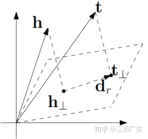

将Trans-E中的 ![[公式]](https://www.zhihu.com/equation?tex=r) 的集合 ,替换为可以在超平面的分解法向量 ![[公式]](Element.assets/equation-20200902171928888) 和 ![[公式]](Element.assets/equation-20200902171929053) 超平面上的翻译向量组成，并且满足约束 ![[公式]](Element.assets/equation-20200902171928952) , 即在之前transE中的 ![[公式]](Element.assets/equation-20200902171928924) 关系映射到了另外一个平面，那在同样一个元素如 ![[公式]](Element.assets/equation-20200902171928924-9038368.) 在原始空间中对应着有多重表达，即**多了一层超平面的表达能力。**其他就类似transE表达：

![[公式]](Element.assets/equation-20200902171928923) 

\3. trans-R[[3\]](https://zhuanlan.zhihu.com/p/153392625#ref_3)系列 and trans-D[[4\]](https://zhuanlan.zhihu.com/p/153392625#ref_4) 系列

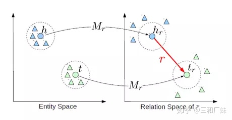

trans-R 将 ![[公式]](https://www.zhihu.com/equation?tex=r) 更复杂化成一个矩阵，先将 ![[公式]](Element.assets/equation-20200902171928833) 和 ![[公式]](Element.assets/equation-20200902171928832) 通过关系映射矩阵 ![[公式]](Element.assets/equation-20200902171929027) 映射到另一个空间 ， 相当于TransE 中通过 ![[公式]](https://www.zhihu.com/equation?tex=r) 分解 ![[公式]](https://www.zhihu.com/equation?tex=h) 和 ![[公式]](https://www.zhihu.com/equation?tex=t) , 取出 ![[公式]](https://www.zhihu.com/equation?tex=r) 的某个方面。

trans-D 在trans-R的基础上在 ![[公式]](Element.assets/equation-20200902171929027) 中加入了 ![[公式]](https://www.zhihu.com/equation?tex=h) 和 ![[公式]](https://www.zhihu.com/equation?tex=t) 项, 认为映射方式不能只由关系决定， ![[公式]](https://www.zhihu.com/equation?tex=M_r) 做映射的时候加入了 ![[公式]](Element.assets/equation-20200902171928768) 本身的语义信息，无形中相当于做了方向限制。

![[公式]](Element.assets/equation-20200902171929090)  

\4. 基于属性和结构embedding的实体对齐

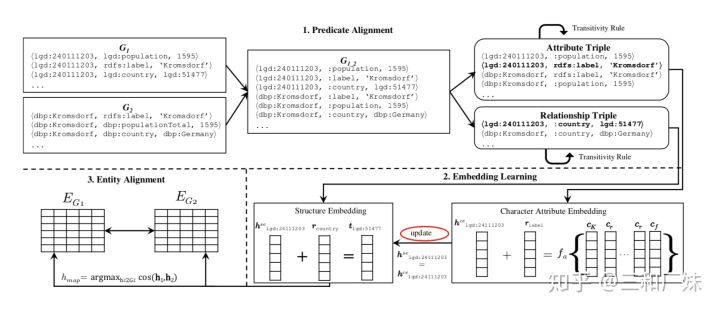

基于结构和属性的相互监督的对齐[[5\]](https://zhuanlan.zhihu.com/p/153392625#ref_5)文章将目标定义为3个部分，谓词对齐，embedidng学习，实体对齐。谓词对齐用编辑距离，用0.95的阈值来卡 ，0.95应该是编辑距离数/总体字符个数。 embedidng学习的部分 ![[公式]](https://www.zhihu.com/equation?tex=J%3DJ_%7BSE%7D%2BJ_%7BCE%7D%2BJ_%7Bsim%7D) , 即在学习 ![[公式]](Element.assets/equation-20200902171928768) 的embediing的同时也要学习他们结构的关系，知识图谱也是一种图，图的结构对一个节点的表达意义巨大，最后将属性和结构相似也累加，效果不错。

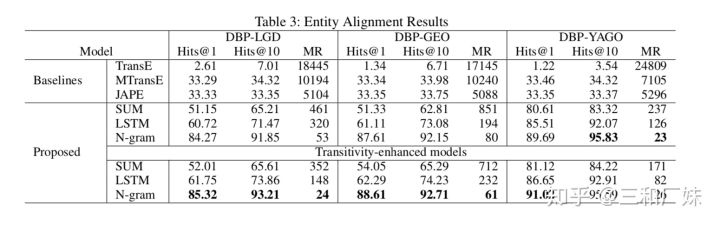

**评测方法**：hits@1，hits@10s，MeanRank

假设整个知识库中一共有n个实体，那么评价过程如下：

- 一个正确的三元组a中的头实体或者尾实体，依次替换为整个知识库中的所有其它实体，也就是会产生n个三元组。
- 分别对上述n个三元组计算其能量值，在transE中，就是计算h+r-t的值。这样可以得到n个能量值，分别对应上述n个三元组。
- 对上述n个能量值进行升序排序。(从小到大的排序)
- 记录三元组a的能量值排序后的序号。
- 对所有的正确的三元组重复上述过程。
- 每个正确三元组的能量值排序后的序号求平均，得到的值我们称为**MeanRank**。
- 计算正确三元组的能量排序后的序号小于10的比例，得到的值我们称为Hits@10。

**「实体消岐」**是用于解决同个实体名称在不同语句不同意义的问题，同一个词不同的实质，如apple 在知识图谱里至少有两个歧义，静态词向量无法解决这个问题，不能要求你的知识库里所有的苹果 ，都是吃的苹果。

- **实体归并到概念：**先抽象出概念，然后根据实体属性，将实体归并到这些概念中，首先**获取实体含义构成关键词词组**，如97年版《天龙八部》：[“1997”, “李添胜”, “天龙八部”, “黄日华”, “樊少皇”,"电视剧"] ，腾讯动漫的天龙八部：[“漫画作品”, “天龙八部”,  “连载”, “腾讯”, “动漫”, “凤凰”, ]。

1. **概念已知**的情况下，直接利用关键词组对实体进行**文本分类**。
2. **概念未知**时，可以从关键词组中抽取出概念，最常用的是在抽取的过程中直接利用实体的上位词，如电视剧《天龙八部》，或者在百科知识图谱中利用Info Box中的说明。
3. **实体在概念内的消岐**，如 97版天龙八部还是03内地胡军版天龙八部电视剧，这种消岐本质是选择一个层次的最典型关键词代表，可以利用Name  Dictionary（消岐词表|命名字典），命名字典包含了各种命名实体的名称的表达方式，如：变体、缩写、混淆名称、拼写变体等，命名字典的最常见的构建利用了大量类似wikipedia这种百科知识图谱中的信息。或者在Candidate Entity Generation生成候选实体后经过排序得到。在这里**实体消岐和实体链接是一致的**，具体常用方法在实体链接中说明。

- **监督学习候选实体排序方法**包括二分类、学习排序、概率方法和基于图的方法，给定<实体指称项，  候选实体>对，用二分类器去判断是否实体指称项能否链接到实体对象上，基于置信度的方法、VSM的方法等排序。一个是正负样本的极度不均衡，另一个当是多个候选实体被分为正样本，则需要使用其他的技术再去选择出最适合的候选实体。
- **非监督学习排序方法**包括基于向量空间模型的方法和基于信息检索的方法。

**「实体链接」**将自由文本中已识别的实体对象（人名、地名、机构名等），无歧义的正确的指向知识库中目标实体的过程。本质仍是同一个词不同实质，如已有一个知识库的情况下，预测输入query的某个实体对应知识库id，如 apple 在一个有上下文的query中是指能吃的apple 还是我们手上用的apple。**实体链接强调链接的过程，而消岐强调先描述这个实体是什么。**

当然有一些直接「基于实体链接的实体消歧方法」，个人觉得还是属于链接。 消岐和链接这个概念还是常常在被混淆，方法很多也通用，以致于也不知道到底谁标准。

实体消歧时，不同场景的特征选取是非常重要的，基于上下文消岐和上下文独立非常不一样。比如做百科问答或是通用文本的阅读增强，就很依赖于**wikipedia和搜索引擎，**但如果是某个具体的行业领域，就需要通过一些**启发式的方法、用户日志、网页爬取，甚至人工标注的方法**来构建Name Dictionary。这里的Name Dictionary命名字典在构建时需要的一些消岐处理（上文提过那个），然后应用于实体链接。

1. 下文独立：

- LinkCount：(m->e)，知识库中某个提及m指向实体e的次数；
- Entity Attributes：Popularity、Type；

LinkCount常常可以用该实体在文本中出现的频次表达，**作为一个先验知识，在消歧时，这很有用**，比如当我们在问“姚明有多高？”时，大概率都是在问<篮球运动员姚明>，而不是其他不为人知的“姚明”。虽然context中完全没有包含篮球运动员这一信息，但大多数情况下，根据“姚明”到<篮球运动员姚明>的LinkCount最高，选其作为实体进行查询。 另外可以用一般指实体自身的一些属性（比如热度、类型、所在实体的篇章属性等等）来做链接。

\2. 上下文不独立：

- - Textual Context：BOW,  Concept Vector
  - Coherence Between Entities：WLM、PMI、Jaccard Distance

文本上下文可以用一些深度学习的方法去深度理解文本的语义，从而实现消歧；实体间的一致性则可以用一些文本相似性来计算。对于监督方法，可以当成二分类问题处理，给定<实体指称项， 候选实体>对，用二分类器去判断是否实体指称项能否链接到实体对象上。输出是对每一对<实体指称项，  候选实体>的标签判断，可以使用一下三种类型方法：

- **基于搜索排序的方法：**Point-wise，Pair-wise，List-wise。Point-wise、Pair-wise、List-wise分别代表搜索排序中，一个query对应一个truth, 两个truth，多个truth。 由于ED任务ground  truth只有一个实体，一般都是用point-wise来做。输入是文本的context、mention、某个entity的一些attributes，输出mention指向该entity的置信度，以此rank，选出最可信的entity。
- **基于概率模型：**结合不同信息，得到条件概率P(e|m,c)P(e|m,c)，其中 c 是输入文本，e 为实体， m 是mention。比如用归一化的LinkCount信息，作为先验概率P(e|m)P(e|m)。
- **基于图的模型**：利用图特征 (entity embedding、relation)，在消歧时，考虑全局消歧后实体的一致性。

一般可能会同时基于以上三种方法来做，在CCKS的冠军训练方案[[6\]](https://zhuanlan.zhihu.com/p/153392625#ref_6)中，在已知候选项的时候（候选项在实体消岐的时候已经全部得到），链接就是一个分类问题，将mention与候选项拼接直接深度学习一把梭做二分类，效果出奇。

【**信息抽取**】当信息来源是非结构化文本时，构建知识图谱关键的一步是需要从非结构化文本中抽取去结构化信息。知识图谱中的信息抽取是从自然语言文本中抽取指定类型的实体、关系、事件等事实信息，并形成结构化数据输出的文本处理技术。在知识图谱构建所需的RDD三元组结构中，一般抽取的信息也是「实体」-「关系」-「实体」，知识图谱的构建会先确定好要抽取的信息，确定抽取信息的schema, 然后基于schema去抽取信息。

- Pipeline：把**实体识别**和**关系分类**作为两个完全独立的过程，不会相互影响，关系的识别依赖于实体识别的效果。
- Joint  Model：实体识别和关系分类的过程共同优化。

采用pipline方法时，基于schema的信息抽取任务分解为NER+ 关系分类，实践中大多数也是这样做的，但是pipline却分割了两个任务之间的连接关系，特别是有一些从属和并列关系，指代问题，省略等，导致需要想另一些方法去将任务直接的结果对应起来。

Joint Model 任务一般会在模型的输入将所需特征做一些组合，在输出端做一些多输出的改造同时得到多个输出结果，这种多任务改造避免的pipline分割了模型结果的问题，但多任务模型同时也有一些固有的弊端。在[[7\]](https://zhuanlan.zhihu.com/p/153392625#ref_7)中，对输出做一些改造避免了pipline的一些重叠与对应问题。

【**知识图谱融合**】知识图谱的融合的核心是**实体对齐**和**schema融合**以及解决**数据冲突**，实体对齐前面已经提到过，本体匹配侧重发现模式层等价或相似的类、属性或关系，也成为本体映射（mapping）、本体对齐（alignment）。

Schema mapping的难点是**属性体系并非简单的一对一关系:**

- 出生={出生日期，出生地点} 
- 出生日期={出生年份，出生月，出生日} 

**需要综合利用多种类别的信息 ：**

属性的语义信息 

- 成立={创立，建立} 
- 出生={诞辰，诞生} 

属性的值分布信息 

- 出生日期的主要值为时间 
- 总部的主要值为机构 

 属性的联合分布 

- 出生日期+出生地点+职业+单位 =>人

**Schema之间的蕴含关系：**

- 公司.创始人 => 公司.员工 
- 收购（公司，公司）=>合开（公司，公司）

可以建立一个全局的Schema， 利用一个Base learner，将不同知识源中 的schema到全局Schema进行映射 ， 使用Meta-Learner来综合利用Base learner的分类结果并利用属性的联合分布信息，从而得到最 终的Schema mapping全局结果。

**知识融合**一般通过冲突检测、真值发现等技术消解知识图谱融合过程中的冲突，再对知识进行关联与合并，最终形成一个一致的结果，知识图谱构建不是一个静态的过程, 需要 及时更新动态知识 。加入新知识 需要判断新知识是否是否正确，不已有知识 是否一致。

解决知识冲突可以从几个方面选择，权威度高的信息源更有可能出现正确的答案 ； 有冲突知识时正确的答案更有可能出现 的次数更多；实际应用中大家可以参考[[8\]](https://zhuanlan.zhihu.com/p/153392625#ref_8)。

**「知识图谱推理」**：推理是知识图谱的核心，先推荐一个非常棒的课程[[9\]](https://zhuanlan.zhihu.com/p/153392625#ref_9)，下面简单总结方法

1. **基于符号逻辑的推理——本体推理**

- 传统的符号逻辑推理中主要是基于描述逻辑的本体推理。描述逻辑主要被⽤来对事物的本体进⾏建模和推理，⽤来描述和推断概念分类及其概念之间的关系。

- 主要方法：

- - 基于表运算（Tableaux）及改进的⽅法：FaCT++、 Racer、  Pellet Hermit等；
  - 基于Datalog转换的⽅法如KAON、RDFox等；
  - 基于产⽣式规则的算法（如rete）：  Jena 、 Sesame、OWLIM等；

- RDF表示关系层次受限，因此有了RDFS，在RDF的基础上，新增了Class,  subClassOf, type, Property, subPropertyOf, Domain, Range 词汇，可以更好的表述相关关系

这种逻辑符号推理也叫OWL为本体语言，OWL是知识图谱语言中最规范最严谨， 表达能力最强的语言[[9\]](https://zhuanlan.zhihu.com/p/153392625#ref_9)，基于RDF语法，使表示出来的文档具有语义理解的结构基础，促进了统一词汇表的使用，定义了丰富的语义词汇，且允许逻辑推理。

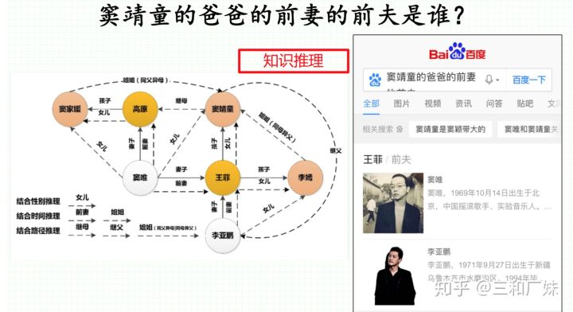

**2. 基于图结构和统计规则挖掘的推理**

- 基于路径排序学习⽅法(PRA， Path ranking Algorithm)
- 基于关联规则挖掘⽅法(AMIE)

即将连接两个实体的路径作为特征来预测其间可能存在的关系

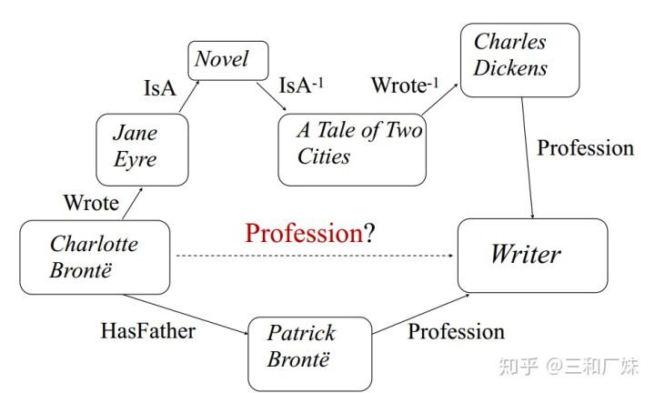

路径排序算法 Path Ranking Algorithm (PRA)

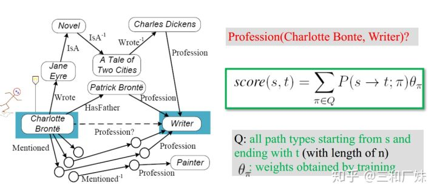

**3. 基于知识图谱表示学习的关系推理**

- 将实体和关系都表示为向量
- 通过向量之间的计算代替图的遍历和搜索来预测三元组的存在，由于向量的表示已经包含了实体原有的语义信息，计算含有⼀定的推理能⼒。
- 可应⽤于链接预测，基于路径的多度查询等
- transE

\4. **基于概率逻辑的⽅法——Statistical Relational Learning**

- 概率逻辑学习有时也叫Relational Machine Learning (RML)，关注关系的不确定性和复杂性。通常使用Bayesian networks or Markov networks

【**应用场景**】

1. **知识图谱问答**，之前写过一点具体参考[[10\]](https://zhuanlan.zhihu.com/p/153392625#ref_10)

**2. 个性化推荐：**通过实体与实体之间的关系，利用用户感兴趣的实体，进一步扩展用户偏好的相似的实体，提供可解释性的推荐内容。一方面，图谱提供了实体在多个维度的特征信息，另一方面，表示学习向量带有一定的语义信息，使得寻找推荐实体更接近目标实体或更偏向用户喜好。

**3. 语义搜索**，搜索引擎对Query的处理不再拘泥于字面本身，而是抽象出其中的实体、查询意图，通过知识图谱直接提供用户需要的答案，而不只是提供网页排序结果，更精准的满足用户的需求。当前Google、百度、神马搜索都已经将基于知识图谱的语义搜索融入到搜索引擎中，对于一些知识性内容的查找，能智能地直接显示结果信息。

**4. 金融风险管理和反欺诈**：知识图谱中的社区发现、标签传播等方法来对用户进行风险管理，能够更准确的识别逾期客户以及用户的不良行为，从而大大提升信用风险管理能力。团伙通常会存在较多关联及相似特性，图谱中的关系可以帮助人工识别出多层、多维度关联的欺诈团伙，再利用规则等方式，识别出批量具有相似行为的客户，辅助人工优化调查，同时可以优化策略。

\5. **图像视频理解：**实现视频的深度语义理解，在纯感知技术的基础上，利用知识图谱进行深度语义理解，这样识别出的结果没有刻画出用户对视频核心的细粒度兴趣，比如影视剧的角色、关系等知识，利用知识图谱对视频做深度结构化的解析，然后上层的推荐、搜索可以应用这些知识作为特征辅助内容的高效分发[[11\]](https://zhuanlan.zhihu.com/p/153392625#ref_11)。

## 参考

1. [^](https://zhuanlan.zhihu.com/p/153392625#ref_1_0)Translating Embeddings for Modeling Multi-relational Data（
2. [^](https://zhuanlan.zhihu.com/p/153392625#ref_2_0)Knowledge Graph Embedding by Translating on Hyperplanes
3. [^](https://zhuanlan.zhihu.com/p/153392625#ref_3_0)Learning Entity and Relation Embeddings for Knowledge Graph Completion
4. [^](https://zhuanlan.zhihu.com/p/153392625#ref_4_0)Knowledge Graph Embedding via Dynamic Mapping Matrix
5. [^](https://zhuanlan.zhihu.com/p/153392625#ref_5_0)Entity Alignment between Knowledge Graphs Using Attribute Embeddings
6. [^](https://zhuanlan.zhihu.com/p/153392625#ref_6_0)https://github.com/panchunguang/ccks_baidu_entity_link
7. [^](https://zhuanlan.zhihu.com/p/153392625#ref_7_0)https://spaces.ac.cn/archives/6671
8. [^](https://zhuanlan.zhihu.com/p/153392625#ref_8_0)http://bj.bcebos.com/cips-upload/kg/cips.pdf
9. ^[a](https://zhuanlan.zhihu.com/p/153392625#ref_9_0)[b](https://zhuanlan.zhihu.com/p/153392625#ref_9_1)https://github.com/npubird/KnowledgeGraphCourse
10. [^](https://zhuanlan.zhihu.com/p/153392625#ref_10_0)https://zhuanlan.zhihu.com/p/150119544
11. [^](https://zhuanlan.zhihu.com/p/153392625#ref_11_0)https://zhuanlan.zhihu.com/p/122373439

# 00从知识工程到图谱全面回顾

- 
- 数智物语的文章 - 知乎 https://zhuanlan.zhihu.com/p/67914830

> 像人一样的思考能力具体体现在：机器对数据和语言的理解、推理、解释、归纳、演绎的能力，体现在一切人类所独有的认知能力上。学界业界都希望通过计算机模拟，让机器获得和人类相似的智慧，解决智能时代下的精准分析、智慧搜索、自然人机交互、深层关系推理等实际问题。
>
> 
>
> 知道了认知智能是机器智能化的关键，进一步我们要思考，如何实现认知智能——**如何让机器拥有理解和解释的认知能力。**

知识工程主要包括：知识获取、知识表示和知识应用。我们可以尝试突破的方向在于知识的利用，在于对符号知识和数值模型结合的应用。而这些努力，最终结果就是使机器具备理解和解释的能力。

**01知识工程前世今生**

## 01知识工程起源

### **20世纪50年代—70年代初**【符号主义

**知识工程诞生之前的早期人工智能**

那么知识图谱到底将如何助力人工智能？回顾历史总能帮助我们更好的理解未来。把时间的车轮回滚到 1956 年 8 月，在美国汉诺斯小镇宁静的达特茅斯学院中，几位心理学家、数学家、计算机科学家、信息论学家聚在一起，举办了一次长达 2  个月的研讨会，认真而热烈地讨论了用机器模拟人类智能的问题。他们为会议的内容起了一个响亮的名字：人工智能(artificial  intelligence)。

人工智能学科自此诞生。

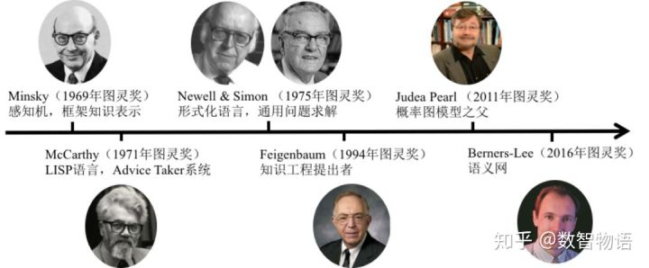

传统知识工程代表性人物与成就

达特茅斯会议之后，参会者们相继取得了一批令人瞩目的研究成果。具有代表性的成果为：A.Newell、J.Shaw 和 H.Simon 等人编制出逻辑机 LT，它证明了 38 条数学定理；1960 年又定义了 GPS  的逻辑推理架构，并且提出启发式搜索的思路；1956 年， Samuel  研制了一个跳棋程序，该程序具有自学习功能，可以从比赛中不断总结经验提高棋艺。还有很多令人激动的成就，这掀起人工智能发展的第一个高潮。

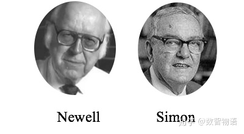

其中，以 Newell 和 Simon 为代表人物的符号主义学派，最先取得丰硕成果，最著名的代表为逻辑机 LT。

符号主义最核心的思想是什么呢？**符号主义认为人工智能源于数理逻辑，认为智能的本质就是符号的操作和运算。**符号主义在后来几大门派的较量中，曾长期一支独秀，为人工智能的发展作出重要贡献。当然，也为后来红火一时的知识工程奠定了基业。

再把时间的焦点挪到 20 世纪 60 年代— 70 年代初，学界还在为人工智能发展初期取得的胜利高兴不已的时候，不切实际的研发目标带来接二连三的项目失败、期望落空。过高的期望总是带来更具破坏性的失望，终于，人工智能迎来第一次寒冷的冬天。

### **1977 专家系统**

**知识工程诞生**

在人工智能领域经历挫折之后，研究者们不得不冷静下来，重新审视、思考未来的道路。这时候，西蒙的学生，爱德华·费根鲍姆(Edward A. Feigenbaum)站了出来。他分析传统的人工智能忽略了具体的知识，人工智能必须引进知识。

爱德华·费根鲍姆(Edward Feigenbaum，1936-)，美国计算机科学家，专家系统之父，知识工程奠基人，曾获得 1994 年图灵奖。他有一句名言流传甚广：“Knowledge is the power in AI”。

在费根鲍姆的带领下，专家系统诞生了。**专家系统作为早期人工智能的重要分支，是一种在特定领域内具有专家水平解决问题能力的程序系统。**

##### **两部分组成：知识库与推理引擎**

**专家系统一般由两部分组成：知识库与推理引擎。**它根据一个或者多个专家提供的知识和经验，通过模拟专家的思维过程，进行主动推理和判断，解决问题。第一个成功的专家系统 DENDRAL 于 1968 年问世。1977 年，费根鲍姆将其正式命名为知识工程。

把知识融合在机器中，让机器能够利用我们人类知识、专家知识解决问题，这就是知识工程要做的事。

### 1998语义网链接

**万维网与连接数据**

万维网的出现，为知识的获取提供了极大的方便。1998 年，万维网之父蒂姆·伯纳斯·李再次提出语义网。它的核心是：语义网可以直接向机器提供能用于程序处理的知识。**通过将万维网上的文档转化为计算机所能理解的语义，使互联网成为信息交换媒介。**但是，语义网是一个比较宏观的设想，需要“自顶向下”的设计，很难落地。

传统知识工程为什么会有这么苛刻的条件呢？**因为传统知识工程是一种典型的自上而下的做法，是一种严重依赖专家干预的做法。**知识工程的基本目标，就是把专家的知识赋予机器，希望机器能够利用专家知识来解决问题。传统的知识工程里，首先需要有领域专家，专家能够把自己的知识表达出来；进一步，还需要有知识工程师把专家表达这个知识变成计算机能够处理的形式。

### 传统的知识工程面临着的两个主要困难：

- **第一：知识获取困难**
  隐性知识、过程知识等难以表达。比如如何表达老中医看病用了哪些知识；不同专家可能存在主观性，例如，我国有明确治疗规范的疾病占比非常小，大部分依赖医生的主观性。
- **第二：知识应用困难**
  很多的应用，尤其是很多开放性的应用很容易超出预先设定的知识边界；还有很多应用需要常识的支撑，**而整个人工智能最怕的恰恰就是常识。**为什么？因为常识它难以定义、难以表达、难以表征；知识更新困难，太依赖领域专家，还有很多异常或难以处理的情况。

## **02知识图谱引领知识工程复兴**

大数据时代下知识图谱的出现，有其必然性，大数据时代给知识图谱技术的发展奠定了丰富的土壤。或许你会问，知识图谱和传统的语义网络有什么本质不同么？大数据时代能给我们带来什么特别的有利条件？前沿进展的回答是——

**大数据技术使得大规模获取知识成为可能，而知识图谱即为一种大规模语义网络。这样的一个知识规模上的量变带来了知识效用的质变。**

我们有海量的数据、强大计算能力、群智计算以及层出不穷的模型。在这些的外力的支持下，解决了传统知识工程的一个瓶颈性问题——**知识获取**。我们可以利用算法实现数据驱动的大规模自动化知识获取。

### 符号主义声势渐长

以知识图谱为代表的符号主义声势渐长，这个蕴含大量先验知识的宝箱正被大数据技术开启。 | ©ontotext

##### 利用数据**自下而上**

和传统知识获取不同，以前是通过专家自上而下的获取知识，而现在是利用数据**自下而上**，

从数据里面去挖掘知识、抽取知识。另外，**众包与群智**成为大规模知识获取的一条新路径。

高质量的 UGC 内容，为自动挖掘知识提供了高质量数据源。

总的来说，知识工程在知识图谱技术引领下进入了全新阶段，叫做大数据时代知识工程阶段。肖仰华教授提出了一个简单的公式表明传统知识工程与以知识图谱为代表的新一代知识工程的联系与区别：

**Small knowledge + Big data=Big knowledge**

大数据知识这个词是 BigKE，它将会显著提升机器认知智能水平，那么，大数据知识工程对我们人工智能最根本的意义是什么？是提升机器的认知智能水平。我们正在经历感知智能到认知智能的过渡阶段，未来最重要到技术即是实现认知智能。

### 知识图谱又有什么独特的魅力

大数据时代下，知识图谱又有什么独特的魅力？为什么会受到如此广泛的关注呢？

##### **知识图谱使机器语言认知成为可能。**

机器想要认知语言、理解语言，需要背景知识的支持。而知识图谱富含大量的实体及概念间的关系，可以作为背景知识来支撑机器理解自然语言。

##### **知识图谱使可解释人工智能成为可能。**

在人工智能发展的任何阶段，我们都需要事物的可解释性，现在的深度学习也常因为缺少可解释性受人诟病。而知识图谱中包含的概念、属性、关系是天然可拿来做解释的。 

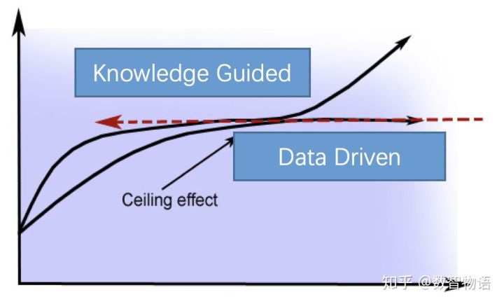

通过知识图谱等先验的知识去赋能机器学习，来降低机器学习对于样本的依赖，增强机器学习的能力。

知识将显著增强机器学习能力。传统的机器学习都是通过大量的样本习得知识，在大数据红利渐渐消失的情况下，逐渐遇到发展瓶颈。**而通过知识图谱等先验的知识去赋能机器学习，来降低机器学习对于样本的依赖，增强机器学习的能力，或许是连接主义和符号主义在新时代下的共生发展。**

除了上述的种种优势，知识图谱在一系列实际应用上也非常有用，比如搜索、精准推荐、风险识别、深化行业数据的理解与洞察等，将在各种各样的应用场景发挥作用。

信息技术革命持续进行，数据将会继续向更大规模、更多连接的方向发展，在此背景下，知识图谱将引领知识工程走上复兴的道路，推动在机器身上实现认知智能。

# END