# 知识图谱构建技术综述与实践

知识图谱构建技术综述与实践 - Yang Peter的文章 - 知乎 https://zhuanlan.zhihu.com/p/69360094

[Zpaisley](https://www.zhihu.com/people/zhongyuyao) 等 

> 作者： 
>
> [@Yang Peter](https://www.zhihu.com/people/145a62cdf56d7365e61bb787e88ed015)

## **前言**

知识图谱，即一种特殊的语义网络，它利用**实体**、**关系**、**属性**这些基本单位，以符号的形式描述了物理世界中不同的概念和概念之间的相互关系。为什么说知识图谱对于**信息检索**、**推荐系统**、**问答系统**中至关重要，我们用一个例子来说明：

假设在一个搜索场景，我们在搜索框中输入

> 坐月子可以洗澡吗？

可以看到这句Query是一个完整的问句，如果在检索系统中有一个较大的问答语料库（比如FAQ场景），或者一个足够庞大的文章数据库（文章的title覆盖率高），使用**语义匹配**技术对Query与FAQ问句、文章title做相似度计算或许是个更为理想的方案（可参考上一期文章[引用]）。但是，现实总是比较骨感，想要被检索的内容在语言表述上很完备是非常困难的。那么对于这个case，检索的baseline是怎么样的呢？

在传统搜索流程下，我们首先会对Query进行**分词** ，即原句就变成了

> 坐，月子，可以，洗澡，吗，？

对于数据库里的文章等内容，利用 **倒排索引** 事先做好了索引，再根据 **BM25** 算法对分词结果中的词做文章的召回、排序。

当然，我们可以根据业务场景的需要建立业务词典，准备一些业务关键词，比如例子中的 **“坐月子”** 是一个组合名词；另外做索引的时候舍弃一些停用词，比如 **“可以”，“吗”** 等。再之根据词性等调整一下权重（比如疾病词优于其他词等），以期待最终文章排序的相关性有所提升。

但是到目前为止，我们可以看到检索的中心都是根据 **关键词** 做的，也就是说文章的内容中必须出现**“坐月子” 、“洗澡”**这些词。同时，因为去除了停用词、动词，也会导致Query的**语义丢失**，**“坐月子”**和**“洗澡”**成为了割裂的两个概念。

那么，作为一个自然人类，我们是这样理解这句Query的：

> 坐月子 –> 产褥期妇女 
> 洗澡 –> 日常生活活动

整句话理解起来就是**“产褥期妇女是否可以做洗澡之类的日常生活活动”**，并且我们也可以很自然地推理，或许这个Query比较合适的反馈是形如 **“产褥期的日常禁忌”** 等这类文章。

可以发现，人类在思考自然语言的表示时，是**基于几个概念作为支点，并且具有清晰的概念上下级区分**  ，这些概念来自于人类多年习得的知识体系，我们可以在已有的知识上进行推理、分析、联想，这是计算机所不具备的。传统基于Corpus的NLP技术，希望从大量文本数据中反向映射出整个现实世界，这种方法工程实现容易，在一些小场景中可以获得不错的效果，但是会暴露出如前文所提的各类问题，映射出的知识表示严重受场景限制，难以迁移；缺乏对知识体系的组织；效果不可解释等；

为了解决这类难题，笔者认为**知识图谱**或许是突围的关键。相比于长文本，知识点（实体、关系）更易于组织、扩充、更新。自然语言本是人类认知世界的抽象，想要计算机理解自然语言，也需要装一个填满知识的大脑。

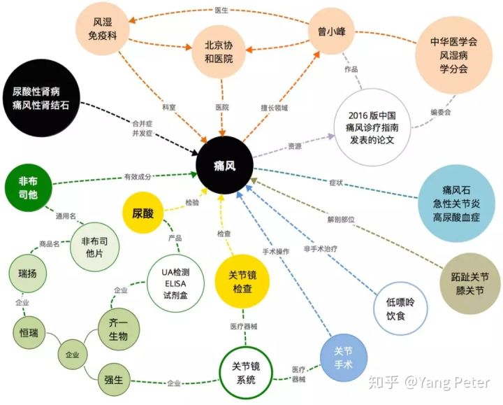

丁香园也在尝试构建自己的医学大脑知识图谱，往后也会陆续分享知识图谱相关的知识抽取、知识表示、知识融合、知识推理等方面的技术调研笔记，以及在搜索推荐等场景的落地实践。本文主要为我们在知识图谱构建的技术调研笔记分享。

## **概念**

我们已经在各知识图谱概述中知道，知识图谱本质上是一种语义网络，节点代表**实体**（entity）或者**概念**（concept），边代表实体（或概念）之间的各种**语义关系**。而知识图谱在知识体系的层面上又有三种具体的组织分类，包括**Ontology、Taxonomy**和**Folksonomy**。

### 三个分类

这三个分类可以简单地理解为知识图谱对**层级关系**的三种不同严格程度的区分。

### **Ontology**

**Ontology**为树状结构，对不同层节点之间具有最严格的**IsA关系**（打个比方，Human activities -> sports -> football），这类图谱的优点是便于知识推理，但是无法表示概念关系的多样性；

### **Taxonomy**

**Taxonomy**也是树状结构，但是层级严格程度低一些，节点间是以**Hypernym-Hyponym关系**构建，这样的好处的概念关系比较丰富，但是也因此容易造成歧义，很难有效地推理；

### **Folksonomy**

**Folksonomy**则是非层级的结构，全部节点以标签分类，除了灵活以外，语义的精确性、推理能力也全都丧失了。

目前，**Taxonomy**的组织结构是互联网行业内较为流行的类型，因为它在一定程度上兼顾上下层关系和标签体系，在各类应用上的灵活性最好，本文主要关注**Taxonomy**的构建技术。

## **构建**

构建大规模知识库的数据源可以来自于一些公开的半结构化、非结构化和第三方结构化数据库。从结构化数据库中获取数据最为简单，需要做的大多为统一概念、对齐实体等整理工作；其次是从半结构化数据中获取知识，比如从维基百科中：

百科中的词条描述是一份很好的数据来源，它提供了实体词丰富的context，并且每个词条都具有详细的目录和段落区分：

我们从不同的段落可以抽取相应结构化字段的信息，当然，有些词可能藏在正文当中，这就需要借助一些NLP算法来做识别和抽取，比如**命名实体识别**、**关系抽取**、**属性抽取**、**指代消解**等等。相关技术以及模型优化我们会在后续文章详细展开，这里不做赘述。

那么，前文提到**Taxonomy**类型的知识图谱是一个**IsA**的树状结构，从结构化或半结构化的数据源中，具体类型的关系可以很容易获得，但是**上下级的层级关系**数据就相对较少。想要扩充这一类别的数据，或者扩充原知识图谱中没有的关系类型，则需要从非结构化文本或者半结构化数据源的文本段落中抽取。

比如从上面正文中可提取 **“痛风 Is A 嘌呤代谢紊乱症 ”**，**“蛋白聚糖 Is A 细胞外基质”**，**“胶原蛋白 Is A 细胞外基质”**，**“硫酸软骨素 Is A 细胞外基质”**等。

随着知识图谱领域的升温，这方面的研究也在近年来逐渐增多，也包括了在中文领域的构建方法，下面我们对**Taxonomy**的构建技术做了方法调研，并展开介绍一下中英文领域构建的几个具体方法。

## **Taxonomy构建技术**

虽然前面畅想了构建一个完善的Taxonomy对后续NLP应用的诸多好处，但是还是要冷静得知道目前这个领域的研究还并不完善，主要困难来自于一下三个原因：其一，文本数据存在篇幅、主题和质量上的巨大差异，设计好的抽取模板（比如某些正则表达式）难以兼容在不同领域的语言场景下；其二，由于语言表达的多样性，抽取数据的完整性也会遇到困难，这也极大影响了最终的准确度；其三，同样是领域的差异，抽取所得知识的消岐也是个头疼的问题。

下面我们会介绍一些已有的学术界、工业界的研究成果，这些方法从不同角度利用算法来提升准确度，同时也包括Taxonomy构建任务下的几个子任务，包括**下位词获取（hyponym acquisition）、上位词预测（hypernym prediction）、结构归纳（taxonomy induction）**。

在目前基于free text-based的各taxonomy构建流程中，都可以总结出以下两个主要步骤：i) 利用模板方式(Pattern-based) 或 分布式方式(Distributional) 从文本中抽取 **Is-A** 的关系对；ii) 将抽取得到的关系对数据 induct 出完整的taxonomy结构。

### **Pattern-based 方法**

模板方法，顾名思义就是设计一些固定模板去原文中进行匹配，最直观的就是写**正则表达式**去抓取。这领域最早是由 **Hearst** 设计了几个简单的模板比如 “[C] such as [E]”，“[C] and [E]” ，从而可以从符合这些逻辑句式的句子中得到上下位关系词对。这些模板看似简单，但是也有不少基于它们的成功应用，比如最著名的微软的**Probase**数据集。

也正因为简单，模板方式显然有许多弊端，最大的问题就是召回率低，原因也很简单，自然语言具有各种丰富的表达方式，而模板数量是有限的，难以覆盖所有的句式结构。其次，语言的灵活性也会影响抽取的准确性，常见的错误包括**未知常用语、错误表达、抽取补全、歧义**等。学界已有不少研究成果在基于模板方式下，如何提升召回率和准确率。

### **a). 如何提升召回？**

首先是如何提升召回率，第一类方法是对模板进行各种扩展**（Pattern Generalization）**，比如给不同类型实体词设计相应的模板；模板内部冠词、助词做灵活替换；

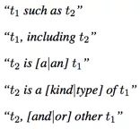

也有一些自动扩充模板的工作，比如Rion Snow组的*《Learning syntactic patterns for automatic hypernym discovery》*成果中，利用句法依赖path自动获取新的模板

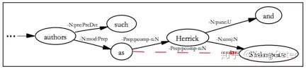

不过，这种自动模板生成方法也会带来新的问题，如果我们的原始语料非常庞大的话，单个模板的特征是非常稀疏的**（Feature sparsity problem）**，另一个思路就是去关注Pattern的特征，提升它们的generality，从而提高召回率。相关工作包括Navigli组提出了 *star pattern* 的概念：替换句子中的低频实体词，再通过聚类算法挑出更general的pattern。

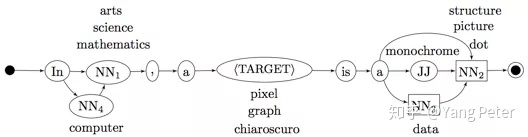

句法依存作为特征的这一路子也有类似的思路，在**PATTY**系统里，会在dependency path中随机替换pos tag，ontological type 或 实体词，最终再挑选pattern。

第二类方法是**迭代抽取**，主要假设是说某些错误的关系数据因为语言的歧义或者语义漂移问题（semantic drift）会被一些过于general的parttern的多次抽取。那么如果设计一个验证机制，或许就可以把它们清除出来。比如在*《Semantic Class Learning from the Web with Hyponym Pattern Linkage Graphs》*设计了“doubly-anchored”的模式，用一个bootstrapping loop进行抽取。

第三类方法是**上位词推断（Hypernym Inference）**，利用模板抽取关系数据的另一个影响召回率的因素是，模板作用的目标是完整的句子，也就以为着某条关系的上位词和下位词必须同时出现在句子中。一个很自然的想法就是是否可以利用词的传递性，比如说 y 是 x 的上位词，而同时 x 与 x'  非常相似，那这种上下位关系就可以作为传递，已有工作中就有train一个HMM来做跨句子的预测。除了名词之间，也有一些研究是根据下位词的修饰词做句法上的推断，比如说 “grizzly bear” 也是一种 “bear”

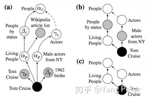

上图是*《Revisiting Taxonomy Induction over Wikipedia》*的工作，通过词组中的头部词作为特征，做了一套启发式抽取的流程。

### **b). 如何提升准确率？**

对于图谱构建这类问题，是如何评价准确度的呢？最常见的是一些基于统计的方式。比如 (x, y) 是一对候选的 is-a 关系对，在**KnowItAll**系统中，借助搜索引擎来计算 x 与 y 的点互信息（PMI）；在**Probase**中使用的是似然概率来表示 y 是 x 是上位的概率，取概率最大的作为结果；其他也有通过贝叶斯分类器的预测结果、外部数据验证、专家评判验证等方法。

对于如何在抽取流程外再提升准确率，多数研究方法就是**选取一个验证指标，然后构建一个分类器去迭代优化**。不过，单纯利用模板的准确率还是普遍偏低，引入分类器的工作多数是在模板+分布式的混合方案中被提到，下面来介绍一下分布式的抽取思路。

### **Distributional 方法**

在NLP领域中，分布式方法就是包括**词向量**、**句向量**等一些表示学习的结果。分布式表示的一大优点是将NLP领域中原本离散的数据转换为连续的、可计算的。这个idea也可以引入到图谱构建中，因为可计算就意味着词向量间蕴含了某些关系，这些关系也可以是 Is-A 数据对的上下位关系。分布式方法抽取的另一个优点是我们可以对 Is-A  关系进行直接预测，而不是通过抽取。这类方法的主要步骤可以总结为：i) 获取种子数据集（Key term）; ii)  使用无监督或有监督模型获取更多的候选 Is-A 关系对。

### **a). Key Terms 抽取**

种子数据集获取的方法有很多，最直观就是设计严格的 pattern，这样做的好处是可以保证 Key term  有较高的准确率，在大量语料的情况下效果不错，但是当语料数据较少的时候，可能存在抽取数量不足，导致后续模型training过拟合的情况。除了使用  pattern 抽取，也有研究使用**序列标注模型**或是**NER工具**进行预抽取，接着使用若干规则进行过滤。

部分基于垂直领域Toxonomy构建的研究中，会附加某些领域特定的后处理（domain filtering）。多数是根据一些统计值做一些阈值，比如**TF、TF-IDF或其他领域相关的分值**。也有研究会在挑选句子的时候就给句子打上权重，从领域权重高的句子中抽取key term。

获取key term后，后续就是何如基于这些种子数据扩充出新的关系对。

### **b).Unsupervised 模型**

第一方向就是聚类的方案，对于聚类，研究的核心就是采用哪种距离评价指标，简单的指标包括 **cosine、Jaccard、Jensen-Shannon divergence**都可作为尝试，也有稍微复杂一些的在实体对 (x, y) 取其他特征或权重做比较，比如 **LIN measure**： 

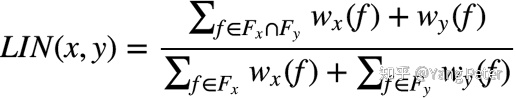

其中 Fx ，Fy 表示抽取的 feature，w 表示feature的权重。

此外，有研究人员关注到，比如在维基百科的词条页面中，下位词只会出现在描述上位词的某些context中。但是上位词可能会出现在下位词的整个context中，由于这样的不对称性，距离评估上也做了相应调整，比如使用 **WeedPrec**: 

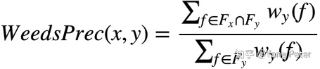

这类假设被称为 **Distributional Inclusion Hypothesis（DIH）**，类似的距离评价还有**WeedRec、BalAPInc、ClarkeDE、cosWeeds、invCL**等。

除了距离评价指标，另一个需要关注的就是feature怎么取，常见比如  在文本语料中的共现频数、点互信息、LMI等。

### **c). Supervised 模型**

在拥有 key term 和聚类操作后，进一步提升精度的方法是构建有监督的模型，可以使用**Classification**或**Ranking**的方式。

从分类器的角度，最流行的方案是我们提前训练好一个语言模型，比如**Word2Vec**，候选数据对 (x, y) 以相应映射为向量，把两个向量做拼接，然后使用比如**SVM**来做一个二分类的分类器。这个办法在后续许多研究中都作为baseline来比较。这个方法简单有效，但是在近年的研究中也指出它也存在一些列的问题。实践发现，这种分类器学到的是语义上的联系，而非我们所期待的上下位关系的联系，换句话说就是非常容易过拟合。替代方案就是对 (向量x) 和 (向量y) 做 diff 操作，或者结合相加、点乘等方式取综合的feature。

后续研究者认为，词向量的training受语料环境影响很大，将上下位关系也一同映射到词的embedding中比较困难。所以在词向量的基础上，为 x 与 y 单独构建一层 embedding 来表示关系，实验结果表明这种方式在特定领域的图谱构建有不错的指标提升。

除了分类器，上位词生成方法**（Hypernym Generation）**也是一种选择，同时这也是目前效果最好的一种方法，大致是构建一个 **piecewise linear projection model**用于选取与 (向量x) 的上位词最接近的 (向量y) ,此处也使用了**Ranking**的技巧。我们选取了中文领域的相关工作做了尝试，具体展开可以继续看后续的章节。

### **Taxonomy Induction**

在前面章节，介绍了各种技术从文本中抽取 Is-A 关系对，最后一步的工作就是如何把这些关系对数据做合并，构成完整的图谱。多数方法是一个增量学习**（Incremental Learning）**的模式，初始化一个 seed taxonomy，然后将新的 Is-A 数据往图上补充。而这个方向的研究就在于使用何种评价指标作为插入新数据的依据。

常见的方法是把构建看作一个聚类问题，相似的子树通过聚类进行合并。如《Unsupervised Learning of an IS-A Taxonomy from a Limited Domain-Specific Corpus》就使用**K-Medoids**聚类去寻找最小公共祖先阶段。

图相关的算法也可以作为一个方向，因为Taxonomy天然得是个图的结构，比如在《A Semi-Supervised Method to Learn and Construct Taxonomies using the  Web》提供了一种思路，找到所有入度为0的节点，它们大可能是taxonomy的顶部，找到所有出度为0的节点，它们大可能是底部的instance，然后在图中寻找从root到instance的最长路径，就可以得到一个较为合理的结构。

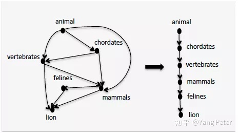

其他也有在图的edge上附上各种领域相关的权重值，然后用动态规划一类的算法求最优分割，比如**Optimal branching algorithm**。

构建的最后一步是**对taxonomy做清洗**，把错误的 Is-A 关系对数据去除。第一个关键特征是taxonomy中的上下级关系是不存在环状结构的，**Probase**数据库在构建时通过去除环状结构，清理了约74K的错误 Is-A 关系对。

另一个比较大的问题是**实体词的歧义**，这个问题就目前来看没有特别有效的解决方法。尤其是在一些自动化图谱构建的系统中，引入上文提到的“传递性”来扩充数据往往带来更大的脏数据的风险。举个例子，有两条 Is-A 关系对：

> (Albert Einstein, is-a, professor) 
> (professor, is-a, position)

但是我们并**不可以**用传递性得到

> (Albert Einstein, is-a, position)

虽然现在也有一些工作是试图学习一个实体词的 multiple senses，但是有多个选择并不代表知道哪个是正确的选择。多数情况下，实体词的消岐需要有更多的旁证，也就意味它需要你首先就拥有丰富的知识背景数据，我们正在做的就是构建图谱，这变成了“**鸡生蛋还是蛋生鸡**”的问题。从学术层面，构建一个 fully-disambiguated 的 taxonomy 任重道远，好在我们在应用层面可以有很多其他的trick，包括收集用户的搜索、点击日志，解析UCG内容，从中获取信息帮助我们消岐，并且反哺给知识图谱。

上文我们对Taxonomy的构建技术做了简单的综述，下面可以看看在中英文领域构建图谱的完整流程是怎样的。

## **Probase的构建**

从微软的Probase开始，图谱的构建强调了**probabilistic taxonomy**的概念，知识的存在并不是“非黑即白”的，而是以一定的概率形式存在，保留这一层面的不确定性可以减轻数据中噪声带来的影响，并有助于后续进行知识计算。在Probase的数据中，每一对 **hypernym-hyponym** 以保留构建语料中的**共现频数**的形式来对应确信度，如下：

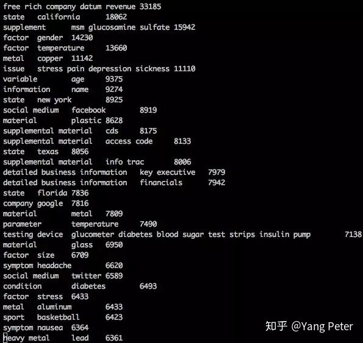

比如 company 与 google 在图谱构建中被关联了 7816 次，在后续应用计算可信度时就可利用该值。

那么，Probase具体的构建流程可以理解为两个步骤，首先是利用**Hearst Patterns**（下图）在原始语料中获得上下位名词短语候选对。

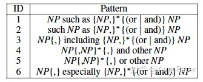

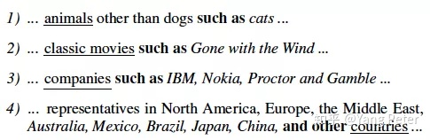

在获得候选对之后，再根据父子级关系合并成树状的数据结构，整个流程比较简单，如下：

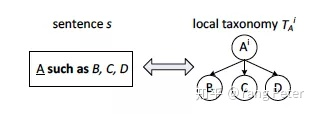

从原始的sentence中把候选实体对（如（company, IBM）、（company, Nokia）等）挖掘出来，形成小的子树；

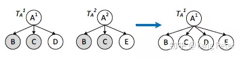

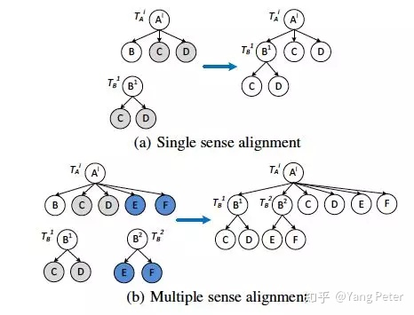

接着再由横向或是纵向合并原则将各个子树合并成完整的图谱，论文后续给出了完整的构建流程

可以看到，在合并子树的过程中，并不是简单得做直接合并，而是要通过一个相似度计算**Sim(Child(T1), Child(T2))** 决定，这个相似度计算也比较简单，使用`Jaccard similarity`即可， 

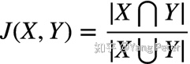

假设现在有三个子树：

A = {Microsoft, IBM, HP} 
B = {Microsoft, IBM, Intel} 
C = {Microsoft, IBM, HP, EMC, Intel, Google, Apple}

计算可得 J(A,B) = 2/4 = 0.5，J(A,C) = 3/7 = 0.43，此处在构建时会设置一个阈值，假设为0.5，那么 A 与 B 可以做横向合并，而 A 与 C 则不可以。

## **中文图谱构建存在的问题**

总得来说，Probase的方法算是比较简单的，在构建上提供了一个大的框架层面的思路，但是从细节上还存在不少问题。在论文《Learning Semantic Hierarchies via Word  Embeddings》中详细探讨了这个问题，尤其是在中文方面，第一个问题是中文的语法较英语来说更加灵活，使用 Chinese  Hearst-style lexical patterns  虽然准确率会很高，但是召回率较其他方法而言非常低，随之F1值也较差。因为人工遍历整理完所有的句式结构难度较大，同时也十分低效，可见下图文章中对几种方法做的比较：

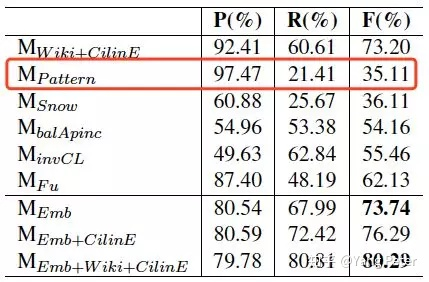

另一方面，单纯使用 patterns 的方法，在语义结构构建（semantic hierarchy construction）方面的能力也存在不足

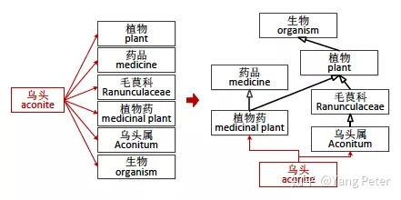

像Probase这种简单的构建方法往往容易出现关系缺失或者错误的情况。

## **映射模型与模板的混合框架**

目前研究比较主流的构建方案中，除了使用 `Hearst Pattern`以外，常用的手段就是借助分布式表示的手段，比如计算上下位词汇的`PMI`、`Standard IR Average Precision`，或者计算两者`词向量`的offset等。延续哈工大团队的工作，华师大团队完成了一套结合词向量、映射模型以及Hearst Pattern的Taxonomy构建方法，本节就主要以《Predicting hypernym-hyponym relations for  Chinese taxonomy learning》介绍的工作展开讨论。

### **问题定义**

首先，根据垂直领域的知识背景和数据，我们已构建了一个知识图谱的基本框架，称为 Taxonomy, 记为 ***T*** **= (V, R)**，其中 ***V*** 表示实体向量，***R*** 表示关系。

接着从图谱 ***T\*** 中采样出部分 *is-a* 关系数据，记作 R。并且随后从中取出 `传递闭包` 的关系集合，记作 ***R\****，可以理解在这个集合中的关系数据为可信度较高的数据。

以百度百科为例，从外部数据源获取的实体集合记为 *E*，集合中的每个元素为 ，该元素的父级记作 **Cat(x)** ，那么整个爬取来的数据集合可表示为： 

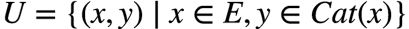

对于整个问题，则可以定义为：根据 **Rx** 学习出一个算法 **F** ，能够将 ***U\*** 中 **unlabeled**的数据筛选出来，并融入到 ***T\*** 中。

### **基本框架**

在文章《Learning Semantic Hierarchies via Word Embeddings》中已经介绍过了使用`词向量`中类似 ***v(king) - v(queen) = v(man) - v(woman)\*** 的特性可以帮助构建过程中预测实体上下位关系`hypernym-hyponym relations`（比如，*糖尿病与糖代谢异常类疾病，胃溃疡与胃肠疾病*）。本文延续了使用词向量，并在词向量空间上训练映射模型的思路，整体框架如下：

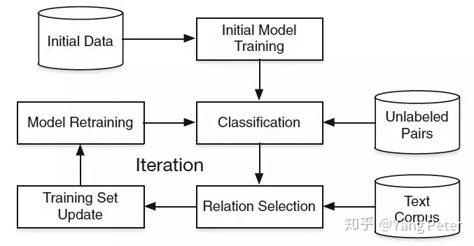

流程可以表述为：首先从已有的 Taxonomy中提取部分初始化数据，将它们映射到词向量空间（embedding space），接着在这个空间中训练`线性映射模型(piecewise linear projection model)`，从而获得了这个空间的先验表示。然后，从数据源获取新的关系对，通过模型的预测以及其他规则的筛选，提取出新的一批关系对数据来更新 training set，这批新的数据又可以重新校正 projection model，以此循环。

### **模型定义**

根据前文描述，第一步就是利用一个大语料train一个靠谱的词向量，作者使用了 *Skip-gram* 的模型， 在10亿个words的语料上获得了词向量，方法此处不再赘述。

得到了词向量后，对于给定词汇 **x** ，求取词汇 **u** 的条件概率就可以表示为： 

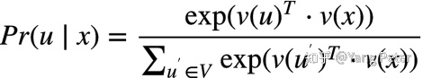

此处 **v(x)** 表示取词向量操作，***V\*** 表示整个语料获得的词典

第二步，构建映射模型，这样的模型也非常简单，对于某个关系对数据 (xi, yi) , 模型假设它可以通过一个转换矩阵 ***M*** 和一个偏置向量完成转换： 

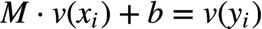

此外，作者也吸取前人的经验，在实验中发现单个映射模型并不能很好地学到这个空间的映射关系，打个比方，在开放域的数据集下，可能表示自然界生物的领域知识 与 表示金融经济类领域知识  的空间表示差异过大，用单个模型cover不住。怎么办？那就多搞几个模型分别处理吧，不过作者没有用引入先验知识的方式，而是用`K-means`直接找出类别：

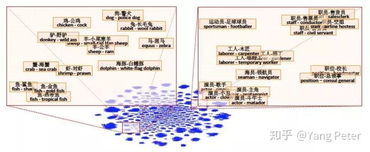

可以看到，经过聚类算法后，动物和职业被分到了不同的簇中，随后就可以对每个簇分别构建映射模型。

整个模型的优化目标也很好理解，对实体 ***x*** 的向量进行转换后，要尽可能接近实体 ***y*** 向量，目标函数如下：

其中 , ***k\*** 表示聚类后的第 ***k\*** 个簇, ***Ck\*** 表示各个簇下的关系数据集合，优化方法使用`随机梯度下降(Stochastic Gradient Descent)` 

### **训练方法**

系统是以一种循环的方式进行训练，核心思想是通过聚类和映射模型不断动态地扩充训练集 ***R(t)(t = 1, 2, ..., T)\*** , 在不断重新训练模型后，逐渐增强对目标数据源的泛化能力。

首先在初始化的部分约定一些**术语标记**:

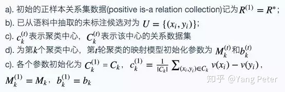

以下为循环流程：

### **Step 1.**

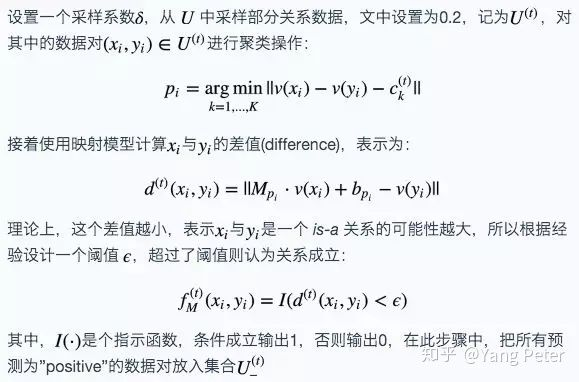

### **Step 2.**

在经过模型预测后，需要再经过模板筛选，可用的中文模板例如：

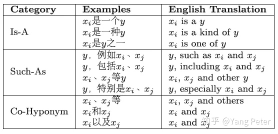

筛选后，最终得到高可信度的关系集合： 

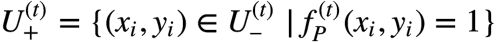

特别的是，此处的 ***f*** 不是简单地通过模板即可，对于以上”Is-A”、”Such-As”和”Co-Hyponym”三种模板做了分别分析：

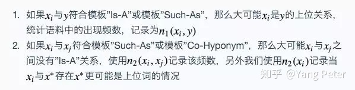

根据以上分析，这里设计了一套算法来决定如何把 U(t)- 中的关系数据筛选进入 U(t)+ ,对候选数据集 U(t)- 中的的关系数据，根据可信度定义positive和negative两个量，positive具体定义为：

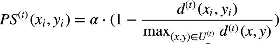

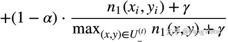

其中，**a** 的范围是 (0, 1)，是一个调节系数，***gamma\*** 是平滑系数，论文设置了经验值**a = 0.5, gamma = 1**。

negative具体定义为：

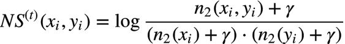

如果 NS(t) 分数高，代表 xi 与 yi 更可能是”co-hyponyms”关系，而是”Is-A”关系的可能性越低。

接着，此处涉及的算法就是要最大化同时最小化，形式化表示出来就是： 

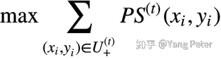

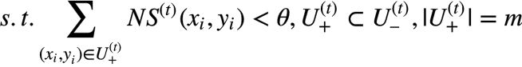

这里，***m\*** 表示 U(t)+ 的size，***theta\*** 是一个约束阈值。我们发现这个问题是`预算最大覆盖问题(budgeted maximum coverage proplem)`的一个特例，是个`NP-hard`问题，需要引入`贪心算法`来求解：

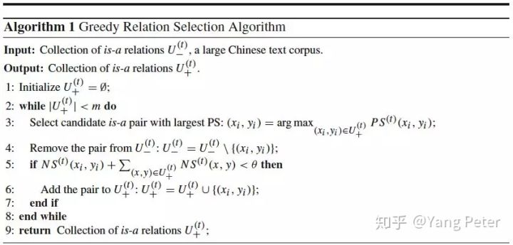

最后，除了更新 U(t)+ ，另一个是把 U(t)+ 与原training数据合并:

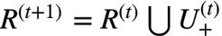

**Step 3.**

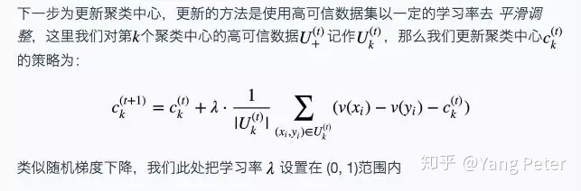

**Sep 4.**

### **模型预测**

## **总结**

本文调研的知识图谱构建方法是为数不多在中文领域进行的工作，相较英文，不论是pattern的设计、数据源等都有非常大的差异。论文的后半段也讨论了在这个流程中发现的问题，首先是在系统中用了聚类的方法，而在调参过程中，发现效果对于聚类中心个数 K 并不敏感，在 K 较小的情况下效果相差不是很多，差不多在 K = 10  的情况效果最佳。但是如果设置的过大的话，最终效果会很差。不过作者做的是开放领域的知识图谱，而我们是做垂直领域（医疗）的知识图谱，在实践中我们尝试根据先验知识来人为划分子数据集，从而分别训练映射模型。

其次，在具体情况下，发现某些上下位错误的问题，比如说**“草药”**被识别成**“中药”**的父级，虽然中药中的确大部分是由草药构成，但是从分类的角度看的话是不合理的。这类情况可能是因为数据源里中文表达的问题，同时如果没有外部知识辅助的话也不容易处理。而这部分在我们实际的实践中会根据具体数据源做一些定向的pattern设计，比如在《实用诊断学》一书中，描述属性分类常用句式有

> 根据 * 不同，分为 a1, a2, a3 
> x 有 * 种类型：y1, y2, y3 等

人工的前期观察有助于提高信息提取的召回率和准确率。

另外，还发现某些词向量训练得不好，比如论文实验中**“植物”**与**“单子叶植物纲”**的词向量表示很相近，可能是某些词在语料中过于低频，不过这个是硬伤，需要想办法提升中文领域的预训练效果。

------

### **参考文献**

1.《Web Scale Taxonomy Cleansing》

2.《Probase- a probabilistic taxonomy for text understanding》

3.《An Inference Approach to Basic Level of Categorization》

4.《Improving Hypernymy Detection with an Integrated Path-based and Distributional Method》

5.《A Short Survey on Taxonomy Learning from Text Corpora- Issues, Resources and Recent Advances》

6.《Learning Semantic Hierarchies via Word Embeddings》

7.《Chinese Hypernym-Hyponym Extraction from User Generated Categories》

8.《Learning Fine-grained Relations from Chinese User Generated Categories》

9.《Predicting hypernym–hyponym relations for Chinese taxonomy learning》

10.《Unsupervised learning of an IS-A taxonomy from a limited domain-specific corpus》

11.《Supervised distributional hypernym discovery via domain adaptation》

12.《Semantic Class Learning from the Web with Hyponym Pattern Linkage Graphs》

13.《What Is This, Anyway-Automatic Hypernym Discovery》

14.《Learning Word-Class Lattices for Definition and Hypernym Extraction》

15.《Taxonomy Construction Using Syntactic Contextual Evidence》

16.《Learning syntactic patterns for automatic hypernym discovery》

17.《A Semi-Supervised Method to Learn and Construct Taxonomies using the Web》

18.《Entity linking with a knowledge base: Issues, techniques, and solutions》

19.《Incorporating trustiness and collective synonym/contrastive evidence into taxonomy construction》

20.《Semantic class learning from the web with hyponym pattern linkage graphs》

21.[https://www.shangyexinzhi.com/Article/details/id-23935/](https://link.zhihu.com/?target=https%3A//www.shangyexinzhi.com/Article/details/id-23935/)

22.https://zhuanlan.zhihu.com/p/30871301

23.[https://xiaotiandi.github.io/publicBlog/2018-10-09-436b4d47.html](https://link.zhihu.com/?target=https%3A//xiaotiandi.github.io/publicBlog/2018-10-09-436b4d47.html)

编辑于 2019-07-01

# END