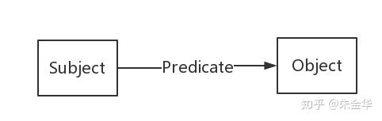

本体、知识库、知识图谱、知识图谱识别之间的关系？

本体：领域术语集合。

知识库：知识集合。

知识图谱：图状具有关联性的知识集合。

知识图谱本质上是语义网络，是一种基于图的数据结构，由节点(Point)和边(Edge)组成。

我们通常用“实体（Entity）”来表达图里的节点、用“关系（Relation）”来表达图里的“边”。**实体指的是现实世界中的事物比如人、地名、概念、药物、公司等**，**关系则用来表达不同实体之间的某种联系**

在现实世界中，实体和关系也会拥有各自的属性，比如人可以有“姓名”和“年龄”。**当一个知识图谱拥有属性时，我们可以用属性图（Property Graph）来表示**

属性图的表达很贴近现实生活中的场景，也可以很好地描述业务中所包含的逻辑。除了属性图，知识图谱也可以用RDF来表示，它是由很多的**三元组（Triples）来组成**。RDF在设计上的主要特点是易于发布和分享数据，但不支持实体或关系拥有属性，如果非要加上属性，则在设计上需要做一些修改。目前来看，RDF主要还是用于学术的场景，在工业界我们更多的还是采用图数据库（比如用来存储属性图）的方式。感兴趣的读者可以参考RDF的相关文献，在文本里不多做解释。

每个节点表示现实世界中存在的“实体”，每条边为实体与实体之间的“关系”。

知识图谱是关系的最有效的表示方式。通俗地讲，知识图谱就是把所有不同种类的信息连接在一起而得到的一个关系网络。知识图谱提供了从“关系”的角度去分析问题的能力。

### 知识库

知识库就是一个知识数据库，包含了知识的本体和知识。

比如Freebase是一个知识库（结构化），维基百科也可以看成一个知识库（半结构化），等等。

也就是说，本体是强调概念关系，知识图谱强调实体关系和实体属性值，知识库则是所有知识的集合。但是知识库不局限于分类和图谱，知识库可以包括规则，包括过程性知识等。而本体也可以定义得很抽象，任何概念的内涵和外延可以定义本体。

 知识图谱是一系列结构化数据的

### 处理方法

，它涉及**知识的提取、 表示、存储、检索等诸多技术。**

从渊源上讲，它是**知识表示与推理、数据库、信息检索、自然语言处理**等多种技术发展的融合。 但传统的知识处理方法，在实际的工程应用，特别是互联网应用中，面临实施成本高、技术周期长、熟悉该类技术的人才缺乏、 基础数据不足等诸多现实制约。实战中的知识图谱，需要充分利用成熟的工业技术，不拘泥于特定的工具和方法，特别是不盲目追求标准化、技术的先进性或者新颖性，以实际的业务出发，循序渐进推进工程的实施。

###  全周期成本

:有哪些成本？分为**技术成本、团队成本和组织成本**。技术有知识提取的成本、知识存储的成本、知识推理的成本、知识检索的成本、运维的成本、更新的成本。教育成本，一个人进来之后，他到底是一个月之后就能干活，还是半年之后能干活，**取决于你的技术架构**。如果你的知识提取架构是以正则表达式为基础的，那可能很容易。如果你是以一个规则的神经网络分布式表示来做，可能要半年之后才能理解是什么，所以这都是成本。

 

## **知识表示**

**知识**是人类通过观察学习思考有关客观世界的各种现象而获得和总结出的所有事实Facts，概念Concepts，规则或原则Rules&Principles的集合。

**关于数据描述语言：**

**RDF(**Resource Description Framework**):**资源描述框架，是最常用的符号语义表示模型，它提供了一个统一标准，用于描述实体/资源。RDF的基本模型是有向标记图，途中的每条边对应主谓宾三元组，一个三元组对应于一个逻辑表达式或对世界的陈述。RDF由节点和边组成，节点表示实体/资源、属性，边则表示了实体和实体之间的关系以及实体和属性的关系。

【spo】

作者：方弟
链接：https://www.jianshu.com/p/bd15e0f50eb9
来源：简书
著作权归作者所有。商业转载请联系作者获得授权，非商业转载请注明出处。

作者：方弟
链接：https://www.jianshu.com/p/bd15e0f50eb9
来源：简书
著作权归作者所有。商业转载请联系作者获得授权，非商业转载请注明出处。