 

# 知识图谱入门

#  (一)  知识图谱与语义技术概览


欢迎大家关注我的博客 [http://pelhans.com/](https://link.zhihu.com/?target=http%3A//pelhans.com/) ，所有文章都会第一时间发布在那里哦~

------

> 知识图谱与语义技术概览。主要介绍知识表示、知识抽取、知识存储、知识融合、知识推理、知识众包、语义搜索、知识问答等内容。同时还包含一些典型的应用案例。本系列笔记为王昊奋老师知识图谱课程的学习笔记，若理解有偏差还请指正。课程购买连接在文末。

## 知识图谱与语义技术概览

## 知识图谱的概念演化

​       知识图谱(Knowledge Graph， KG)的概念演化可以用下面这幅图来概括:

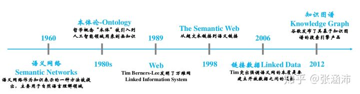

​       在1960年，语义网络(Semantic  Networks)作为知识表示的一种方法被提出，主要用于自言语言理解领域。它是一种用图来表示知识的结构化方式。在一个语义网络中，信息被表达为一组结点，结点通过一组带标记的有向直线彼此相连，用于表示结点间的关系。如下图所示。简而言之，语义网络可以比较容易地让我们理解语义和语义关系。其表达形式简单直白，符合自然。然而，由于缺少标准，其比较难应用于实践。

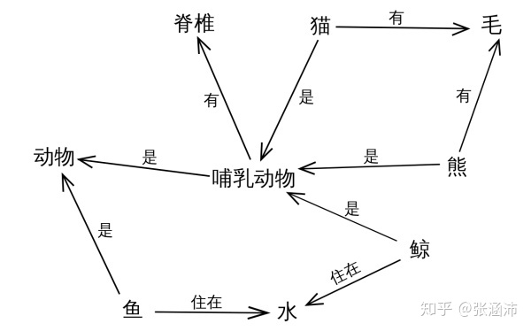

​        1980s出现了本体论(Ontology)，该本体是由哲学概念引入到人工智能领域的，用来刻画知识。在1989年Time Berners-Lee发明了万维网，实现了文本间的链接。

​        1998年语义网(THe Semantic  Web)被提出，它从超文本链接到语义链接。语义网是一个更官方的名称，也是该领域学者使用得最多的一个术语，同时，也用于指代其相关的技术标准。在万维网诞生之初，网络上的内容只是人类可读，而计算机无法理解和处理。比如，我们浏览一个网页，我们能够轻松理解网页上面的内容，而计算机只知道这是一个网页。网页里面有图片，有链接，但是计算机并不知道图片是关于什么的，也不清楚链接指向的页面和当前页面有何关系。语义网正是为了使得网络上的数据变得机器可读而提出的一个通用框架。“Semantic”就是用更丰富的方式来表达数据背后的含义，让机器能够理解数据。“Web”则是希望这些数据相互链接，组成一个庞大的信息网络，正如互联网中相互链接的网页，只不过基本单位变为粒度更小的数据，如下图。

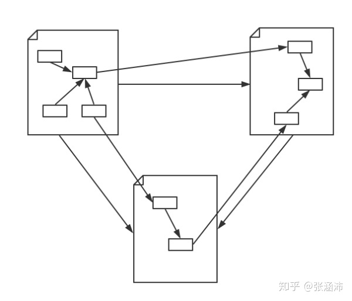

​        2006年Tim突出强调语义网的本质是要建立开放数据之间的链接，即链接数据(LInked  Data)。2012年谷歌发布了其基于知识图谱的搜索引擎产品。可以看出，知识图谱的提出得益于Web的发展和数据层面的丰富，有着来源于知识表示(Knowledge Represention， KR)、自然语言处理(NLP)、Web、AI多个方面的基因。可用于搜索、问答、决策、AI推理等方面。

## 知识图谱的本质

​        知识图谱目前没有标准的定义，这里引用一下“Exploiting Linked Data and Knowledge Graphs in Large Organisations”这本书对于知识图谱的定义：

> A knowledge graph consists of a set of interconnected typed entities and their attributes.

​        即**知识图谱是由一些相互连接的实体和它们的属性构成的**。最简单情况下它长这样：

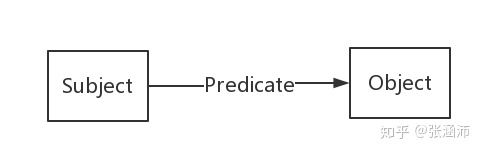

复杂一些是这样的：

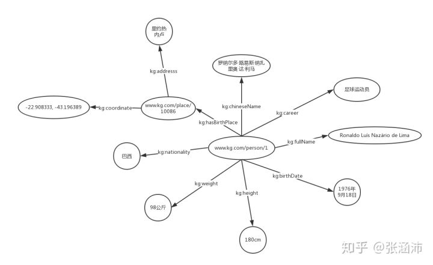

​         前面说过，知识图谱综合了众多方面，其中从Web角度看KG，它像建立文本之间的超链接一样，建立数据之间的语义链接，并支持语义搜索。从NLP角度看，它主要在做怎么能够从文本中抽取语义和结构化的数据。从知识表示角度看是怎么利用计算机符号来表示和处理知识。从AI角度则是怎么利用知识库来辅助理解人类的语言。从数据库角度看就是用图的方式存储知识。因此要做好KG要综合利用好KR、NLP、Web、ML、DB等多方面的方法和技术。

## 知识图谱技术概览

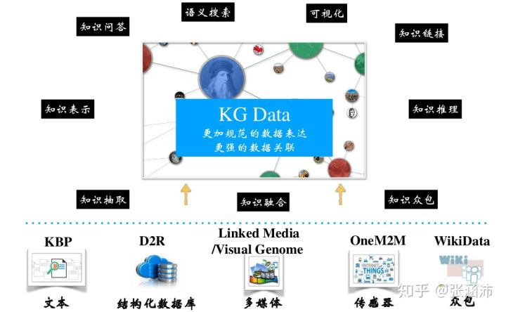

​         上图表示了知识图谱的技术体系，首先在最底层我们有大量的文本、结构化数据库、多媒体文件等数据来源。通过知识抽取、知识融合、知识众包等技术，获取我们需要的数据，而后通过知识表示和知识推理、知识链接等将知识规范有序的组织在一起并存储起来。最终用于知识问答、语义搜索、可视化等方面。

## 知识表示

​        知识表示研究怎么利用计算机符号来表示人脑中的知识，以及怎么通过符号之间的运算来模拟人脑的推理过程。

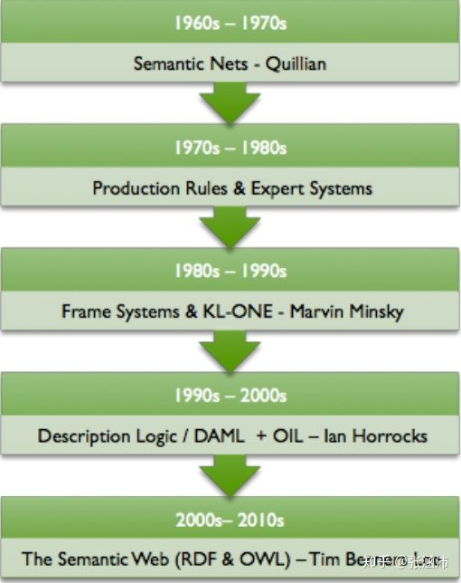

​        上图给出了知识表示的演化过程，其中最主要根本的变化是从基于数理逻辑的知识表示过渡到基于向量空间学习的分布式知识表示。

下图给出官方推荐的语义网知识表示框架：

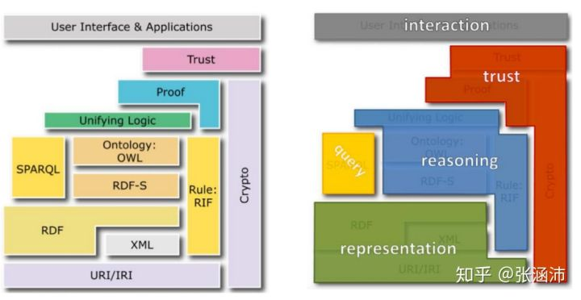

​         其中最底层的是URI/IRI是网络链接，其上是XML和RDF为资源表示框架。SPARQL是知识查询语言。被蓝色部分覆盖的是推理模块，它包含了如RDFS和OWL这样的支持推理的表示框架。在往上就是trust和interaction部分，暂时不需要了解(还不清楚是什么，只知道用不到。。。)。

## RDF

​        RDF(Resource Description  Framework)即资源描述框架，是W3C制定的。用于描述实体/资源的标准数据模型。在知识图谱中，我们用RDF形式化地表示三元关系。(Subject, predicate, object)。例如:

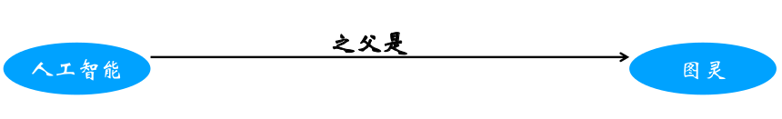

​        RDFS在RDF的基础上定义了一些固定的关键词如：Class，subClassOf，type， Property， subPropertyOf， Domain， Range以及多了Schema层。它的表示为：

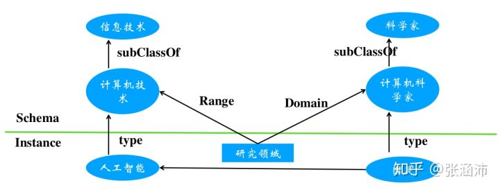

## OWL

​        OWL(Web Ontology Language), 这个本体就是从哲学那面借鉴来的。OWL在RDF的基础上扩充了Schema层，使它支持推理等操作。如：

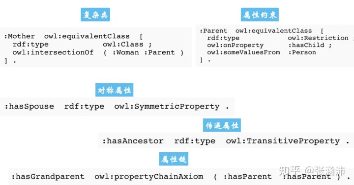

## SPARQL

​         SPARQL是RDF的查询语言，它基于RDF数据模型，可以对不同的数据集撰写复杂的连接，由所有主流的图数据库支持。其操作如：

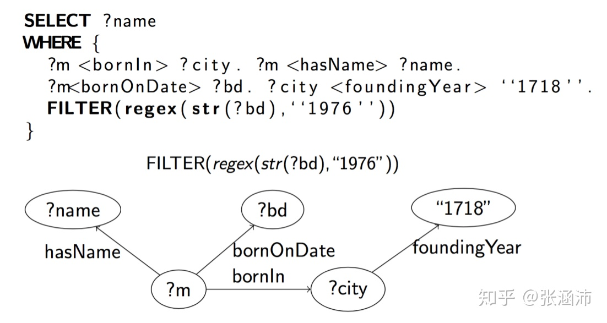

## JSON-LD

​        JSON for Linking Data: 适用于作为程序之间做数据交换,在网页中嵌入语义数据和Restful Web Service。存储格式如:

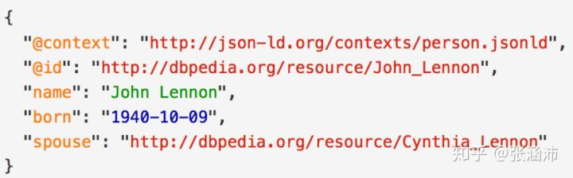

## 知识图谱的分布式表示--KG Embedding

​        其实看到 Embedding这个词我们就知道，它是一个向量嵌入。详细来说就是在保留语义的同时，将知识图谱中的实体和关系映射到连续的稠密的低维向量空间。

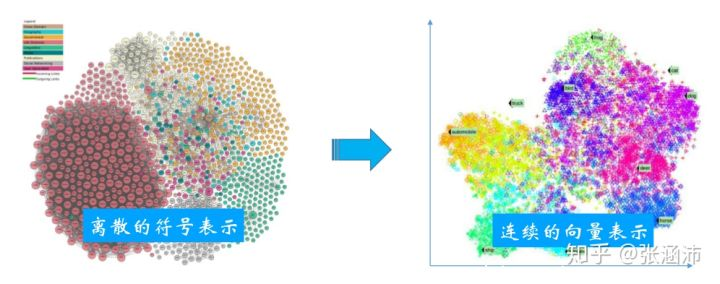

## 知识抽取

​        知识抽取是一个结合NLP和KR的工作，它的目标是抽取KR用的三元组、多元关系、模态知识等。具体流程如下：

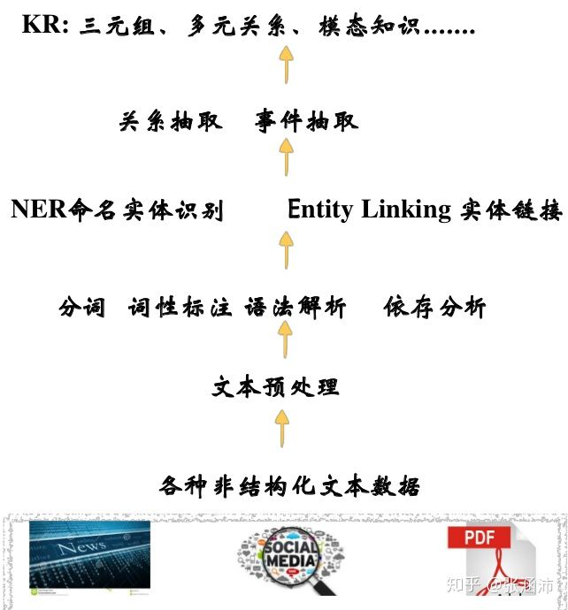

​         文字表述为，首先从网络上获取大量的各种非结构化的文本数据，经过文本预处理后得到干净的文本数据。而后借助机器学习相关程序对文本进行分词、词性标注、词法解析、依存分析等工作，此时词法及句法层次的分析结束，接下来对该文本进行NER和实体链接工作，为关系抽取和时间抽取做准备，最终形成KR用的三元组、多元关系、模态知识等构成知识图谱。

## 知识问答

​        知识问答(Knowledge-Based Question Answering，  KBQA)是基于知识库的问题回答，它以直接而准确的方式回答用户自然语言提问的自动问答系统，它将构成下一代搜索引擎的基本形态。如搜索姚明的身高，就可以给出226cm的回答。其实现流程为：

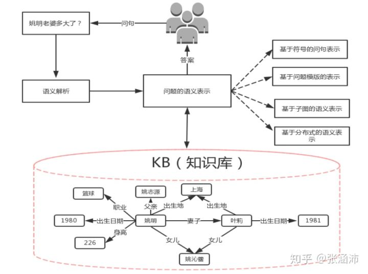

## 知识推理

​       简单而言，推理就是指基于已知事实推出未知的事实的计算过程，例如回答张三儿子的爸爸是谁？按照解决方法分类可分为：基于描述逻辑的推理、基于规则挖掘的推理、基于概率逻辑的推理、基于表示学习与神经网络的推理。按照推理类型分类可分为：缺省推理、连续变化推理、空间推理、因果关系推理等等。

## 知识融合

​        实体融合(Knowledge Fusion),也叫数据连接(Data  Linking)等，目的是在不同的数据集中找出一个实体的描述记录，主要目的是对不同的数据源中的实体进行整合，形成更加全面的实体信息。典型的工具为Dedupe(一个基于python的工具包)和LIMES。

## 知识众包

​        允许各网站基于一定的方式如RDFa、JASON-LD等方式在网页和邮件等数据源中嵌入语义化数据，让个人和企业定制自己的知识图谱信息。

## Ref

[王昊奋知识图谱教程](https://link.zhihu.com/?target=http%3A//www.chinahadoop.cn/course/1048)


#   (二)  知识表示与知识建模

欢迎大家关注我的博客 [http://pelhans.com/](https://link.zhihu.com/?target=http%3A//pelhans.com/) ，所有文章都会第一时间发布在那里哦~

------

> 本讲首先对早期的知识表示做了一个简单介绍，而后详细介绍了基于语义网的知识表示框架，如RDF和RDFS和查询语言SQARQL。最终给出几个典型的知识项目的知识表示。本系列笔记为王昊奋老师知识图谱课程的学习笔记，若理解有偏差还请指正。课程购买连接在文末。

## 知识表示历史

## 知识的概念

​        知识表示就是对知识的一种描述，或者说是对知识的一组约定，一种计算机可以接受的用于描述知识的数据结构。它是机器通往智能的基础，使得机器可以像人一样运用知识。

​         知识具有相对正确性、不确定性、可表示性以及可利用性的特点。根据不同划分标准，知识可以分为不同的类别。例如按照作用范围分类，可分为常识性知识和领域性知识。按作用及表示分类为事实性知识、过程性知识、控制知识。按确定性分类有确定性知识，不确定性知识。按结构及表现形式可分为逻辑性知识和形象性知识。

## 早期的知识表示方法

## 一阶谓词逻辑

​        谓词逻辑(Lp)可以对原子命题做进一步分析，分析出其中的个体词、谓词、量词，研究它们的形式结构的逻辑关系、正确的推理形式和规则。

​         一阶逻辑是数理逻辑的基础部分，主要包括经典命题逻辑和一阶谓词逻辑，但实际上一阶谓词逻辑包含了命题逻辑。一阶逻辑之所以是“一阶”的，是因为它所包含的谓词逻辑是一阶的。谓词就是表示对象属性的语词。对象的属性具有层次，在谓词用法中，这种层次叫做“阶”。所谓一阶谓词就是指刻画个体属性的谓词，如“红色”“大于”等谓词都只适用于个体概念，像“鲜艳”“传递性”等用来刻画“红色”“大于”这种谓词的谓词就是高阶谓词了，它们刻画的是属性的属性。

​        一阶谓词逻辑具有自然性、接近自然语言、容易接受、严密性、易于转化为计算机内部形式等优点，但同时也具有无法表示不确定性知识、难以表示启发性知识及元知识、组合爆炸、效率低等缺点。为了克服以上缺点，人们提出了Horn逻辑、描述逻辑等改进方案。

## 产生式系统

​         产生式系统是一种更广泛的规则系统，和谓词逻辑有关联，也有区别。早起的专家系统多数是基于产生式系统的。产生式知识表示法是常用的知识表示方式之一。它是依据人类大脑记忆模式中的各种知识之间的大量存在的因果关系，并以“IF-THEN”的形式，即产生式规则表示出来的。这种形式的规则捕获了人类求解问题的行为特征，并通过认识--行动的循环过程求解问题。一个产生是系统由规则库、综合数据库和控制机构三个基本部分组成。

​         谓词逻辑中的规则与产生式的基本形式相似,事实上,蕴涵式只是产生式的一种特殊情况。产生式规则表示法具有非常明显的优点，如自然型好，易于模块化管理、能有效表示知识、知识表示清晰等优点。但是产生式规则也有着效率不高、不能表达具有结构性的知识等缺点。因此,人们经常将它与其它知识表示方法(如框架表示法、语义网络表示法)相结合。

## 框架表示法

​        框架表示法是明斯基于1975年提出来的，其最突出的特点是善于表示结构性知识，能够把知识的内部结构关系以及知识之间的特殊关系表示出来，并把与某个实体或实体集的相关特性都集中在一起。

​        框架表示法认为人们对现实世界中各种事物的认识都是以一种类似于框架的结构存储在记忆中的。当面临一个新事物时,就从记忆中找出一个合适的框架,并根据实际情况对其细节加以修改、补充,从而形成对当前事物的认识。

​         框架是一种描述固定情况的数据结构，一般可以把框架看成是一个节点和关系组成的网络。框架的最高层次是固定的，并且它描述对于假定情况总是正确的事物，在框架的较低层次上有许多终端--被称为槽（Slots）。在槽中填入具体值，就可以得到一个描述具体事务的框架，每一个槽都可以有一些附加说明--被称为侧面（Facet），其作用是指出槽的取值范围和求值方法等。一个框架中可以包含各种信息：描述事物的信息，如何使用框架的信息，关于下一步将发生什么情况的期望及如果期望的事件没有发生应该怎么办的信息等等，这些信息包含在框架的各个槽或侧面中。

​         一个具体事物可由槽中已填入值来描述，具有不同的槽值得框架可以反映某一类事物中的各个具体事物。相关的框架链接在一起形成了一个框架系统，框架系统中由一个框架到另一个框架的转换可以表示状态的变化、推理或其它活动。不同的框架可以共享同一个槽值，这种方法可以把不同角度搜集起来的信息较好的协调起来。

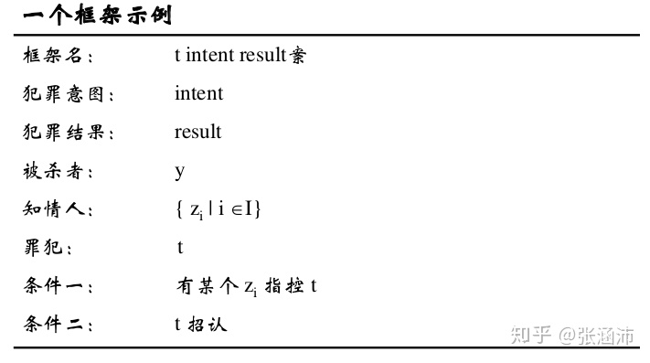

​        框架表示法对于知识的描述非常完整和全面;基于框架的知识库质量非常高;且框架允许数值计算,这一点优于其它知识表示语言。但框架的构建成本非常高,对知识库的质量要求非常高;框架的表达形式不灵活,很难同其它形式的数据集相互关联使用。

## 语义网络

​       语义网络是知识表示中最重要的方法之一，是一种表达能力强而且灵活的知识表示方法。语义网络利用节点和带标记的边结构的有向图描述事件、概念、状况、动作及客体之间的关系。带标记的有向图能十分自然的描述客体之间的关系。

​         语义网络由于其自然性而被广泛应用。采用语义网络表示的知识库的特征是利用带标记的有向图描述可能事件。结点表示客体、客体性质、概念、事件、状况和动作，带标记的边描述客体之间的关系。知识库的修改是通过插入和删除客体及其相关的关系实现的。采用网络表示法比较合适的领域大多数是根据非常复杂的分类进行推理的领域以及需要表示事件状况、性质以及动作之间的关系的领域。

​        语义网络的基本形式为(节点， 弧，  节点2)，节点表示各种事物、概念、情况、属性、动作、状态等，每个节点可以带有若干属性，一般用框架或元组表示。此外节点还可以是一个语义子网络，形成一个多层次的嵌套结构。语义网络中的弧表示各种语义联系，指明它所连接的节点间某种语义关系。节点和弧都必须带有标示，来方便区分不同对象以及对象间各种不同的语义联系。一个语义网络的例子为：

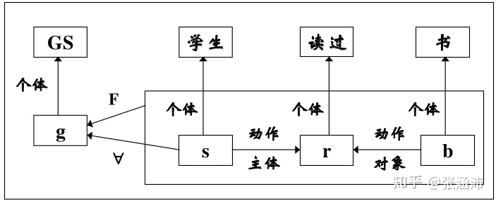

**本质上是将逻辑运算符和逻辑项映射到了图中的元素**。语义网络具有以下优点：  

\- 把各个节点之间的联系以明确、简洁的方式表示出来，是一种直观的表示方法；  

\- 着重强调事物间的语义联系，体现了人类思维的联想过程，符合人们表达事物间的关系，因此把自然语言转换成语义网络较为容易;  

\- 具有广泛的表示范围和强大的表示能力，用其他形式的表示方法能表达的知识几乎都可以用语义网络来表示；  

\- 把事物的属性以及事物间的各种语义联系显示地表示出来，是一种结构化的知识表示法。

但语义网络也具有以下缺点：  

\- 推理规则不十分明了，不能充分保证网络操作所得推论的严格性和有效性；  

\- 一旦节点个数太多，网络结构复杂，推理就难以进行；  

\- 不便于表达判断性知识与深层知识。

## 基于语义网的知识表示框架

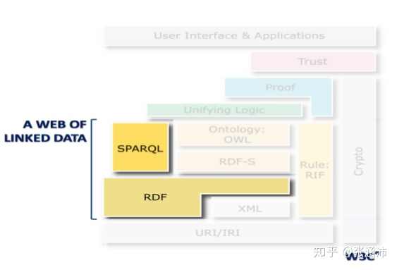

​        上图为W3C推荐的语义网标准栈，其中RDF和SPARQL为网络数据链接部分。与此同时，W3C还推出五星级标准，规定了RDF为标准数据格式，URI标准为事物命名等规范。

## RDF简介

## RDF概念

​        资源描述框架(Resource Description Framework，  RDF)，R代表页面，图片、视频等任何具有URI标识符，D标识属性、特征和资源之间的关系，F标识模型、语言和这些描述的语法。在RDF中，知识总是以三元组的形式出现，即每一份知识都可以被分解为：(subject, predicate, object)。

![[公式]](pelhans.assets/equation) 

​        与此同时，RDF三元组可以看做是图模型的边和顶点 ![[公式]](pelhans.assets/equation-20200904171713670) ,还可以将两个三元组结合起来表示：

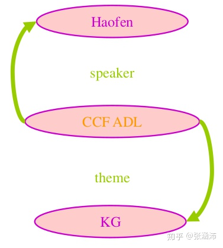

​        在RDF中resource和properties是以URIs的形式表示的，如  。这样我们的表示就变成了这样：

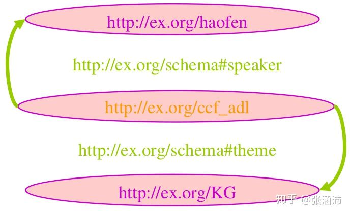

​        再结合URI的表示，我们可以把它简化为：

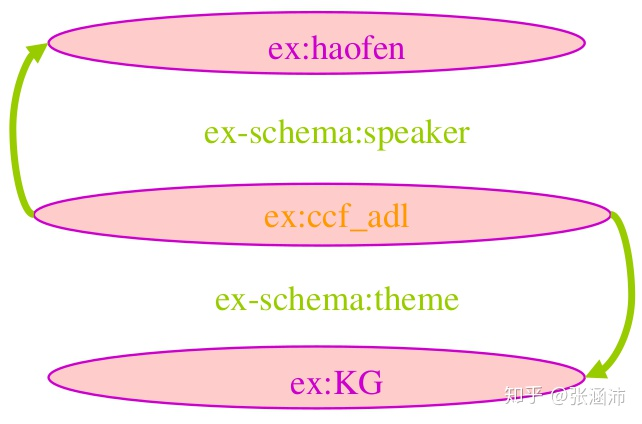

​        在RDF中，properties的值可以是literals，如字符串，因此也可以长成：

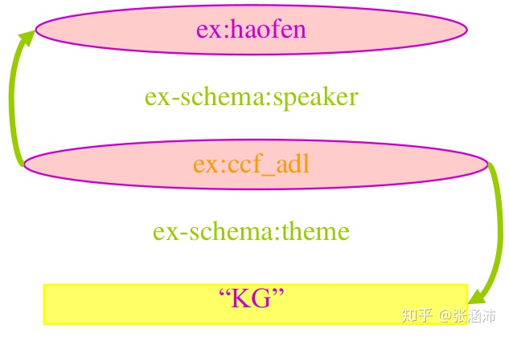

​         properties还可以是XML类型的，因此还可以长成：

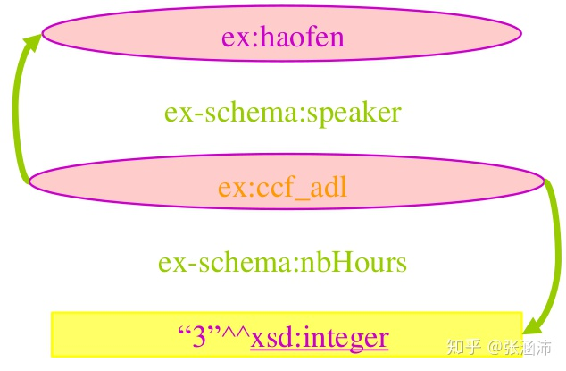

## RDF和RDFS

​        **RDFS(RDF Schema)在RDF的基础上提供了一个术语、概念的定义方式，以及那些属性可以应用到哪些对象上**。换句话说，RDFS为RDF模型提供了一个基本的类型系统。如：

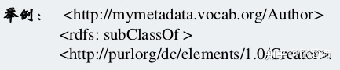

​        上述三元组表示用户自定义的元数据Author是Dublin Core的元数据Creator的子类。RDF Schema正是通过这样的方式来描述不同词汇集的元数据之间的关系,从而为网络上统一格式的元数据交换打下基础。

RDFS支持推理功能，如：

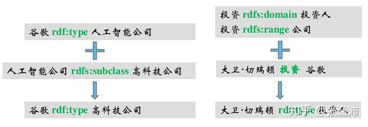

## OWL和OWL2

​         前面我们知道，通过RDF(S)可以表达一些简单的语义，但在更复杂的场景下，RDF(S)语义表达能力显得太弱，还缺少诸多常用的特征。包括对局部值域的属性定义，类、属性、个体的等价性，不相交类的定义，基数约束，关于属性特征的描述等。因此W3C提出了OWL语言扩展RDF(S)，作为语义网上表示本体的推荐语言。

## OWL

​        W3C于2002年7月31日发布了OWL Web本体语言(OWL Web Ontology  Language)工作草案的细节其目的是为了更好地开发语义网。OWL有三个子语言：OWL Lite、OWL DL、OWL  Full。下表给出OWL三个子语言的特征于区别：

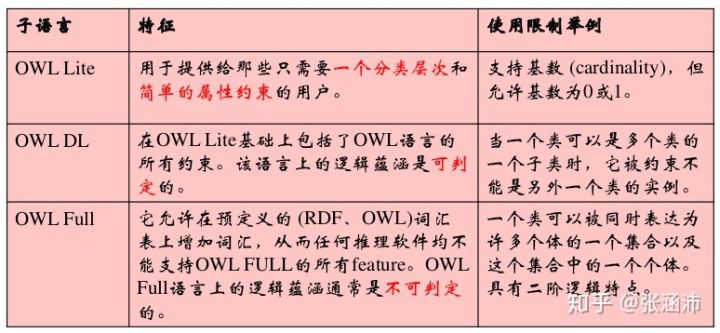

## OWL各语言如何选择

- 选择OWL Lite还是OWL DL主要取决于用户需要整个语言在多大程度上给出约束的可表达性;    
- 选择OWL DL还是OWL Full主要取决于用户在多大程度上需要RDF的元模型机制 (如定义类型的类型以及为类型赋予属性);    
- 在使用OWL Full而不是OWL DL时,推理的支持可能不能工作,因为目前还没有完全的支持OWL Full的系统实现。

​         综上所述，在要求简单是可采用OWL Lite，通常可采用OWL DL，对概念要求定义精确时采用OWL Full。(在Protege练习中感觉DL 和 Full区别并不明显)

## OWL与RDF的关系

- OWL Full可以看成是RDF的扩展;    
- OWL Lite和OWL Full可以看成是一个约束化的RDF的扩展;    
- 所有的OWL文档 (Lite,DL,Full)都是一个RDF文档;    
- 所有的RDF文档都是一个OWL Full文档;    
- 只有一些RDF文档是一个合法的OWL Lite和OWL DL文档。

​        上面说的很模糊，在Protege操作中，OWL给我的感觉就是在RDFS的基础上，添加了很多描述类别、属性之间关系的定义或约束。,如两个类是否不相交这样的类属性。

## OWL词汇扩展

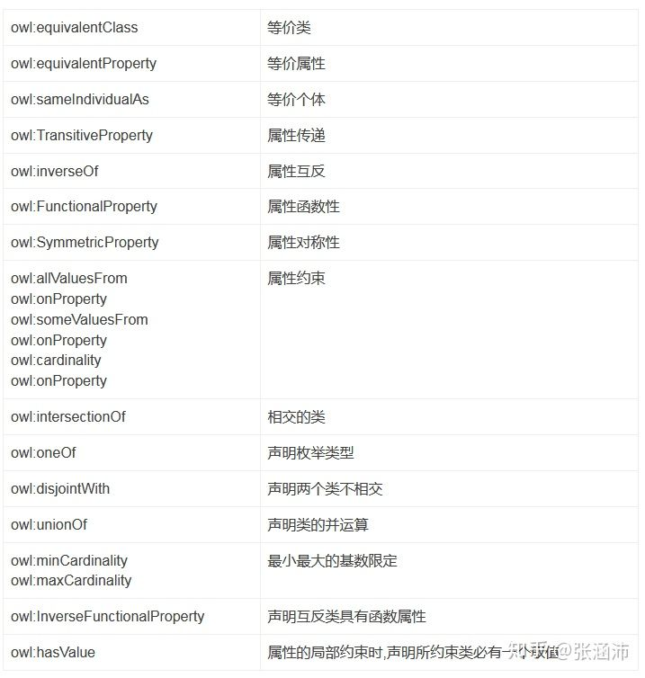

## OWL2

​        OWL2是OWL的最新版本，老的OWL也称为OWL1，OWL2定义了一些OWL的子语言,通过限制语法使用,使得这些子语言能够更方便地实现,以及服务于不同的应用;OWL2也有三大子语言：OWL2 RL，OWL2 QL， OWL2 EL；

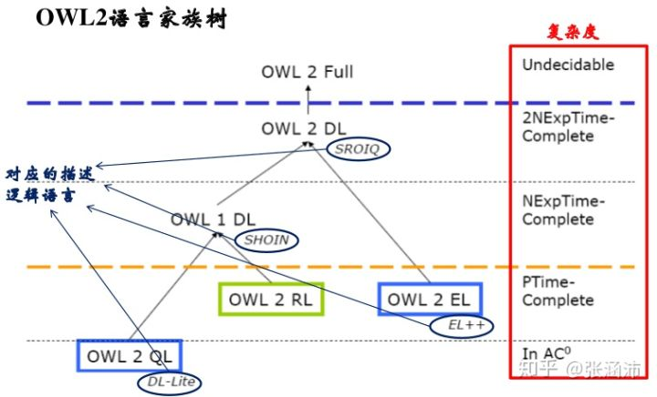

​        OWL2 QL适合概念多的情况，OWL2 EL适合实例较多的情况，如医学领域，OWL2 RL适合高效推理。

## OWL2 QL

QL代表query language的意思,专为基于本体的查询设计:  

\- OWL 2 QL的复杂度是AC 0 ,非常适合大规模处理;  

\- OWL 2的三大子语言中,QL最为简单;  

\- OWL 2 QL是基于描述逻辑语言DL-Lite定义的。

OWL2 QL允许的核心词汇为：

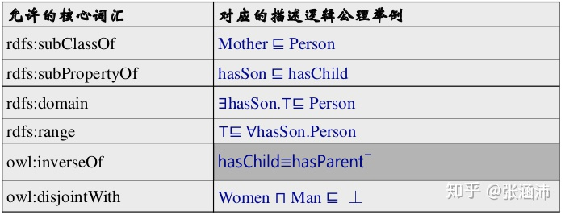

​        通过OWL 2 QL的语言限制,基于QL的本体查询可以优化到多项式对数时间复杂度。

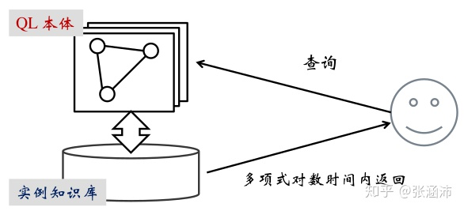

## OWL2 EL

OWL 2 EL专为概念术语描述,推理而设计:

- 在生物医疗领域广泛应用,如临床医疗术语本体SNOMED CT;    
- 复杂度是PTime-Complete；    
- OWL2 EL是基于描述逻辑语言EL++定义的；

它允许的核心词汇为:

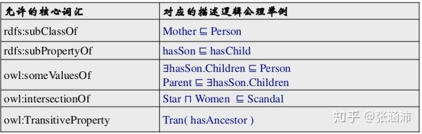

OWL2 EL允许表达复杂的概念，如

![[公式]](pelhans.assets/equation?tex=Female+%E2%8A%93+%E2%88%83likes.Movie+%E2%8A%93+%E2%88%83hasSon.(Student+%E2%8A%93+%E2%88%83attends.CSCourse+)) 

## OWL2 RL

OWL 2 RL在ter Horst的工作基础上延伸而来;  该工作的目的是将OWL词汇引入RDFS,使得RDFS在表达能力上丰富起来,同时保持计算复杂度在PTime级别。OWL 2  RL在RDFS的基础上引入属性的特殊特性 (函数性,互反性,对称性);允许声明等价性;允许属性的局部约束。OWL 2  RL与描述逻辑没有直接关系。

业界的一种观点是,OWL 2 RL是专为高效推理设计的本体语言(推理针对的是实例数据)。

OWL2 RL允许的核心词汇为：

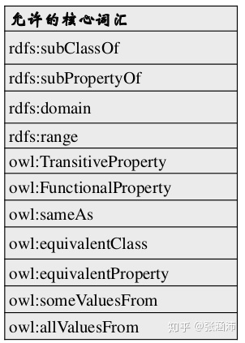

## OWL2的推理系统

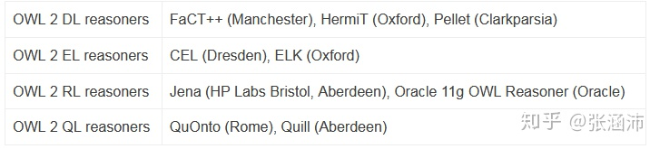

## SPARQL简介

​        SPARQL是RDF的查询语言，它基于RDF数据模型，可以对不同的数据集撰写复杂的连接，同时还被所有主流的图数据库支持。

​        SPARQL的查询结构如下图所示：

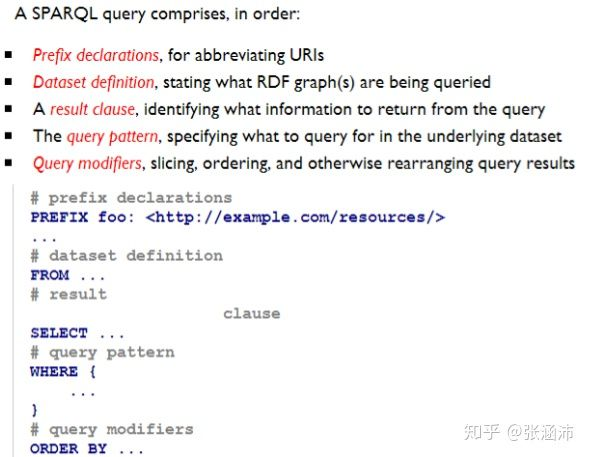

​        从语法上结构上来看，SPARQL和SQL语言还是有一定的相似性的。比较重要的区别有：

- 变量,RDF中的资源,以“?”或者“$”指示；    
- 三元组模板 (triple pattern), 在WHERE子句中列示关联的三元组模板,之所以称之为模板,因为三元组中允许变量;    
- SELECT子句中指示要查询的目标变量    

​        有关SPARQL的详细操作指令我打算在实战单开一个小结把重要操作演示一遍。这里仅给出一个小例子看操作是什么样子的：

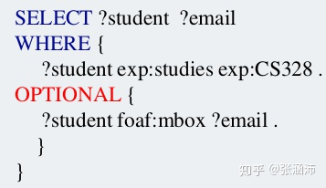

## JSON-LD

​        为了方便程序员阅读知识标识，出现了JSON-LD，JSON-LD是JavaScript Object Notation for  Linked Data的缩写,是一种基于JSON表示和传输互联数据 (Linked  Data)的方法。JSON-LD描述了如何通过JSON表示有向图,以及如何在一个文档中混合表示互联数据及非互联数据。JSON-LD的语法和JSON兼容。

​         JSON-LD呈现出语义网技术的风格,它们有着类似的目标:围绕某类知识提供共享的术语。例如,每个数据集不应该围绕“name”重复发明概念。JSON-LD 的 实 现 没 有 选 择 大 部 分 语 义 网 技 术 栈 (Turtle/SPARQL/Quad  Stores)而是以简单、不复杂以及面向一般开发人员的方式推进。下图给出JSON-LD事例，可以看出非常容易理解:

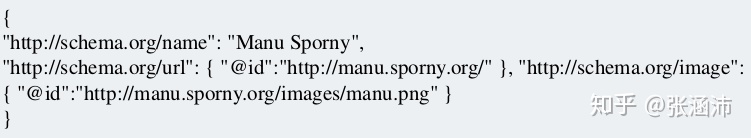

## RDFa

​        RDFa(Resource Description Framework in attributes)是网页标记语言，也是W3C推荐的标准，它**扩充了XHTML的几个属性**,网页制作者可以利用这些属性在网页中添加可供机器读取的资源。与RDF的对应关系使得RDFa可以将RDF的三元组嵌入在XHTML文档中,它也使得符合标准的使用端可以从RDFa文件中提取出这些RDF三元组来。**RDFa从机器可理解的层面优化搜索,提升访问性以及网页数据的关联性**。

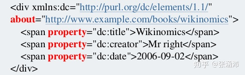

## HTML5 Microdata

​        Microdata微数据,是在网页标记标记语言嵌入机器可读的属性数据，微数据使用可以来自自定义词汇表、带作用域的键/值对给DOM做标记。用户可以自定义微数据词汇表,在自己的网页中嵌入自定义的属性。微数据是给那些已经在页面上可见的数据施加额外的语义。当HTML的词汇不够用时,使用微数据可以取得较好的效果。

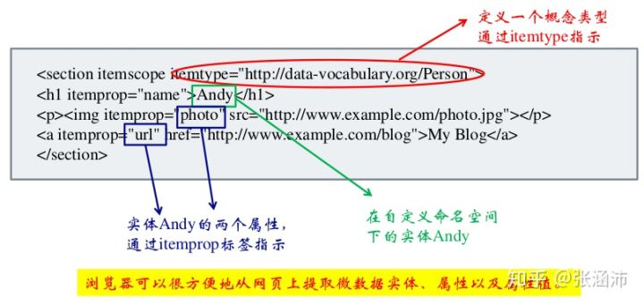

## Ref

[王昊奋知识图谱教程](https://link.zhihu.com/?target=http%3A//www.chinahadoop.cn/course/1048)


# (三)   知识抽取


欢迎大家关注我的博客 [http://pelhans.com/](https://link.zhihu.com/?target=http%3A//pelhans.com/) ，所有文章都会第一时间发布在那里哦~

------


> 本节介绍了针对结构化数据、非结构化数据、半结构化数据的知识抽取方法。

## 知识抽取的概念

​        知识抽取，即从不同来源、不同结构的数据中进行知识提取，形成知识(结构化数据)存入到知识图谱。大体的任务分类与对应技术如下图所示：

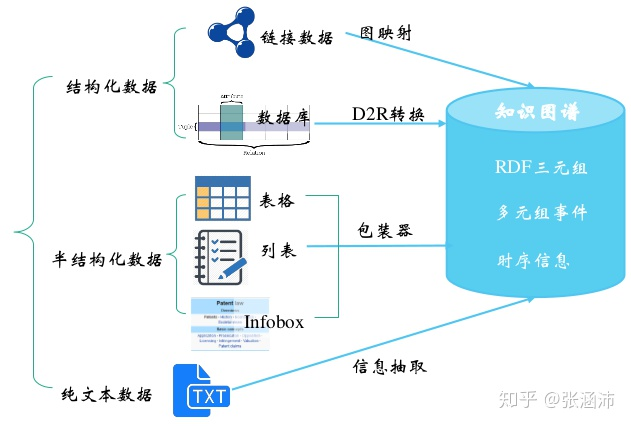

## 知识抽取的子任务

- 命名实体识别    

- - 检测: 北京是忙碌的城市。        [北京]： 实体
  - 分类：北京是忙碌的城市。        [北京]:  地名    

- 术语抽取  
  从语料中发现多个单词组成的相关术语。    

- 关系抽取  
  王思聪是万达集团董事长王健林的独子。 ![[公式]](pelhans.assets/equation-20200904171803869) [王健林] <父子关系> [王思聪]    

- 事件抽取  
  例如从一篇新闻报道中抽取出事件发生是触发词、时间、地点等信息，如图二所示。    

- 共指消解  
  弄清楚在一句话中的代词的指代对象。例子如图3所示。

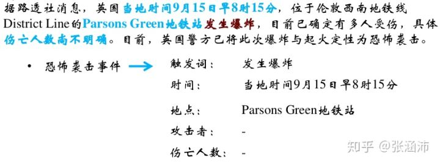

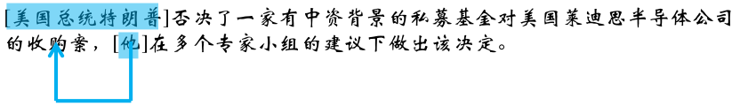图3

## 面向非结构化数据的知识抽取

## 实体抽取

​        实体抽取抽取文本中的原子信息元素，通常包含任命、组织/机构名、地理位置、时间/日期、字符值等标签，具体的标签定义可根据任务不同而调整。如：

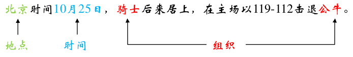

​        单纯的实体抽取可作为一个序列标注问题，因此可以使用机器学习中的HMM、CRF、神经网络等方法解决。

## 实体识别与链接

​       实体识别即识别出句子或文本中的实体，链接就是将该实体与知识库中的对应实体进行链接。其中涉及到了实体的识别与消岐技术。实体识别技术刚刚介绍过，下面把重点放在实体链接部分。

​        实体链接的流程如下图所示：

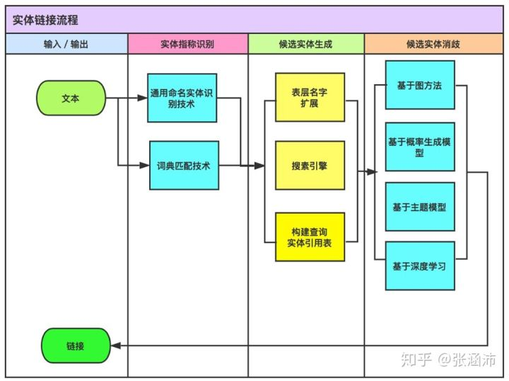

​         文字表述为，首先输入的是非结构化的文本数据，经由命名实体识别或词典匹配技术进行实体的指称识别。由于刚刚识别出来的实体可能是实体的部分表示或另类表示，因此需要结束表层名字扩展、搜索引擎、构建查询实体引用表等技术来对候选实体进行生成。经过该步骤生成的实体可能有多个候选项，因此需要对候选实体进行消岐，此处可使用基于图的方法、基于概率生成模型、基于主题模型或基于深度学习的方法。经过实体消岐后得到的唯一实体候选后就可以与知识库中的实体进行连接了。

​        举个例子：

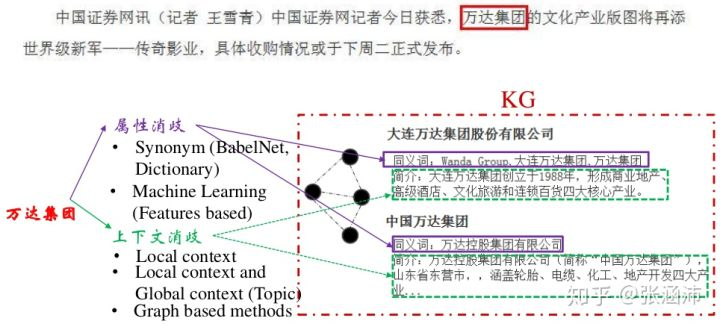

## 关系抽取

​        关系抽取是从文本中抽取出两个或多个实体之间的语义关系。它是信息抽取研究领域的任务之一。如:  
\- 王健林谈儿子王思聪:我期望他稳重一点。  
​    \- 父子 (王健林, 王思聪)

​        根据关系抽取方法的不同，可以将其分为:基于模板的方法(触发词的Pattern, 依存句法分析的Pattern)、基于监督学习的方法(机器学习方法)、弱监督学习的方法(远程监督、Bootstrapping)。

## 基于模板的方法

​         基于模板的方法在小规模数据集上容易实现且构建简单，缺点为难以维护、可移植性差、模板有可能需要专家构建。

## 基于触发词的Pattern

​        首先定义一套种子模板，如：

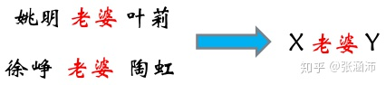

​        其中的触发词为老婆、妻子、配偶等。根据这些触发词找出夫妻关系这种关系，同时通过命名实体识别给出关系的参与方。

## 基于依存分析的Pattern

​        以动词为起点，构建规则，对节点上的词性和边上的依存关系进行限定。一般情况下是形容词+名字或动宾短语等情况，因此相当于以动词为中心结构做的Pattern。其执行流程为:

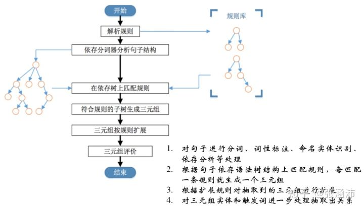

## 监督学习

​        在给定实体对的情况下，根据句子上下文对实体关系进行预测，执行流程为：

- 预先定义好关系的类别。    
- 人工标注一些数据。    
- 设计特征表示。    
- 选择一个分类方法。(SVM、NN、朴素贝叶斯)    
- 评估方法。

​        其优点为准确率高，标注的数据越多越准确。缺点为标注数据的成本太高，不能扩展新的关系。

## Pipeline训练

​        即识别实体和关系分类是完全分离的两个过程,不会相互影响,关系的识别依赖于实体识别的效果，这样的好处的各模型相互独立，设计上较为容易，但误差会逐层传递，步骤太多有可能导致后续不可用。

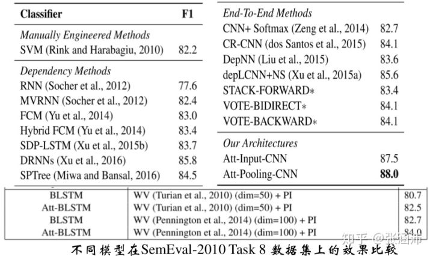

## 联合模型

​        将实体识别和关系分类一起做，在一个模型中完成。

## 半监督学习方法

​        前面的监督学习效果虽好，但有标注数据集的获取困难。因此可以借助半监督学习的方法，此处又分为远程监督学习和Bootstrapping方法两种。

​        所谓远程监督方法就是知识库与非结构化文本对齐来自动构建大量训练数据,减少模型对人工标注数据的依赖,增强模型跨领域适应能力。Bootstrapping是通过在文本中匹配实体对和表达关系短语模式,寻找和发现新的潜在关系三元组。

## 远程监督

​         该方法认为若两个实体如果在知识库中存在某种关系,则包含该两个实体的非结构化句子均能表示出这种关系。如在某知识库中存在“创始人(乔布斯，苹果公司)”。那么就认为出现乔布斯和苹果公司的句子就是表述创始人这项关系。因此可构建训练正例：乔布斯是苹果公司的联合创始人和CEO。

远程监督流程为：
\- 从知识库中抽取存在关系的实体对。  
\- 从非结构化文本中抽取含有实体对的句子作为训练样例。

​       远程监督可以利用丰富的知识库信息，减少一定的人工标注，但它的假设过于肯定，如乔布斯被赶出苹果公司。这句话表达的就不是创始人的例子，因此会引入大量的噪声，存在语义漂移现象。同时由于是在知识库中抽取存在的实体关系对，因此很难发现新的关系。

## Bootstrapping

​        这个方法在很多任务中都有提到，其执行流程为：

- 1.从文档中抽取出包含种子实体的新闻，如：

- - 姚明老婆 叶莉 简历身高曝光  
        X 老婆 Y 简历身高曝光
  - 姚明 与妻子 叶莉 外出赴约  
        X 与妻子 Y 外出赴约    

- 将抽取出的Pattern去文档集中匹配 

- - 小猪 与妻子 伊万 外出赴约

- 根据Pattern抽取出的新文档如种子库,迭代多轮直到不符合条件

​        该方法的优点为构建成本低，适合大规模的构建，同时还可以发现新的(隐含的)关系。缺点为对初始给定的种子集敏感，存在语义漂移现象，结果的准确率较低等。

## 事件抽取

从自然语言中抽取出用户感兴趣的事件信息,并以结构化的形式呈现出来,例如事件发生的时间、地点、发生原因、参与者等。如：

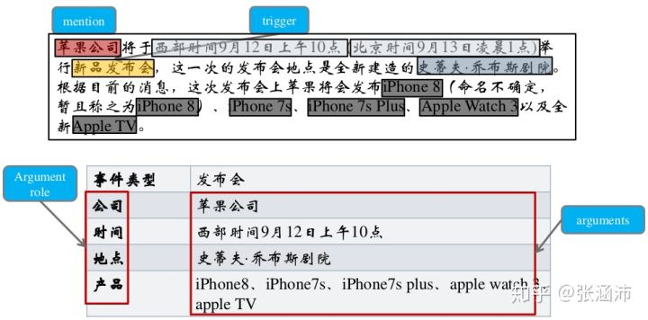

​        事件抽取任务最基础的部分包括：  
​            \- 识别事件触发词及事件类型  
​            \- 抽取事件元素同时判断其角色  
​            \- 抽出描述事件的词组或句子    

​        此外，事件抽取任务还包括：  
​            \- 事件属性标注  
​            \- 事件共指消解

对于事件抽取，也可分为Pipeline方法和联合训练的方法。

## 事件抽取的pipeline方法

​        有监督的事件抽取方法的标准流程一种pipeline的方法,将事件抽取任务转化为多阶段的分类问题,需要的分类器包括:  
\- 事件触发次分类器(Trigger Classifier)  
​    \- 用于判断词汇是否是是事件触发词,以及事件的类别  
\- 元素分类器(Argument Classifier)  
​    \- 判别词组是否是事件的元素  
\- 元素角色分类器(Role Classifier)  
​    \- 判定元素的角色类别  
\- 属性分类器(attribute classifier)  
​    \- 判定事件的属性  
\- 可报告性分类器(Reportable-Event Classifier)  
​    \- 判定是否存在值得报告的事件实例

​        可以看到，这个流程还是蛮长的，因此Pipeline存在的误差传递问题在这里格外严重，因此我们需要联合训练：

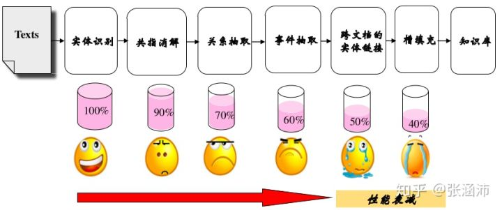

## 联合训练

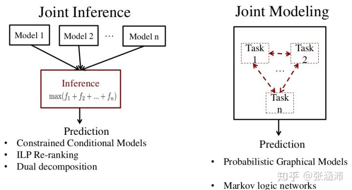

## 基于深度学习的事件抽取方法

​        传统的方法需要借助外部NLP工具，还需要人工设计特征，但深度学习可以自动提取句子特征，减少对外部NLP工具的依赖。

​        下图给出一个典型的基于动态多池化卷积神经网络的事件抽取方法：

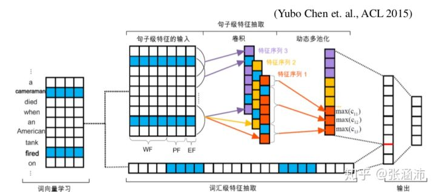

## 面向结构化数据的知识抽取

​         所谓结构化数据就是指类似于关系库中表格那种形式的数据，他们往往各项之间存在明确的关系名称和对应关系。因此我们可以简单的将其转化为RDF或其他形式的知识库内容。一种常用的W3C推荐的映射语言是R2RML(RDB2RDF)。一种映射结果如下图所示：

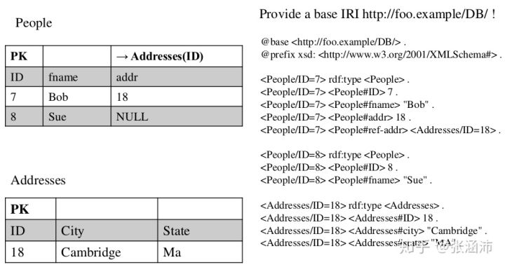

​        现有的工具免费的有D2R，Virtuoso、MOrph等。

## 面向半结构化数据的知识抽取

​        半结构化数据是指类似于百科、商品列表等那种本身存在一定结构但需要进一步提取整理的数据。

## 百科类知识抽取

​        对于百科类数据我们都较为熟悉，下图介绍怎么从百科里抽取知识：

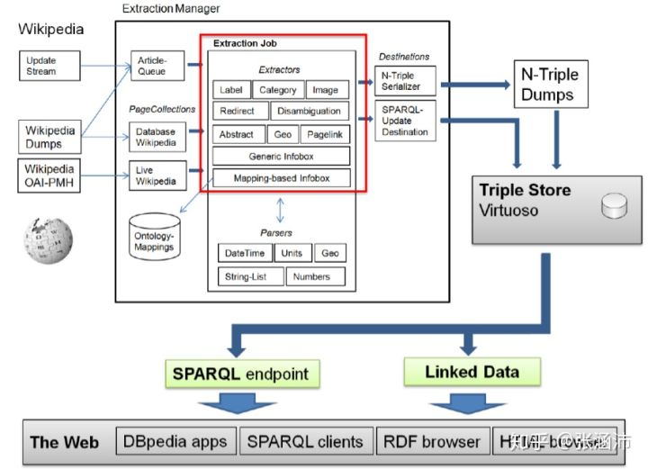

​        上图给出从百科里抽取知识的流程介绍。(**待补**)

## Web网页数据抽取：包装器生成

​        现在我们的目标网站是部分结构化的，如：

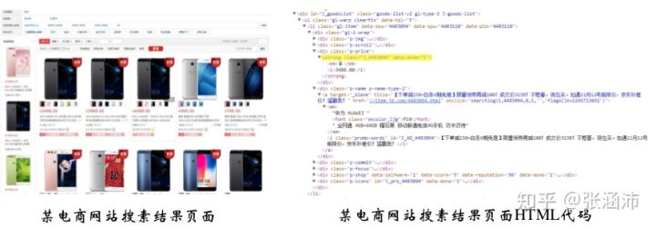

​        包装器是一个能够将数据从HTML网页中抽取出来,并且将它们还原为结构化的数据的软件程序。使用它提取信息流程为：

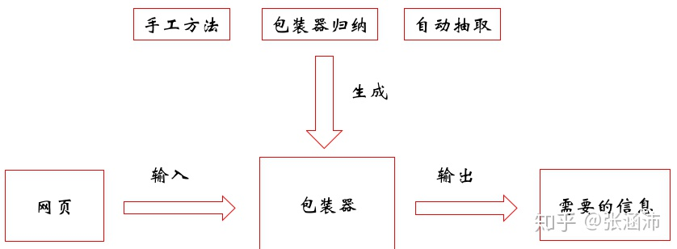

## 包装器归纳

​         对于一般的有规律的页面，我们可以使用正则表达式的方式写出XPath和CSS选择器表达式来提取网页中的元素。但这样的通用性很差，因此也可以通过包装器归纳这种基于有监督学习的方法,自动的从标注好的训练样例集合中学习数据抽取规则,用于从其他相同标记或相同网页模板抽取目标数据。其运行流程为：

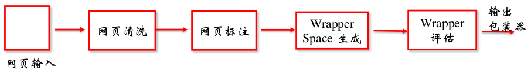

## 自动抽取

​         对于监督学习我们知道标注数据是它的短板，因此我们想到自动抽取的方法。网站中的数据通常是用很少的一些模板来编码的,通过挖掘多个数据记录中的重复模式来寻找这些模板是可能的。自动抽取的流程如图所示：

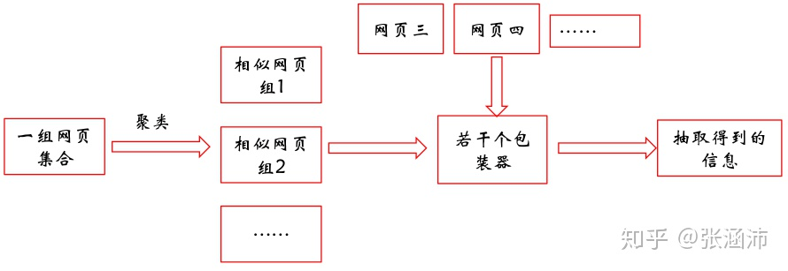

## Ref

[王昊奋知识图谱教程](https://link.zhihu.com/?target=http%3A//www.chinahadoop.cn/course/1048)

发布于 2018-07-07


#  (四)  知识挖掘


欢迎大家关注我的博客 [http://pelhans.com/](https://link.zhihu.com/?target=http%3A//pelhans.com/) ，所有文章都会第一时间发布在那里哦~

------


> 本节介绍了知识挖掘的相关技术，包含实体链接与消歧，知识规则挖掘，知识图谱表示学习。

## 知识挖掘

​         知识挖掘是指从数据中获取实体及新的实体链接和新的关联规则等信息。主要的技术包含实体的链接与消歧、知识规则挖掘、知识图谱表示学习等。其中实体链接与消歧为知识的内容挖掘，知识规则挖掘属于结构挖掘，表示学习则是将知识图谱映射到向量空间而后进行挖掘。

## 实体消歧与链接


​        实体链接的流程如上图所示，这张图在前一章出现过，那里对流程进行了简要说明。此处对该技术做进一步的说明。

## 示例一: 基于生成模型的 entity-mention 模型

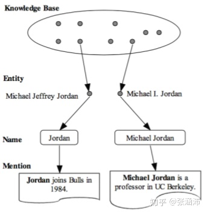

​        该模型的流程如上图所示，文字表述为: 我们有两个句子，其中的实体分别为 Jordan(左)和 Michael  Jordan(右)，我们称之为Mention。我们想要判断这两个Jordan指的到底是篮球大神还是ML大神？ 这个问题可以用公式表述为:

![[公式]](pelhans.assets/equation-20200904171935401) 

等价于:

![[公式]](pelhans.assets/equation-20200904171935442) 

​        其中P(e)表示该实体的活跃度，P(s|e) 来自前面流程图中的实体引用表,它表示s作为实体的毛文本出现的概率，s表示名字。P(c|e )表示的是翻译概率(?)。

简单来说就是根据mention所处的句子和上下文来判断该mention是某一实体的概率。

## 示例二: 构建实体关联图

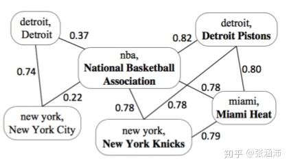

​        实体关联图由3个部分组成： *每个顶点* ![[公式]](pelhans.assets/equation-20200904171935451) *由mention-entity构成。* 

- 每个顶点得分：代表实体指称mi的目标实体为ei概率可能性大小。
- 每条边的权重：代表语义关系计算值，表明顶点Vi和Vj的关联程度。

​        其示例如上图所示，其流程包括：顶点的得分初始化方法、边权初始化方法和基于图的标签传播算法。

## 顶点的初始化

- 若顶点V实体不存在歧义，则顶点得分设置为1；    
- 若顶点中mention和entity 满足 ![[公式]](pelhans.assets/equation?tex=p(e%7Cm)%5Cle+0.95) , 则顶点得分也设置为1.    
- 其余顶点的得分设置为 ![[公式]](pelhans.assets/equation-20200904171935508) ;

## 边的初始化 : 深度语义关系模型

​        其大体流程如下图所示：

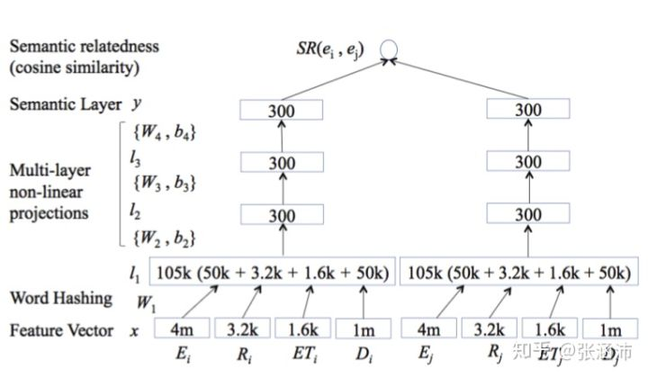

​       其中E 表示实体， R表示关系， ET表示实体类型，D表示词。它做的是将这些东西映射到非常稀疏的空间内，而后通过深度学习进行特征提取和标注，最终给出每对实体见的分值。

## 基于图的标签传播算法

​       初始时，数据中的标签如左侧表格所示

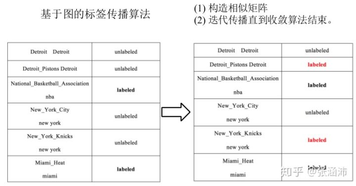

其中标签数据为无歧义的entity-mention，基于此数据，我们采用基于图的标签传播算法，先构造一个相似度矩阵，而后采用图的regulartion，直到最终标签确定。有点类似于协同消歧的作用。

## 示例三：基于知识库

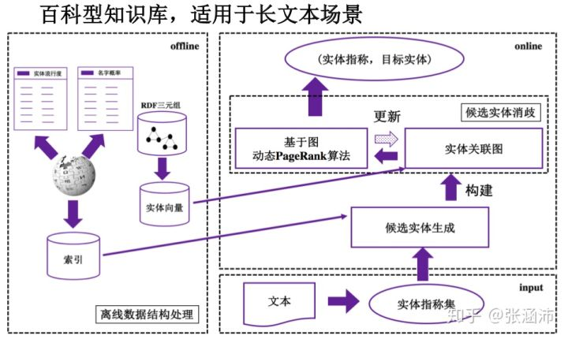

其流程图如上图所示：

- *首先我们有一个知识库，我们经由深度学习算法，将RDF三元组转化为实体向量。* 
- 有了向量之后，我们就可以计算实体向量间的相似度。  
- *基于相似度构建实体关联图。*
- 基于PageRank算法更新实体关联图。

下面对其中重要的部分做讲解。

## 基于向量相似度的实体关联图的构建

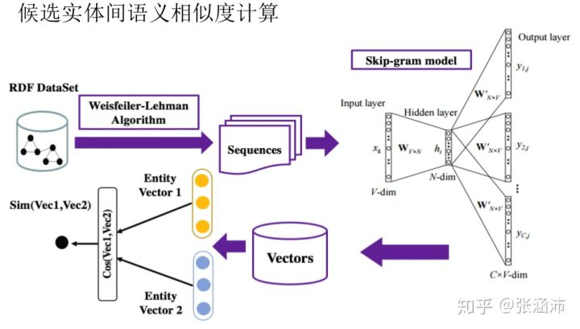

​        上图给出RDF三元组如何生成实体向量并计算实体向量间的相似度。对于相似度的度量可以采用cos函数等方式。即：

![[公式]](pelhans.assets/equation-20200904171935468) 

​        由此我们定义候选实体间的转化概率：

![[公式]](pelhans.assets/equation-20200904171935458) 

​         其中分母为该顶点的出度向量相似度求和。

## 基于PageRank得分

​        首先根据PageRank算法计算未消歧实体指称实体的得分，取得分最高的未消歧实体。而后删除其他候选实体及相关的边，更新图中的边权值。

​         其流程如下图所示：

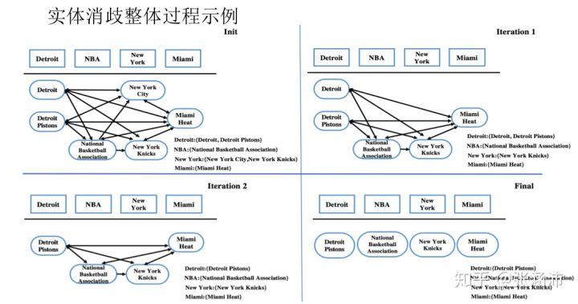

## 知识图谱表示学习(TranSE)

表示学习即将三元组即各种关系映射成向量进行处理。

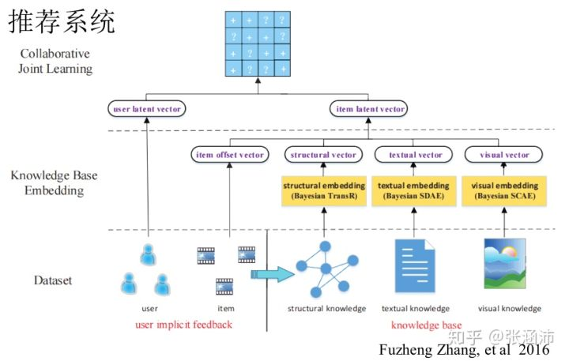

​        一个典型的系统如上图所示，它将结构知识、文本知识和视觉知识结合进行输入得到一个综合的向量，而后将其与用户的行为向量进行匹配来完成推荐功能。

## PRA 与 TranSE的结合

​        表示学习无法处理一对多、多对一和多对多问题，同事可解释性不强。PRA难以处理稀疏关系、路径特征提取效率不高。因此两类方法之间存在互补性。因此提出了路径的表示学习等方法。

## Ref

[王昊奋知识图谱教程](https://link.zhihu.com/?target=http%3A//www.chinahadoop.cn/course/1048)


# (五)  知识存储


欢迎大家关注我的博客 [http://pelhans.com/](https://link.zhihu.com/?target=http%3A//pelhans.com/) ，所有文章都会第一时间发布在那里哦~

------

> 知识存储，即获取到的三元组和schema如何存储在计算机中。本节从以Jena为例，对知识在数据库中的导入、存储、查询、更新做一个简要的介绍，而后对主流的图数据库进行介绍。

## 图数据库简介

​       图数据库源起欧拉和图理论(graph theory),也称为面向/基于图的数据库，对应的英文是Graph  Database。图数据库的基本含义是以“图”这种数据结构存储和查询数据。它的数据模型主要是以节点和关系(边)来体现，也可以处理键值对。它的优点是快速解决复杂的关系问题。

## Apache Jena

​        Jena 是一个免费开源的支持构建语义网络和数据连接应用的Java框架。下图为Jena的框架：

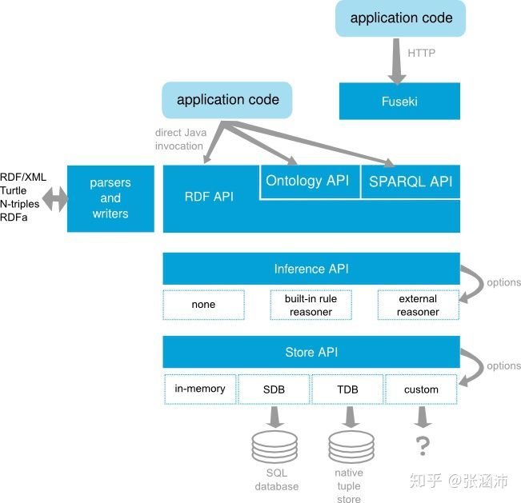

​        其中，最底层的是数据库，包含SQL数据库和原生数据库，其中SDB用来导入SQL数据库，  TDB导入RDF三元组。数据库之上的是内建的和外联的推理接口。在往上的就是SPARQL查询接口了。通过直接使用SPARQL语言或通过REfO等模块转换成SPARQL语言进行查询。

​        在上方我们看到有一个Fuseki模块，它相当于一个服务器端，我们的操作就是在它提供的端口上进行的。

## 数据的导入

​        数据导入分为两种方式，第一种是通过Fuseki的手动导入，第二种是通过TDB进行导入,对应的命令如下:

```text
/jena-fuseki/tdbloader --loc=/jena-fuseki/data filename
```

​         数据导入后就可以启动Fuseki了，对应的命令如下:

```text
/jena-fuseki/fuseki-server --loc=/jena-fuseki/data --update /music
```

## 查询

​        查询也有两种方式，第一种就是简单直接的通过Fuseki界面查询，另一种就是使用endpoint接口查询。

## Endpoint接口查询

endpoint的SPARQL 查询网址为: http://localhost:3030/music/query;  

更新网址为：http://localhost:3030/music/update .

## 查询举例

- 首先是最简单的单个语句查询,意在查询某一歌手所唱的所有歌曲：

```text
SELECT DISTINCT ?trackID
WHERE {
    ?trackID track_artist artistID

}
```

可以看出查询语句整体和SQL很像的，下面多举几个例子。

- 查询某一位歌手所有歌曲的歌曲名:

```text
SELECT ?name
WHERE {
    ?trackID track_artist artistID .
    ?trackID track_name ?name

}
```

- 使用CONCAT关键字进行连接，它的效果是在查询结果前增加一列叫专辑信息，它的结果以专辑名+ : + 查询结果组成：

```text
SELECT ?歌曲id ?专辑id (CONCAT("专辑
                                   名",":",?专辑名) AS ?专辑信息)
WHERE {
    ?歌曲id track_name track_name .
    ?歌曲id track_album ?专辑id .
    ?专辑id album_name ?专辑名

}"))
```

- 其余还有LIMIT 关键字限制查询结果的条数

```text
SELECT ?trackID
WHERE {
    ?albumID
    album_name album_name .
    ?trackID
    track_album ?albumID

}
LIMIT 2
```

- 使用COUNT进行计数；

```text
SELECT (COUNT(?trackID) AS ?num)
WHERE {
    ?albumID album_name album_name .
    ?trackID track_album ?albumID

}
```

- 使用DISTINCT去重；

```text
SELECT DISTINCT ?tag_name
WHERE {
    ?trackID track_artist artistID .
    ?trackID track_tag ?tag_name

}
```

- ORDER BY排序；

```text
SELECT DISTINCT ?tag_name
WHERE {
    ?trackID track_artist artistID .
    ?trackID track_tag ?tag_name

}
ORDER BY DESC(?tag_name)
```

- UNION进行联合查询

```text
SELECT (COUNT(?trackID ) AS ?num)
WHERE {
    {
        ?trackID track_tag tag_name .

    }
    UNION
    {
        ?trackID track_tag tag_name2 .
    }
}
```

- 使用FILTER对结果进行过滤

```text
SELECT (count(?trackID ) as ?num)
WHERE {
    ?trackID track_tag ?trag_name
    FILTER (?tag_name = tag_name1 ||
           ?tag_name = tag_name2)

}
```

- ASK来询问是否存在,回答结果只有True或False

```text
ASK
{
    ?trackID track_name ?track_name .
    FILTER regex(?track_name,‖xx‖)

}
```

## 更新举例

在更新时要更换端口地址为: http://localhost:3030/music/update

- 使用INSERT DATA操作，对数据的属性和事例进行添加

```text
INSERT DATA
{
    artistID artist_name artist_name .
}
```

- 使用WHERE定位，DELETE删除事例

```text
DELETE
{
    artistID artist_name ?x .
}
WHERE
{
    artistID artist_name ?x .
}
```

对于更多的SPARQL用法请参见[官方文档](https://link.zhihu.com/?target=https%3A//www.w3.org/TR/2013/REC-sparql11-query-20130321/)

## 通过SPARQLWrapper 包查询和更新

​         首先通过pip安装SPARQLWrapper，而后就可以通过下图所示的方式进行查询了。具体的查询语句与端口的一样，此处不再赘述。

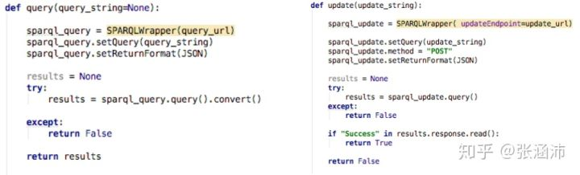

## 图数据库介绍

​         图数据库很多，其中开源的如RDF4j、gStore等。商业数据库如Virtuoso、AllegroGraph、Stardog等。原生图数据库如Neo4j、OrientDB、Titan等，涉及内容较广，我也是刚刚入门，不足以从大体上介绍，因此只对我打算用的几个图数据库进行简单介绍，其余的可以自己查阅文档了解。

​        图数据库的分类与发展如下图所示：

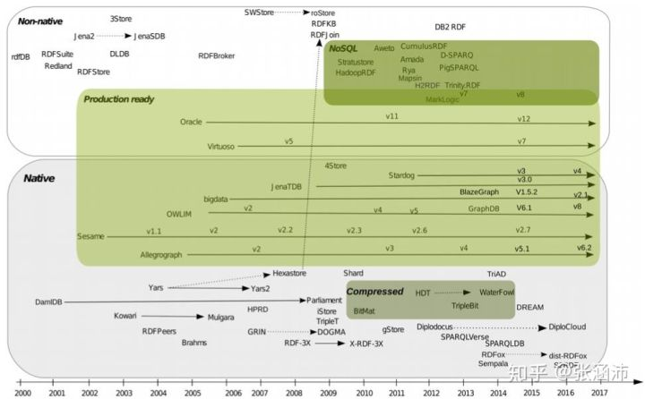

## 开源图数据库

## [RDF4j](https://link.zhihu.com/?target=http%3A//docs.rdf4j.org/migration/)

​        它是处理RDF数据的Java框架，使用简单可用的API来实现RDF存储。支持SPARQL 查询和两种RDF存储机制，支持所有主流的RDF格式。

## [gStore](https://link.zhihu.com/?target=http%3A//www.gstore-pku.com/)

​        gStore从图数据库角度存储和检索RDF知识图谱数据， gStore支持W3C定义的SPARQL  1.1标准,包括含有Union,OPTIONAL,FILTER和聚集函数的查询;gStore支持有效的增删改操作。  gStore单机可以支持1Billion(十亿)三元组规模的RDF知识图谱的数据管理任务。

## 商业图数据库介绍

## [Virtuoso](https://link.zhihu.com/?target=http%3A//virtuoso.openlinksw.com/)

​         智能数据， 可视化与整合。可扩展和高性能数据管理，支持Web扩展和安全

## [Allgrograph](https://link.zhihu.com/?target=http%3A//www.franz.com/agraph/allegrograph)

​        AllegroGraph是一个现代的高性能的，支持永久存储的图数据库。它基于Restful接入支持多语言编程。具有强大的加载速度、查询速度和高性能。

## 原生图数据库

## Neo4j

​        Neo4j是一个高性能的,NOSQL图形数据库，它将结构化数据存储在网络上而不是表中。它是一个嵌入式的、基于磁盘的、具备完全的事务特性的Java持久化引擎，但是它将结构化数据存储在网络(从数学角度叫做图)上而不是表中。Neo4j也可以被看作是一个高性能的图引擎，该引擎具有成熟数据库的所有特性。内置Cypher 查询语言。

​        Neo4j具有以下特性：

- 图数据库 + Lucene索引    
- 支持图属性    
- 支持ACID    
- 高可用性    
- 支持320亿的结点,320亿的关系结点,640亿的属性

Neo4j的优点为：  

- 高连通数据
- 推荐
- 路径查找
- A*算法
- 数据优先

## Ref

[王昊奋知识图谱教程](https://link.zhihu.com/?target=http%3A//www.chinahadoop.cn/course/1048)

编辑于 2018-07-07


#  (六)  知识融合

欢迎大家关注我的博客 [http://pelhans.com/](https://link.zhihu.com/?target=http%3A//pelhans.com/) ，所有文章都会第一时间发布在那里哦~

------


> 本节主要介绍知识融合相关技术，首先介绍了什么是知识融合，其次对知识融合技术的流程做一个介绍并对知识融合常用工具做一个简单介绍。

## 知识融合简介

​        知识融合，即合并两个知识图谱(本体)，基本的问题都是研究怎样将来自多个来源的关于同一个实体或概念的描述信息融合起来。需要确认的是：  

***  **等价实例  
 \*** 等价类/子类  
 \* 等价属性/子属性    

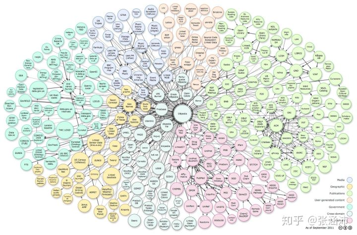

​        一个例子如上图所示，图中不同颜色的圆圈代表不同的知识图谱来源，其中在[http://dbpedia.org](https://link.zhihu.com/?target=http%3A//dbpedia.org)中的Rome 和[http://geoname.org](https://link.zhihu.com/?target=http%3A//geoname.org)的roma是同一实体，通过两个sameAs链接。不同知识图谱间的实体对齐是KG融合的主要工作。

​        除了实体对齐外，还有概念层的知识融合、跨语言的知识融合等工作。

​        这里值得一提的是，在不同文献中，知识融合有不同的叫法，如本体对齐、本体匹配、Record Linkage、Entity Resolution、实体对齐等叫法，但它们的本质工作是一样的。

​        知识融合的主要技术挑战为两点:  

- *数据质量的挑战： 如命名模糊，数据输入错误、数据丢失、数据格式不一致、缩写等。*
- 数据规模的挑战： 数据量大(并行计算)、数据种类多样性、不再仅仅通过名字匹配、多种关系、更多链接等。

## 知识融合的基本技术流程

​        知识融合一般分为两步,本体对齐和实体匹配两种的基本流程相似,如下:

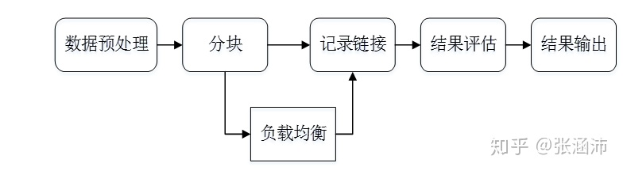

## 数据预处理

​        数据预处理阶段，原始数据的质量会直接影响到最终链接的结果，不同的数据集对同一实体的描述方式往往是不相同的，对这些数据进行归一化是提高后续链接精确度的重要步骤。

常用的数据预处理有： 

- *语法正规化：*  

​    ** 语法匹配： 如联系电话的表示方法*  

​    ** 综合属性： 如家庭地址的表达方式*  

数据正规化：  

​    \* 移除空格、《》、“”、-等符号  

​    \* 输入错误类的拓扑错误  

​    \* 用正式名字替换昵称和缩写等

## 记录连接

​       假设两个实体的记录x 和y， x和y在第i个属性上的值是 ![[公式]](pelhans.assets/equation-20200904172032227) , 那么通过如下两步进行记录连接：

- 属性相似度： 综合单个属性相似度得到属性相似度向量:  
   ![[公式]](pelhans.assets/equation-20200904172032244) 
- 实体相似度： 根据属性相似度向量得到一个实体的相似度。

## 属性相似度的计算

​       属性相似度的计算有多种方法，常用的有编辑距离、集合相似度计算、基于向量的相似度计算等。

- 编辑距离： Levenstein、 Wagner and Fisher、 Edit Distance with Afine Gaps    
- 集合相似度计算： Jaccard系数， Dice    
- 基于向量的相似度计算： Cosine相似度、TFIDF相似度    
- ......

## 编辑距离计算属性相似度

## Levenshtein Distance

​        Levenshtein 距离，即最小编辑距离，目的是用最少的编辑操作将一个字符串转换成另一个.举个例子,计算Lvensshtain 与 Levenshtein 间的编辑距离:

![[公式]](pelhans.assets/equation-20200904172032226) 

 ![[公式]](pelhans.assets/equation-20200904172032232) 

 ![[公式]](pelhans.assets/equation-20200904172032227-9211232.) 

上述讲 Lvensshtain转换为Levenshtein ，总共操作3次，编辑距离也就是3。

Levenstein Distance 是典型的动态规划问题，可以通过动态规划算法计算，具体公式如下：

![[公式]](pelhans.assets/equation?tex=%5Cleft%5C%7B+%5Cbegin%7Baligned%7D+D(0%252C+0)+%2526+%253D+%2526+0+%2526+/+D(i%252C+0)+%2526+%253D+%2526+D(i-1%252C+0)+%252B+1+%2526+~~~1+%3C+i+%5Cle+N+/+D(0%252C+j)+%2526+%253D+%2526+D(0%252C+j-1)+%252B+1+%2526+~~~+1+%3C+j+%5Cle+M+%5Cend%7Baligned%7D+%5Cright.) 

![[公式]](pelhans.assets/equation?tex=D(i%252C+j)+%253D+min%5Cleft%5C%7B+%5Cbegin%7Baligned%7D+D(i-1%252C+j)+%252B+1+/+D(i%252C+j-1)+%252B+1+/+D(i-1.+j-1)+%252B+1+%5Cend%7Baligned%7D+%5Cright.) 

​         其中， +1 表示的是插入，删除和替换操作的代价。

## Wagner and Fisher Distance

它是Levenshtein距离的一个扩展，将这个模型中的编辑操作的代价赋予了不同的权重，如下：

![[公式]](pelhans.assets/equation?tex=%5Cleft%5C%7B+%5Cbegin%7Baligned%7D+D(0%252C+0)+%2526+%253D+%2526+0+%2526+/+D(i%252C+0)+%2526+%253D+%2526+D(i-1%252C+0)+%252B+del%5Bx(i)%5D+%2526+~~~1+%3C+i+%5Cle+N+/+D(0%252C+j)+%2526+%253D+%2526+D(0%252C+j-1)+%252B+del%5By(j)%5D+%2526+~~~+1+%3C+j+%5Cle+M+%5Cend%7Baligned%7D+%5Cright.) 

![[公式]](pelhans.assets/equation?tex=D(i%252C+j)+%253D+min%5Cleft%5C%7B+%5Cbegin%7Baligned%7D+D(i-1%252C+j)+%252B+del%5Bx(i)%5D+/+D(i%252C+j-1)+%252B+ins%5By(j)%5D+/+D(i-1.+j-1)+%252B+sun%5Bx(i)%252C+y(j)%5D+%5Cend%7Baligned%7D+%5Cright.) 

其中del、ins和sub分别是删除、插入和替换的代价。

## Edit Distance with affine gaps

​        在上面的两种算法基础上，引入了gap的概念，将上述的插入、删除和替换操作用gap opening 和gap extension代替，编辑操作的代价也就表示为：

![[公式]](pelhans.assets/equation-20200904172032288) 

​        其中s 是open extension的代价， e是extend gap的代价，l是gap的长度。如计算 Lvensshtain 与  Levenshtein间的距离，首先将两个单词首尾对齐，将对应缺少的部分视为gap，如下图中上面和下面单词相比少了第一个e和倒数第三个的e，这是两个gap。下面的单词与上面的比则少了一个s和a，这又是两个gap。加一起一共4个gap，每个长度为1.因此编辑距离为:

![[公式]](pelhans.assets/equation-20200904172032294) 

## 集合相似度计算属性相似度

## Dice系数

​        Dice系数用于度量两个集合的相似性，因为可以把字符串理解为一种集合，因此Dice距离也会用于度量字符串的相似性，Dice系数定义如下：

![[公式]](pelhans.assets/equation-20200904172032278) 

以Lvensshtain 和 Levenshtein为例，两者的相似度为 2 * 9 / (11+11) = 0.82。

## Jaccard系数

Jaccard 系数适合处理短文本的相似度，定义如下：

![[公式]](pelhans.assets/equation-20200904172032313) 

可以看出与Dice系数的定义比较相似。两种方法,将文本转换为集合,除了可以用符号分格单词外,还可以考虑用n-gram分割单词,用n-gram分割句子等来构建集合,计算相似度。

## TF-IDF 基于向量的相似度

TF-IDF主要用来评估某个字或者用某个词对一个文档的重要程度。其中:

![[公式]](pelhans.assets/equation-20200904172032312) 

![[公式]](pelhans.assets/equation-20200904172032308) 

举个例子，比如某个语料库中有5万篇文章,含有“健康”的有2万篇,现有一篇文章,共1000个词,‘健康’出现30次,则sim TF-IDF = 30/1000 * log(50000/(20000+1)) = 0.012。

## 实体相似度的计算

计算实体相似度可从三大方面入手，即聚合、聚类和表示学习。其中： 


- *聚合：加权平均、手动制定规则、分类器*
- 聚类：层次聚类、相关性聚类、Canopy + K-means
- 表示学习

下面对其进行一一详解。

## 聚合

​      加权平均方法，即对相似度得分向量的各个分量进行加权求和，得到最终的实体相似度：

![[公式]](pelhans.assets/equation-20200904172032325) 

​        手动制定规则就是给每一个相似度向量的分量设置一个阈值，若超过该阈值则将两实体相连:

![[公式]](pelhans.assets/equation-20200904172032335) 

​        对于分类器等机器学习方法，最大的问题是如何生成训练集合，对于此可采用无监督/半监督训练，如EM、生成模型等。或主动学习如众包等方案。

## 聚类

​        聚类又可分为层次聚类、相关性聚类、Canopy + K-means等。

## 层次聚类

​        层次聚类 (Hierarchical Clustering) 通过计算不同类别数据点之间的相似度对在不同的层次的数据进行划分,最终形成树状的聚类结构。

​        底层的原始数据可以通过相似度函数计算，类之间的相似度有如下三种算法：

- SL(Single Linkage)算法： SL算法又称为最邻近算法 (nearest-neighbor),是用两个类数据点中距离最近的两个数据点间的相似度作为这两个类的距离。    
- CL (Complete Linkage)算法: 与SL不同的是取两个类中距离最远的两个点的相似度作为两个类的相似度。    
- AL (Average Linkage) 算法: 用两个类中所有点之间相似度的均值作为类间相似度。

​        举个例子， 有下图的数据，用欧氏距离和SL进行层次聚类。

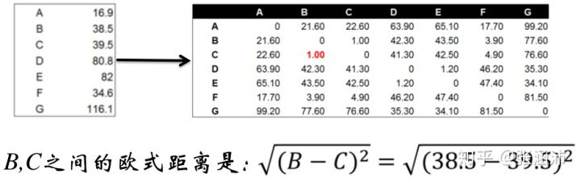


​         这样结果就变成：

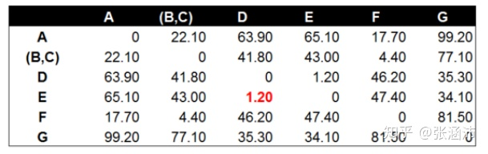

​        如此往复就得到最终的分类表:

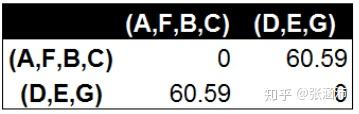

## 相关性聚类

![[公式]](pelhans.assets/equation-20200904172032342) 表示x,y被分配在同一类中, ![[公式]](pelhans.assets/equation-20200904172032351) 代表x,y是同一类的概率 (x,y之间的相似度), ![[公式]](pelhans.assets/equation-20200904172032352) 和 ![[公式]](pelhans.assets/equation-20200904172032356) 分别是切断x,y之间的边的代价和保留边的代价。相关性聚类的目标就是使用最小的代价找到一个聚类方案。

![[公式]](pelhans.assets/equation-20200904172032373) 

​        是一个NP-Hard问题，可用贪婪算法近似求解。

## Canopy + K-means

​        与K-means不同,Canopy聚类最大的特点是不需要事先指定k值 (即clustering的个数),因此具有很大的实际应用价值,经常将Canopy和K-means配合使用。

用图形表达流程如下图所示：

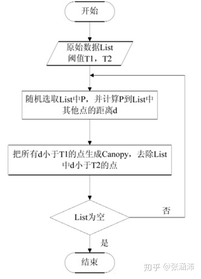

​         文字表述为：初始时有一个大的list，其中list中每个点都是一个canopy，设置阈值T1，T2。随机玄奇List中的点P，并计算list中其他的点到点P的距离d，把所有距离d小于T1的点生成Canopy，去除list中d小于T2的点。如此往复这个过程就得到了聚类结果。生成Canopy的过程就像以T2为中心扣下来一块，然后剩下的环就是Canopy。这样一块一块的扣就知道最终list为空。

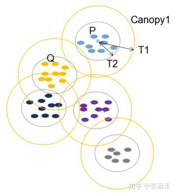

## 知识表示学习--知识嵌入

​        将知识图谱中的实体和关系都映射低维空间向量,直接用数学表达式来计算各个实体之间相似度。这类方法不依赖任何的文本信息,获取到的都是数据的深度特征。

​        将两个知识图谱映射到同一空间的方法有很多种，它们的桥梁是预连接实体对(训练数据),具体可以看详细论文。

​        完成映射后如何进行实体链接呢？KG向量训练达到稳定状态之后,对于KG1每一个没有找到链接的实体,在KG2中找到与之距离最近的实体向量进行链接,距离计算方法可采用任何向量之间的距离计算,例如欧式距离或Cosine距离。

## 分块

​        分块 (Blocking)是从给定的知识库中的所有实体对中,选出潜在匹配的记录对作为候选项,并将候选项的大小尽可能的缩小。这么做的原因很简单，因为数据太多了。。。我们不可能去一一连接。

​        常用的分块方法有基于Hash函数的分块、邻近分块等。

​        首先介绍基于Hash函数的分块。对于记录x,有 ![[公式]](pelhans.assets/equation-20200904172032377) ,则x映射到与关键字 ![[公式]](pelhans.assets/equation-20200904172032397) 绑定的块 ![[公式]](pelhans.assets/equation-20200904172032391) 上。常见的Hash函数有：  


- *字符串的前n个字*
- n-grams
- 结合多个简单的hash函数等

邻近分块算法包含Canopy聚类、排序邻居算法、Red-Blue Set Cover等。

## 负载均衡

​        负载均衡 (Load Balance)来保证所有块中的实体数目相当,从而保证分块对性能的提升程度。最简单的方法是多次Map-Reduce操作。

## 典型知识融合工具简介

## 本体对齐-[Falcon-AO](https://link.zhihu.com/?target=http%3A//ws.nju.edu.cn/falcon-ao/)

​        Falcon-AO是一个自动的本体匹配系统,已经成为RDF(S)和OWL所表达的Web本体相匹配的一种实用和流行的选择。编程语言为Java。其结构如下图所示：

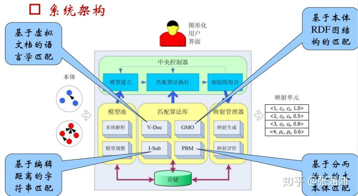


​        此处主要介绍它的匹配算法库，其余部分可查看官方文档。

​         匹配算法库包含V-Doc、I-sub、GMO、PBM四个算法。其中V-Doc即基于虚拟文档的语言学匹配，它是将实体及其周围的实体、名词、文本等信息作一个集合形成虚拟文档的形式。这样我们就可以用TD-IDF等算法进行操作。I-Sub是基于编辑距离的字符串匹配，这个前面我们有详细介绍。可以看出，I-Sub和V-Doc都是基于字符串或文本级别的处理。更进一步的就有了GMO，它是对RDF本体的图结构上做的匹配。PBM则基于分而治之的思想做。

​        计算相似度的组合策略如下图所示:

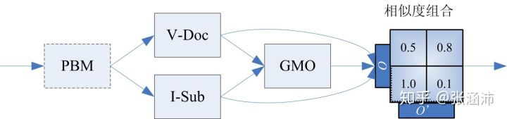


​        首先经由PBM进行分而治之，后进入到V-Doc和 I-Sub ，GMO接收两者的输出做进一步处理，GMO的输出连同V-Doc和I-Sub的输出经由最终的贪心算法进行选取。

## Limes 实体匹配

​      Limes是一个基于度量空间的实体匹配发现框架,适合于大规模数据链接,编程语言是Java。其整体框架如下图所示：

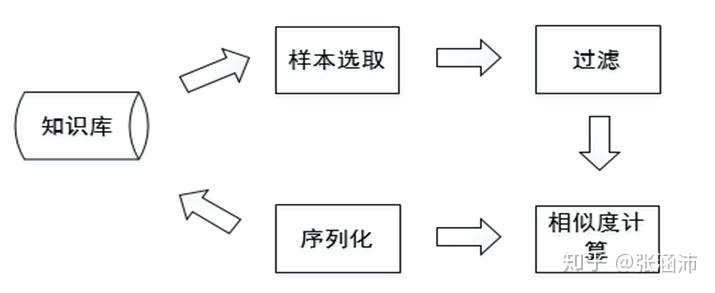

​      该整体流程用文字表述为：

- 给定源数据集S,目标数据集T,阈值 ![[公式]](pelhans.assets/equation-20200904172032389) ；   
- 样本选取: 从T中选取样本点E来代表T中数据，所谓样本点,也就是能代表距离空间的点。应该在距离空间上均匀分布,各个样本之间距离尽可能大。；    
- 过滤: 计算 ![[公式]](pelhans.assets/equation-20200904172032396) 与 ![[公式]](pelhans.assets/equation-20200904172032415) 之间的距离m(s, e),利用三角不等式进行过滤；    
- 相似度计算: 同上;    
- 序列化: 存储为用户指定格式;

## 三角不等式过滤

给定 (A,m),m是度量标准,相当于相似性函数,A中的点x,y和z相当于三条记录,根据三角不等式有:

![[公式]](pelhans.assets/equation-20200904172032428) 

上式通过推理可以得到:

![[公式]](pelhans.assets/equation-20200904172032430) 

上式中y相当于样本点。因为样本点E的数量是远小于目标数据集T的数量,所以过滤这一步会急剧减少后续相似性比较的次数,因而对大规模的web数据,这是非常高效的算法。

## Ref

[王昊奋知识图谱教程](https://link.zhihu.com/?target=http%3A//www.chinahadoop.cn/course/1048)

发布于 2018-07-07

#  (七)  知识推理

欢迎大家关注我的博客 [http://pelhans.com/](https://link.zhihu.com/?target=http%3A//pelhans.com/) ，所有文章都会第一时间发布在那里哦~

------

> 本节对本体任务推理做一个简单的介绍，并介绍本体推理任务的分类。而后对本体推理的方法和工具做一个介绍。

## 知识推理简介

## 知识推理任务分类

​       所谓推理就是通过各种方法**获取新的知识或者结论**，这些知识和结论满足语义。其具体任务可分为可满足性(satisfiability)、分类(classification)、实例化(materialization)。

​        可满足性可体现在本体上或概念上，在本体上即本体可满足性是检查一个本体是否可满足，即检查该本体是否有模型。如果本体不满足，说明存在不一致。概念可满足性即检查某一概念的可满足性，即检查是否具有模型，使得针对该概念的解释不是空集。

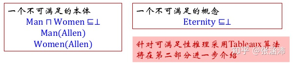

​        上图是两个不可满足的例子，第一个本体那个是说，Man 和 Women 的交集是空集，那么就不存在同一个本体Allen 既是Man 又是Women。 第二个概念是说概念Eternity是一个空集，那么他不具有模型，即不可满足。

​        分类，针对Tbox的推理，计算新的概念包含关系。如:

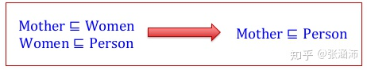

​       即若Mother 是 Women的子集，Women是 Person的子集，那么我们就可以得出 Mother是 Person的子集这个新类别关系。

​      实例化即计算属于某个概念或关系的所有**实例的集合**。如:

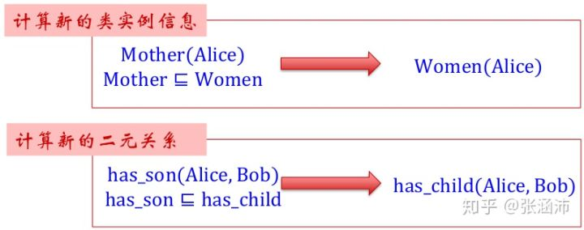

​       第一个是计算新的类实例信息，首先已知Alice 是Mother，Mother 是 Women的子集，那么可知Alice  是一个Women。即为Women增加了一个新的实例。下面那个是计算新的二元关系，已知Alice 和Bob 有儿子，同时has_son  是has_child的子类，那么可知Alice 和Bob has_child。

## 知识推理简介

​        OWL本体语言是知识图谱中最规范(W3C制定)、最严谨(采用描述逻辑)。表达能力最强的语言(是一阶谓词逻辑的子集)，它基于RDF语法，使表示出来的文档具有语义理解的结构基础。促进了统一词汇表的使用，定义了丰富的语义词汇。同时允许逻辑推理。

​      关于OWL语言的规范性我们再之前讨论过，此处我们介绍一下它的逻辑基础：描述逻辑。

## 描述逻辑

​      **描述逻辑(Description Logic)是基于对象的知识表示的形式化，也叫概念表示语言或术语逻辑，是一阶谓词逻辑的一个可判定子集。**

​      一个**描述逻辑系统**由四个基本部分组成：

- 最基本的元素：概念、关系、个体    
- TBox术语集：概念术语的公理集合    
- Abox断言集：个体的断言集合    
- TBox 和 ABox上的推理机制

​      **不同的描述逻辑系统的表示能力与推理机制由于对这四个组分的不同选择而不同。**下面对四个组分中的概念做一个简单介绍。

- 最基本的元素有概念、关系、个体。  *概念即解释为一个领域的子集，如*![[公式]](pelhans.assets/equation-20200904172230903)
- 关系解释为该领域上的二元关系(笛卡尔积)，如 <x,y> |*friend*(*x*,*y*)
- 个体解释为一个领域内的实例，如小明：{Ming}

​      TBox为术语集，它是泛化的知识，是描述概念和关系的知识，被称之为公理(Axiom)。由于概念之间存在包含关系，TBox  知识形成类似格(Lattice)的结构，这种结构是由包含关系决定的，与具体实现无关。TBox语言有定义和包含，其中定义为引入概念及关系的名称，如Mother、Person、has_child，包含指声明包含关系的公理，例如 ![[公式]](pelhans.assets/equation?tex=+Mother+%5Csqsubseteq+%5Cexists+has_child.Person+) 

​      ABox是断言集，指具体个体的信息，ABox包含外延知识(又称为断言(Assertion)), 描述论域中的特定个体。**描述逻辑的知识库 K:= ， T即TBOx， A即ABOx。**ABox 语言包含概念断言和关系断言，概念断言即表示一个对象是否属于某个概念，例如Mother(Alice)、Person(Bob)。关系断言表示两个对象是否满足特定的关系，例如 has_child(Alice, Bob)。

​      描述逻辑语义：解释I是知识库K的模型,当且仅当I是K中每个断言的模型。若一个知识库K有一个模型,则称K是可满足的。若断言σ对于K的每个模型都是满足的,则称K逻辑蕴含σ,记为 ![[公式]](pelhans.assets/equation-20200904172231027) 。对概念C,若K有一个模型I使得 ![[公式]](pelhans.assets/equation-20200904172231025) 则称C是可满足的。

描述逻辑依据提供的构造算子,在简单的概念和关系上构造出复杂的概念和关系。描述逻辑至少包含以下构造算子:交 ( ![[公式]](pelhans.assets/equation-20200904172231030) ),并( ![[公式]](pelhans.assets/equation-20200904172230947) ),非 (¬),存在量词 ( ![[公式]](pelhans.assets/equation-20200904172231024) )和全称量词 ( ![[公式]](pelhans.assets/equation-20200904172231028) )。有了语义之后,我们可以进行推理。通过语义来保证推理的正确和完备性。

下图给出描述逻辑的语义表:

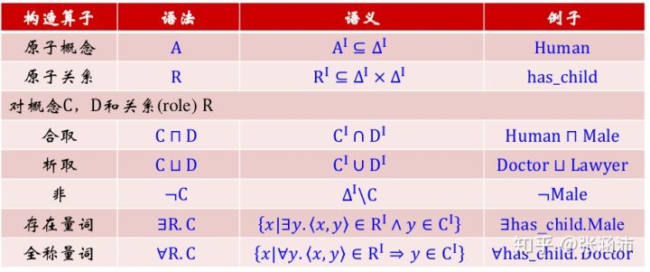

因为OWL采用描述逻辑，因此下图给出了描述逻辑与OWL词汇的对应表：

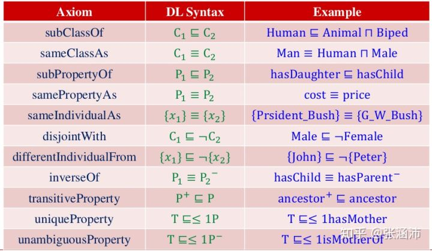

## 本体推理方法与工具介绍

​      基于本体推理的方法常见的有基于Tableaux运算的方法、基于逻辑编程改写的方法、基于一阶查询重写的方法、基于产生式规则的方法等。

- 基于Tableaux运算适用于检查某一本体的可满足性，以及实例检测。    
- 基于逻辑编程改写的方法可以根据特定的场景定制规则，以实现用户自定义的推理过程。    
- 基于一节查询重写的方法可以高效低结合不同数据格式的数据源，重写方法关联起了不同的查询语言。以Datalog语言为中间语言,首先重写SPARQL语言为Datalog,再将Datalog重写为SQL查询；     
- 一种前向推理系统,可以按照一定机制执行规则从而达到某些目标,与一阶逻辑类似,也有区别；

下面对上面的几种方法做详细介绍。

## 基于Tableaux运算

基于Tableaux运算适用于检查某一本体的可满足性，以及实例检测。其基本思想是通过一系列规则构建Abox,以检测可满足性,或者检测某一实例是否存在于某概念。这种思想类似于一阶逻辑的归结反驳。

Tableaux运算规则(以主要DL算子举例)如下：


​      这里对第一个解释一下，其他的类似。第一个是说如果C 和D(x) 的合取是 ![[公式]](pelhans.assets/equation-20200904172231026) ，同时呢C(x) 和 D(x) 却不在 ![[公式]](pelhans.assets/equation-20200904172231077) 里，那么也就是说 ![[公式]](https://www.zhihu.com/equation?tex=+%5Cvarnothing) 有可能只包含了部分C，而C(x)不在里面，那么我们就把它们添加到 ![[公式]](https://www.zhihu.com/equation?tex=+%5Cvarnothing) 里。下面我们举个实际的例子:

现在给定如下本体，检测实例Allen 是否在 Woman中? 即:

![[公式]](pelhans.assets/equation-20200904172231083) 

![[公式]](pelhans.assets/equation-20200904172231082) 

检测 Woman(Allen)？其解决流程为:

- 首先加入带反驳的结论:

![[公式]](pelhans.assets/equation-20200904172231094) 

![[公式]](pelhans.assets/equation-20200904172231127) 

- 初始Abox，记为 ![[公式]](pelhans.assets/equation-20200904172231118) ，其内包含 ![[公式]](pelhans.assets/equation-20200904172231206) 。
- 运用 ![[公式]](pelhans.assets/equation-20200904172231199-9211351.) 规则，得到 ![[公式]](pelhans.assets/equation-20200904172231127-9211351.) 。将其加入到 ![[公式]](pelhans.assets/equation-20200904172231139) 中，现在的 ![[公式]](https://www.zhihu.com/equation?tex=+%5Cvarnothing+) 为 ![[公式]](pelhans.assets/equation-20200904172231189) 。
- 运用 ![[公式]](pelhans.assets/equation-20200904172231172) 规则到 ![[公式]](pelhans.assets/equation-20200904172231199) 与 ![[公式]](pelhans.assets/equation-20200904172231083) 上，得到 ![[公式]](pelhans.assets/equation-20200904172231215) 。此时的 ![[公式]](https://www.zhihu.com/equation?tex=+%5Cvarnothing+) 包含 ![[公式]](pelhans.assets/equation-20200904172231243) 。
- 运用 ![[公式]](pelhans.assets/equation-20200904172231244) 规则，拒绝现在的 ![[公式]](https://www.zhihu.com/equation?tex=+%5Cvarnothing) 。
- 得出Allen 不在Woman的结论。如果Woman(Allen)在初始情况已存在于原始本体,那么推导出该本体不可满足!

​      Tableaux运算的基于Herbrand模型，Herbrand模型你可以把它简单的理解为所有可满足模型的最小模型，具体的可以去看逻辑方面的书。

## 相关工具简介

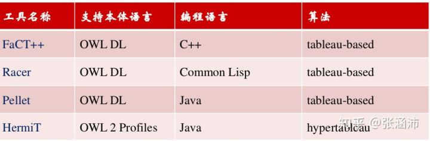

## 基于逻辑编程改写的方法

本体推理具有一定的局限性，如仅支持预定义的本体公理上的推理，无法针对自定义的词汇支持灵活推理；用户无法定义自己的推理过程等。因此引入**规则推理**，它可以根据特定的场景定制规则,以实现用户自定义的推理过程。

基于以上描述，引入Datalog语言，它可以结合本体推理和规则推理。面向知识库和数据库设计的逻辑语言,表达能力与OWL相当,支持递归，便于撰写规则，实现推理。

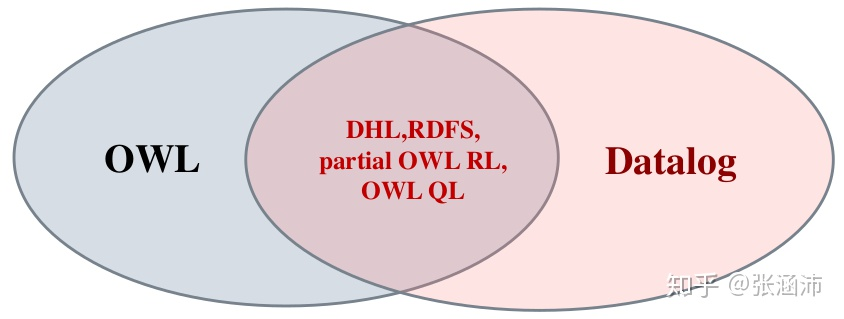

Datalog 的基本语法包含:

- 原子(Atom): ![[公式]](pelhans.assets/equation-20200904172231255) ， 其中p是谓词,n是目数, ![[公式]](pelhans.assets/equation-20200904172231258) 是项 (变量或常量)，例如 has_child(X, Y)；    
- 规则(Rule)： ![[公式]](pelhans.assets/equation-20200904172231268) ，由原子构建，其中H 是头部原子， ![[公式]](pelhans.assets/equation-20200904172231287) 是体部原子。例如:  has_child X, Y : −has_son X, Y    
- 事实(Fact)： ![[公式]](pelhans.assets/equation-20200904172231283) ，它是没有体部且没有变量的规则，例如  has_child Alice, Bob : −     
- Datalog程序是规则的集合

下图给出一个Datalog 推理的例子：

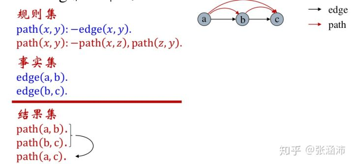

## 相关工具简介

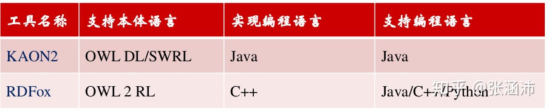

## 基于一阶查询重写的方法

​      基于查询重写我们可以高效地结合不同数据格式的数据源；同时重写方法关联起了不同的查询语言。

​      一阶查询是具有一阶逻辑形式的语言，因为Datalog是数据库的一种查询语言，同时具有一阶逻辑形式，因此可以以Datalog 为中间语言，首先重写SPARQL 语言为Datalog ，再将Datalog 重写为SQL 查询。

![[公式]](pelhans.assets/equation-20200904172231306) 

下图给出查询重写的基本流程:

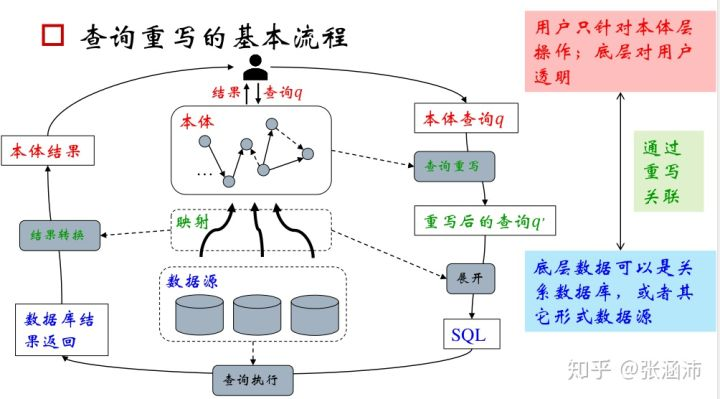

## 查询重写举例

查询所有研究人员及其所从事的项目? 用 SPARQL表述为:

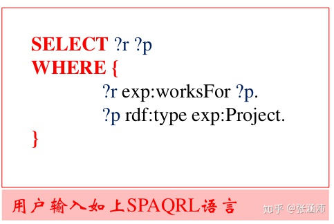

给定Datalog 规则如下:

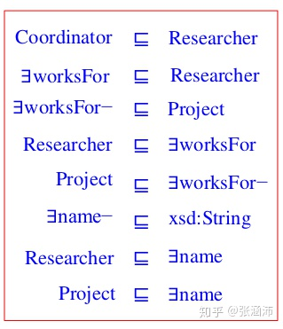

底层数据具体为某数据库中为下图中的两张表:

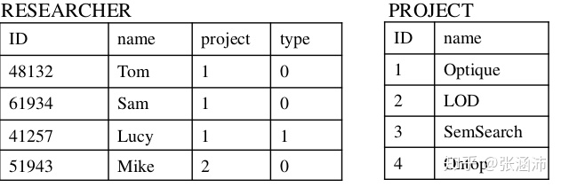

- 步骤一： 重写为Datalog 查询

- - 过滤不需要的公理 (通过语法层过滤)

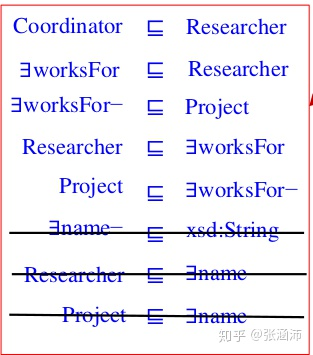

- - 生成所有相关的Datalog 查询

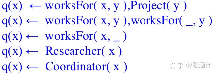

- 步骤二： 将数据库关系表达式映射成Datalog原子

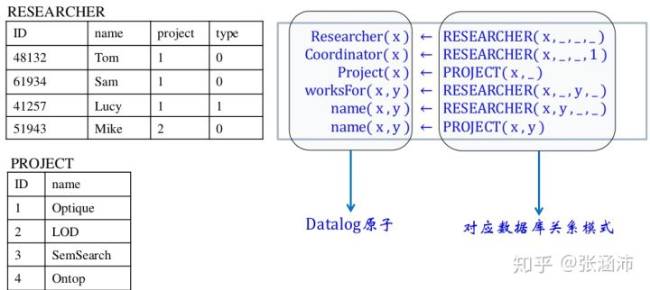

- 步骤三：将从SPARQL以及数据库重写过来的Datalog 规则整合进行查询

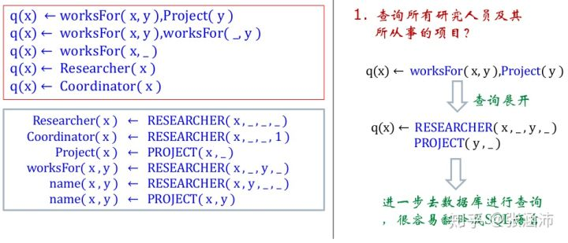

## [Ontop 工具](https://link.zhihu.com/?target=http%3A//obda.inf.unibz.it/)

- 最先进的OBDA 系统，兼容RDFs、OWL 2 QL、R2RML、SPARQL标准    
- 支持主流关系数据库： Oracle、MySQL、SQL Server、Postgres

## 基于产生式规则的方法

产生式系统是一种前向推理系统，可以按照一定机制执行规则从而达到某些目标，与一阶逻辑类似，但也有区别。被应用于自动规划、专家系统上。

产生式系统由: **事实集合(Working Memory)、产生式/规则集合、推理引擎**组成:

- 事实集/运行内存(Working Memory, WM): 是事实的集合，用于存储当前系统中所有事实。    

- - 事实(Working Memory Element, WME)，包含描述对象和描述关系。描述对象形如 ![[公式]](pelhans.assets/equation?tex=(type+attr_1+%253A+val_1+attr_2+%253A+val_2+...+attr_n+%253A+val_n+)) ,其中type, ![[公式]](pelhans.assets/equation-20200904172231311) 均为原子 (常量)， 例如 (student name: Alice age: 24)。描述关系(Refication)，例如  (basicFact relation: olderThan firstArg: John secondArg:  Alice)简记为(olderThan John Alice)。


- 产生式集合(Production Memory, PM)就是产生式的集合。。。。产生式就是类似于 ![[公式]](pelhans.assets/equation-20200904172231318) 这种的语句。其中conditions 是由条件组成的集合，又称为LHS。 actions 是由动作组成的序列，称为RHS 。    

- - LHS 是条件(condition)的集合，各条件之间是且的关系，当LHS 中所有条件均被满足，则该规则触发。条件的形式为: ![[公式]](pelhans.assets/equation?tex=(+type+attr_1+%253A+spec_1+attr_2+%253A+spec_2+...+attr_n+%253A+spec_n+)) 
  - RHS是动作序列，即执行时的顺序，是依次执行的，动作的种类包含 ADD pattern、 REMOVE i、MODIFY i( attr spec ) 。
  - 举个例子: IF (Student name:x ) Then ADD (Person name:x )    

- 推理引擎： 它可以控制系统的执行，包含 模式匹配(用规则的条件**部分匹配**事实集中的事实,整个LHS都被满足的规则被触发,并被加入议程(agenda))、解决冲突(按一定的策略从被触发的多条规则中选择一条)、执行动作(执行被选择出来的规则的RHS,从而对WM进行一定的操作)。

产生式系统的执行流程如下图所示:


上面的WM 和产生式集合是我们定义的数据，相当于ABox 和 TBox，中间部分是推理引擎。其实大部分推理系统都是由这三部分组成。

## 模式匹配 RETE 算法

**模式匹配即 用每条规则的条件部分匹配当前WM。**，一种高效的模式匹配算法是RETE 算法，1979年由Charles Forgy (CMU)提出， 将产生式的LHS组织成判别网络形式，是一种典型的以空间换时间的算法。其流程如下图所示:

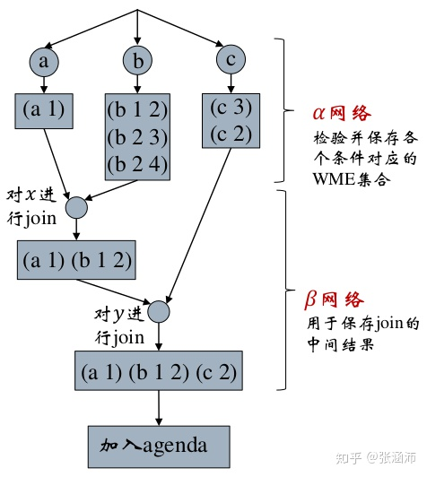

## 相关工具介绍

## Drools

Drools 是商用规则管理系统，其中提供了一个规则推理引擎，核心算法是基于RETE算法的改进。提供规则定义语言 ，支持嵌入Java代码。

## Jena

Jena 用于构建语义网应用Java 框架，提供了处理RDF、RDFs、OWL 数据的接口，还提供了一个规则引擎。提供了三元组的内存存储于查询。

## RDF4J

RDF4J 是一个处理RDF 数据的开源框架，支持语义数据的解析、存储、推理和查询。能够关联几乎所有RDF存储系统，能够用于访问远程RDF存储。

## 相关工具总结

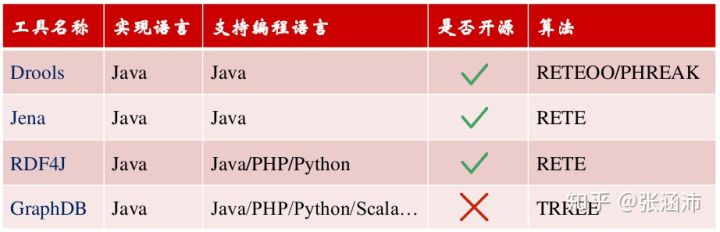

## Ref

[王昊奋知识图谱教程](https://link.zhihu.com/?target=http%3A//www.chinahadoop.cn/course/1048)

发布于 2018-07-07

[知识图谱](https://www.zhihu.com/topic/19838204)

[自然语言处理](https://www.zhihu.com/topic/19560026)

# (八)  语义搜索

欢迎大家关注我的博客 [http://pelhans.com/](https://link.zhihu.com/?target=http%3A//pelhans.com/) ，所有文章都会第一时间发布在那里哦~

------

> 本节对语义搜索做一个简单的介绍，而后介绍语义数据搜索、混合搜索。该部分理解不深，后续会进一步补充。本系列笔记为王昊奋老师知识图谱课程的学习笔记，若理解有偏差还请指正。课程购买连接在文末。

## 语义搜索简介

​        什么是语义搜索，借用万维网之父Tim Berners-Lee的解释 “**语义搜索的本质是通过数学来拜托当今搜索中使用的猜测和近似，并为词语的含义以及它们如何关联到我们在搜索引擎输入框中所找的东西引进一种清晰的理解方式，**

不同的搜索模式之间的技术差异可以分为:

- 对用户需求的表示(query model)    
- 对底层数据的表示(data model)    
- 匹配方法(matching technique)

​       以前常用的搜索是基于文档的检索(document retrieval  )。信息检索(IR)支持对文档的检索，它通过轻量级的语法模型表示用户的检索需求和资源内容，如 AND  OR。即目前占主导地位的关键词模式：词袋模型。它对主题搜索的效果很好，但**不能应对更加复杂的信息检索需求**。

​       数据库(DB) 和知识库专家系统(Knowledge-based Expert System)可以提供更加精确的答案(data  retrieval)。它使用表达能力更强的模型来表示用户的需求、利用数据之间的内在结构和语义关联、允许复杂的查询、返回精确匹配查询的具体答案。

语义搜索答题可分为两类：

- DB 和KB 系统属于重量级语义搜索系统，它对语义**显示的和形式化的建模**，例如 ER图或 RDF(S) 和OWL 中的知识模型。主要为**语义的数据检索系统**。
- 基于语义的IR 系统属于轻量级的语义搜索系统。采用轻量级的语义模型，例如分类系统或者辞典。语义数据(RDF)嵌入文档或者与文档关联。它是基于**语义的文档检索系统**。

随着结构化和语义数据的可用性越来越高，数据Web搜索和文档Web搜索有逐渐融合的趋势。

- 对于Web搜索，采用传统上应用于IR 领域的，扩展性较好的方法，来处理WEb 数据的质量问题，和与长文本描述相关的数据元素。
- 对于文档Web搜索，数据库和语义搜索技术被应用到IR系统中，以便在搜索过程中结合运用日益增加的，高度结构化和表达能力强的数据。

语义搜索的流程图如下图所示：

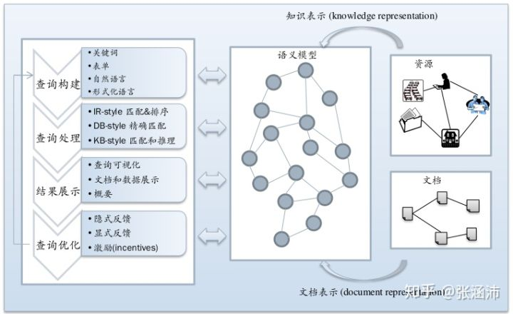

## 语义数据搜索

语义数据搜索具有以下难点:

- 可扩展性： 语义数据搜索对链接数据的有效利用要求基础架构能扩展和应用在大规模和不断增长的内链数据上。    
- 异构性： 数据源的异构性、多数据源查询、合并多数据源的查询结果。    
- 不确定性： 用户需求的表示不完整    

下面介绍一些基于三元组存储的语义数据搜索最佳实践及其对应原理。

- 基于IR：Sindice， FalconS；是单一数据结构和查询算法，针对文本数据进行排序检索来优化。它的数据是高度可压缩的，可访问的。排序是组成部分。但不能处理简单的select，join等操作。
- 基于DB：Oracle的RDF扩展，DB2的SOR；具有各种索引和查询算法，以适应各种对结构化数据的复杂查询。优点是能够完成复杂的selects，joins,...(SQL,  SPARQL)，能够对高动态场景(许多插入/删除)。缺点是由于使用B+树，空间的开销大和访问的局限性。同时来自叶子节点的结果没有集成对检索结果的排序。
- 原生存储(Native stores)：Dataplore, YARS,  RDF-3x；优点是高度可压缩，可访问。类似于IR的检索排序。类似于DB的selects和joins操作。可在亚秒级实践内在单台机器上完成对TB数据的查询。支持高动态操作。缺点是没有事务、恢复等。

## 存储和索引(Semplore，Dataplore的前身)

​      重用IR 索引来索引语义数据。它的核心想法是将RDF转换称具有fields 和terms的虚拟文档。IR索引基于以下概念:

- 文档    
- 字段(field)，例如标题、摘要、正文、作者....    
- 词语(terms)    
- Posting list 和Position list

​      下面以一个例子来理解上面的术语:

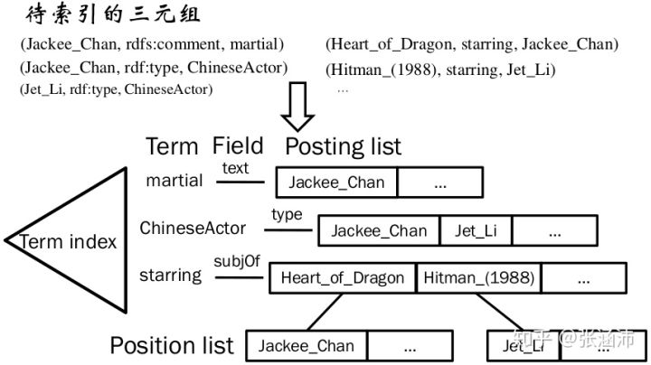

​      当新插入元素时，不可能完全重建索引，因此需要使用增量索引。当前的增量索引需要遍历Posting  list，非常耗时，因此需要将Posting list  进行分块，但更多的快需要更多的随机访问来定位这些块，同时更多的快需要更多的空间开销。因此需要权衡索引更新，搜索和索引大小。

## 排序和索引

​      上面建立的索引并存储。现在我们需要对其进行检索，对于检索我们需要支持四种基本的操作:

- 基础的检索：(f, t)    
- 归并排序：m(S1, op, S2)    
- 概念表达式计算: ![[公式]](pelhans.assets/equation-20200904172259632) ，如 
   ![[公式]](pelhans.assets/equation-20200904172259631) 
- 关系扩展(Relation Expansion): ![[公式]](pelhans.assets/equation-20200904172259623) ，
  如 ![[公式]](pelhans.assets/equation-20200904172259622) **，这个是需要我们去完善的**

​      那么如何进行复杂的查询呢？下图给出一个例子：

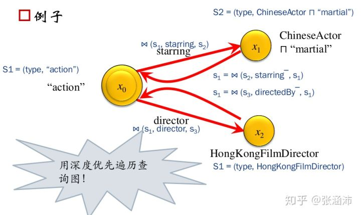

​      其大致流程为先从x0出发到x1，x1返回结果到x0，在将该结果传到x2进行查找，最终再返回x0。 遍历图的方式为深度优先遍历查询。

查询时我们还需要对其进行排序，排序有两个原则：

- 质量传播原则：一个元素的分数可以看成是其质量(quality)的度量,质量传播即通过更新这个分数同时反应该元素的相邻元素的质量。    
- 数量聚合:除质量外,还考虑邻居的数量。因此,如果有更多的邻居,元素排名会更高。

如何将排序紧密结合到基本操作中呢？

- Ascending IntegerStream (AIS)
- 基本检索：给定field f和 term t, b(f, t) 从倒排索引中检索出posting list， 并输出一个Ascending Integer List (AIS)。    
- 归并排序：S1 和 S2 是两个AIS ， ![[公式]](pelhans.assets/equation-20200904172259633) 计算S1 and S2的交集    
- 关系扩展：给定关系R和AIS S，计算集合
   ![[公式]](pelhans.assets/equation-20200904172259658) 并将其作为AIS返回

## 基于结构的分区和查询

​      基于结构的索引和分区，需要将结构上相似的节点聚合到一起，同时结构上相似的节点在硬盘上连续存储。**基于结构感知(Structure-aware)的查询处理需要分两阶段匹配，第一个是只检索出匹配所查询的结构的数据，第二个是通过剪枝减少join和IO。**其流程如下图所示

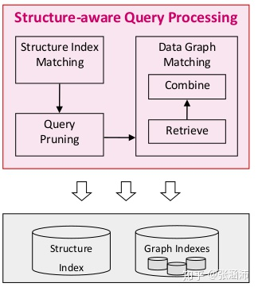

​      一个数据图的索引建立和查询例子如下图所示：

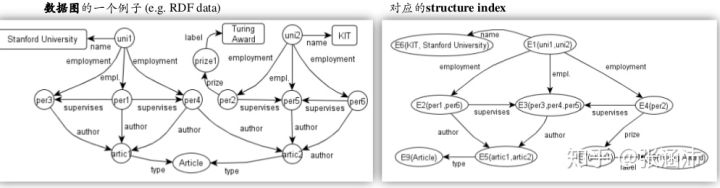

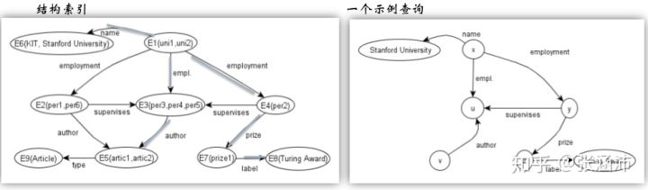

​       首先用结构索引匹配查询在答案空间里检索和join，产生一组包含的数据元素匹配查询中的结构的结构索引。而后根据匹配的结构索引计算最终答案，其中剪枝仅包含非标识(non-distinguished)变量的树形查询部分。在资源空间检索和join:验证答案空间匹配中的元素是否也匹配具体的查询实体,即常量和标识(distinguished)变量。

​      使用结构索引做结构匹配的有点是降低IO开销和union 和join操作的次数。

## 多数据源搜索--以Hermes 为例

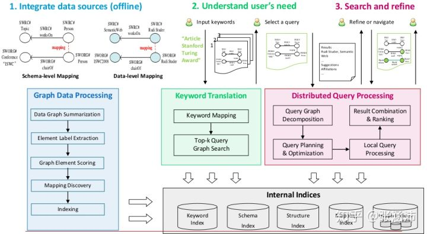

​      可以看出其大体分为三块，第一部分是数据源融合部分，第二部分是理解用户需求，最终是搜索和提炼。

​      其知识融合部分流程为：

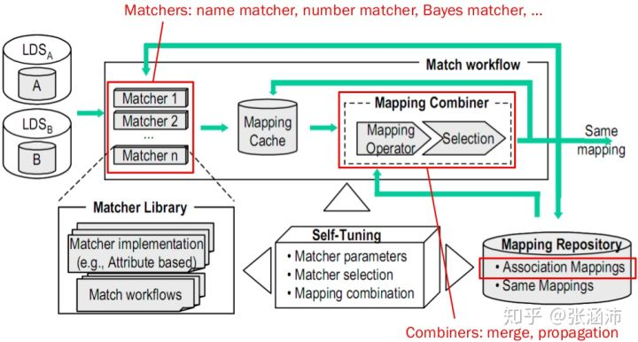

## 混合语义搜索

​      下一代语义搜索系统结合了一系列技术,从基于统计的IR排序方法,有效索引和查询处理的数据库方法,到推理的复杂推理技术等等。一个混合的语义搜索系统应:

- 结合文本，结构化和语义数据    
- 以整体的方式管理不同类型的资源    
- 支持结果为信息单元(文档，数据)的集成的检索。

​      一个典型的系统架构是 ![[公式]](pelhans.assets/equation-20200904172259668) 。其流程图如下图所示:

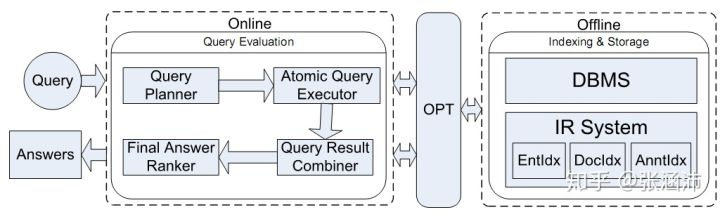

​     上图中的OPT(occur probity table,  发生概率表)分为线上和线下两个步骤。对于线下步骤，数据图存储于DBMS中，除Entldx中的三元组(个体，关键词，"xxx")外，Doc  图存储在Docldx中，注释存储在Anntldx中。线上步骤将混合查询分解为一组原子查询(atomic  queries)；使用DB和IR引擎执行原子查询；根据生成的查询树合并部分结果；对最后的答案排序。

## Ref

[王昊奋知识图谱教程](https://link.zhihu.com/?target=http%3A//www.chinahadoop.cn/course/1048)

编辑于 2018-07-07

[自然语言处理](https://www.zhihu.com/topic/19560026)

[知识图谱](https://www.zhihu.com/topic/19838204)

# (九)  知识问答

欢迎大家关注我的博客 [http://pelhans.com/](https://link.zhihu.com/?target=http%3A//pelhans.com/) ，所有文章都会第一时间发布在那里哦~

------

> 本节对知识问答的概念做一个概述并介绍KBQA实现过程中存在的挑战，而后对知识问答主流方法做一个简要介绍，具体内容还请查阅文末参考论文。

## 知识问答简介

问答系统的历史如下图所示：

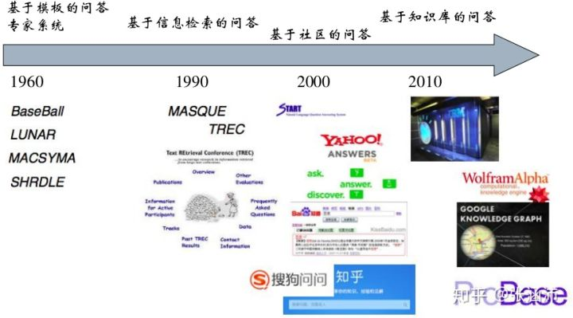

可以看出，整体进程由基于模板到信息检索到基于知识库的问答。基于信息检索的问答算法是基于关键词匹配+信息抽取、浅层语义分析。基于社区的问答依赖于网民贡献，问答过程依赖于关键词检索技术。基于知识库的问答则基于语义解析和知识库。

根据问答形式可以分为一问一答、交互式问答、阅读理解。一个经典的测评数据集为QALD，主要任务有三类：

- 多语种问答，基于Dbpedia    
- 问答基于链接数据    
- Hybrid QA，基于RDF and free text data

## 知识问答简单流程与分类

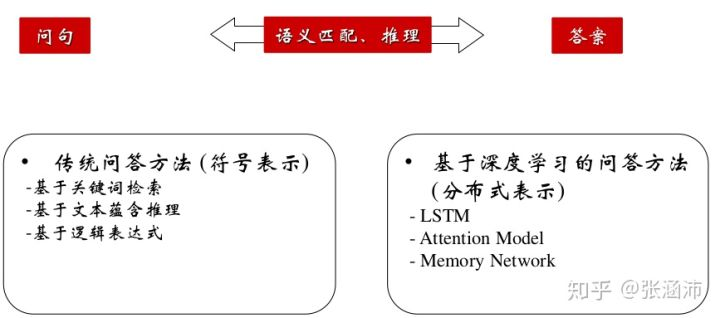

上图为知识问答的简单流程，首先将用户输入的问句经过语义匹配等转换为查询语言进行查询和推理，而后得到答案再进行组合以形成人类可阅读的文本。

传统的问答方法是基于符号表示的，常用的有：

- 基于关键词的检索    
- 基于文本蕴含推理    
- 基于逻辑表达式

一个简单的基于符号表示的例子如：

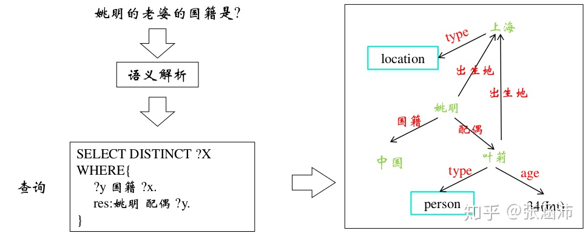

基于深度学习的问答方法是基于分布式表示的，常用的有：

- LSTM    
- Attention Model    
- Memory Network

## KBQA的基本概念和挑战

下面对一些基本概念做一个总结：

- 问句短语定义问的是什么？ 如wh-words: who, what, when...    
- 问题类型：问题类型决定了后续采用什么样的回答处理策略，如事实型问题、观点型问题、因果型问题、方法型问题等。    
- 答案类型： 如实体、地理位置、时间等。    
- 问题主题：问题是关于哪方面的？如 “世界上最高的山是？” 它就和地理、山峰这两个相关。    
- 问答来源类型： 包含是不是结构化的数据、数据的来源等。    
- 领域类型：如开放领域还是特定领域、多模态问答还是其他的。    
- 答案格式：是司法文书还是定义式的短答案等。    
- ......

问答质量如何评估呢？一般有6个原则，包含相关度、正确度、精炼度、完备度、简单度、合理度。

## 问答系统的基本组件

如下图所示：

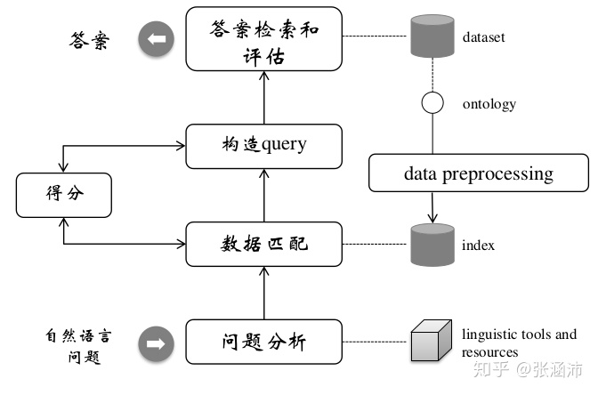

该系统使用自然语言问题作为输入，经由：

- 数据预处理：处理数据库数据，包含索引、数据清理、特征提取等。    
- 问题分析：执行语法分析，同时检测问题的核心特征，如NER、答案类型等。    
- 数据匹配：将问题里的terms 和数据里的实体进行匹配。    
- 查询创建：生成结构查询候选。    
- 排序    
- 结果返回与生成：执行查询并从结果里抽取答案。

## 技术挑战

- 怎样缩小自然语言和规范化结构化数据之间的鸿沟    
- 怎样处理不完全、充满噪音和异构的数据集.    
- 怎样处理大规模的知识图谱    
- 怎样处理分布式数据集上的QA    
- 怎样融合结构化和非结构化的数据    
- 怎样降低维护成本    
- 怎样能快速的复制到不同的领域

## 知识问答主流方法介绍

KBQA常用的主流方法有 基于模板的方法、基于语义解析的方法、基于深度学习的方法。下面分别对其进行详细介绍。

## 基于模板的方法

基于模板的方法包含模板定义、模板生成，模板匹配三大部分。论文参见[TBSL(Unger et al.2012)](https://link.zhihu.com/?target=https%3A//www2012.universite-lyon.fr/proceedings/proceedings/p639.pdf)。

为了理解用户的问题，我们要理解：

- 问题中的词汇：如died in ![[公式]](pelhans.assets/equation-20200904172320691) dbo:deathPalce
- 问题的语义结构：如 the most N ![[公式]](pelhans.assets/equation-20200904172320694) ORDER BY DESC(COUNT(?N)) LIMIT 1

基于模板问答的目标就是将语义结构分析和词映射到URIs，该方法有两个重要的步骤：

- 模板生成：将问题解析为SPARQL模板，该模板能直接反应问题的结构如filters 和 aggregation 这样的操作。
- 模板实例化：通过匹配自然语言表达式和本体概念来实例化SPARQL 模板。

举个例子：

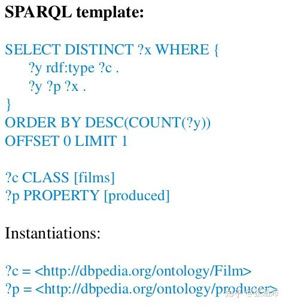

TBSL的架构如下图所示：

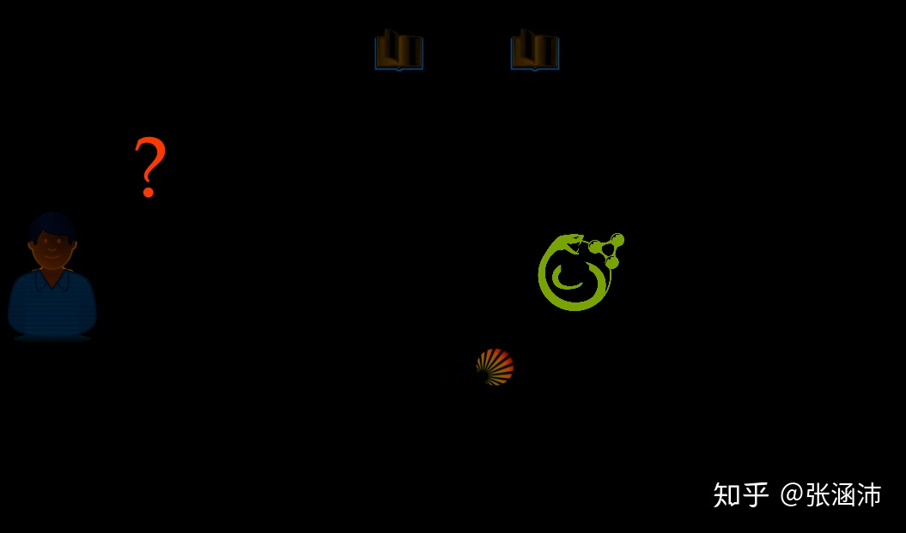

## 模板定义

结合KG的结构,以及问句的句式,进行模板定义。通常没有统一的标准或格式。TBSL的模板定义为SPARQL query模板,将其
直接与自然语言相映射。

## 模板生成

模板生成大致分为如下四个步骤：

- 获取自然语言问题的POS 标记信息    
- 基于POS 标记、语法规则表示问句    
- 利用领域相关或领域无关词汇辅助解决问题    
- 最后将语义表示转化为一个SPARQL 模板    

例如：


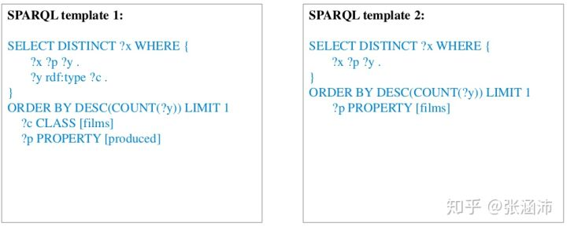

## 模板匹配与实例化

有了SPARQL模板以后,需要**进行实例化与具体的自然语言问句相匹配**。即将自然语言问句与知识库中的本体概念相映射的过程。

对于resource 和 class实体识别，用WordNet 定义知识库中标签常用方法或计算字符串相似度。对于property标签，将还需要与存储在BOA 模式库中的自然语言进行比较，最高排位的实体将作为填充查询槽位的候选答案。如：

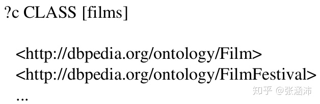

## 排序打分

首先每个entity 根据 string similarity 和 prominence 获得一个打分。一个query 模板的分值根据填充slots 的多个entities 的平均打分。在检查type 类型后，对于全部的查询机和，仅返回打分最高的。

## TBSL的主要缺点

- 创建的模板未必和知识图谱中的数据建模相契合
- 考虑到数据建模的各种可能性，对应到一个问题的潜在模板数量会非常多，同时手工准备海量模板的代价也非常大。

那模板能否自动生成呢？据此有人提出了 [QUINT](https://link.zhihu.com/?target=http%3A//pdfs.semanticscholar.org/2230/816965e900ba76f3fe75a9575a927b3466d5.pdf),它能够根据utterance-answer 对， 根据依存树自动学习utterance-query 模板。该方法利用了自然语言组成的特点，可以使用从简单问题中学到的模板来解决复杂问题。QUINT架构如下图所示：

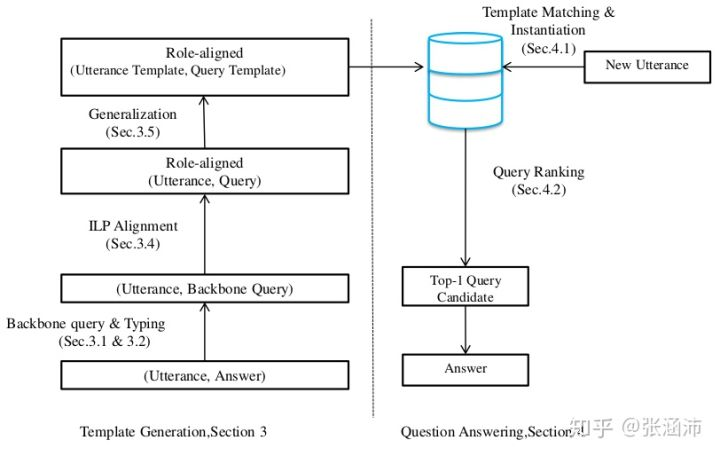

## 基于语义解析的方法

语义解析经典方法[参考](https://link.zhihu.com/?target=https%3A//cs.stanford.edu/~pliang/papers/freebase-emnlp2013.pdf)

基于语义解析的方法大致包含四个部分： 资源映射、逻辑表达式、候选答案生成、排序。

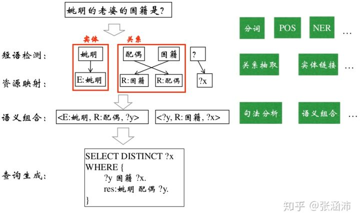

## 资源映射

资源映射将自然语言短语或单词节点映射到知识库的 实体 或 实体关系。 可以通过构造一个词汇表(Lexicon)来完成这样的映射。而后通过逻辑表达式解决文本的歧义。对于复杂映射如"was  also born in" 到 PlaceOfBirth这种，就较难通过字符串匹配的方式建立映射，对此我们可以采用统计方法。如e1 和  e2经常出现在这两个词的两侧，那么我们就认为可以建立映射。

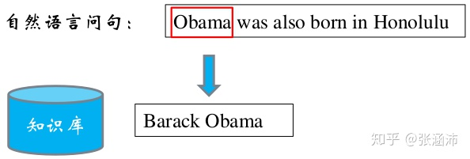

## 逻辑表达式

逻辑表达式是一种能让知识库”看懂“的表示，可以表示知识库中的实体、实体关系,并且可以想数据库语言一样，进行Join，求教及和聚合等操作。逻辑形式通常可分为一元形式和二元形式，一元实体是指对应知识库中的实体，二元实体关系是对应知识库中所有与该实体相关的三元组中的实体对。

## 基于深度学习的方法

KBQA 与深度学习结合的两个方向，第一个是利用深度学习对于传统问答方法进行改进，另一个是基于深度学习的端到端模型。

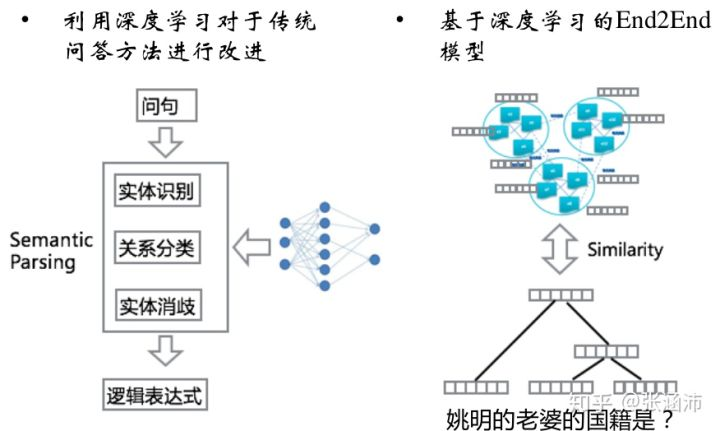

目前基于深度学习的方法无须像模板方法那样人工编写大量模板,也无须像语义分析方法中人工编写大量规则,整个过程都是自动进行。但缺点也很明显，它目前只能处理简单问题和单边关系，对于复杂问题不如两种传统方法效果好。同时由于DL方法通常不包含聚类操作，因此对于一些时序敏感性问题无法很好的处理。

## Ref

[王昊奋知识图谱教程](https://link.zhihu.com/?target=http%3A//www.chinahadoop.cn/course/1048)

[Semantic parsing via paraphrasing](https://link.zhihu.com/?target=https%3A//nlp.stanford.edu/joberant/homepage_files/publications/ACL14.pdf)

[Template-based question answering over RDF data](https://link.zhihu.com/?target=https%3A//www2012.universite-lyon.fr/proceedings/proceedings/p639.pdf)

[Semantic Parsing via Staged Query Graph Generation: Question Answering with Knowledge Base](https://link.zhihu.com/?target=http%3A//www.anthology.aclweb.org/P/P15/P15-1128.pdf)

[Semantic parsing on freebase from](https://link.zhihu.com/?target=http%3A//pdfs.semanticscholar.org/042d/b0977555fcd7d5eac67b26695cd918ecb44c.pdf)
[question-answer pairs](https://link.zhihu.com/?target=http%3A//pdfs.semanticscholar.org/042d/b0977555fcd7d5eac67b26695cd918ecb44c.pdf)

[An End-to-End Model for Question Answering over Knowledge Base with Cross-Attention Combining Global Knowledge Information](https://link.zhihu.com/?target=http%3A//wing.comp.nus.edu.sg/~antho/P/P17/P17-1021.pdf)

[Question Answering over Freebase with Multi-Column Convolutional Neural Networks](https://link.zhihu.com/?target=http%3A//www.anthology.aclweb.org/P/P15/P15-1026.pdf)

[Question Answering with Subgraph Embedding](https://link.zhihu.com/?target=http%3A//www.aclweb.org/anthology/D/D14/D14-1067.pdf)

[A Graph Traversal Based Approach to Answer Non-Aggregation Questions over DBpedia ](https://link.zhihu.com/?target=http%3A//pdfs.semanticscholar.org/9222/c69ca851b26e8338b0082dfafbc663d1be50.pdf)

[Automated Template Generation for Question Answering over Knowledge Graphs](https://link.zhihu.com/?target=http%3A//pdfs.semanticscholar.org/2230/816965e900ba76f3fe75a9575a927b3466d5.pdf)

发布于 2018-07-07


# END