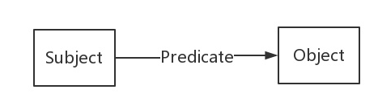
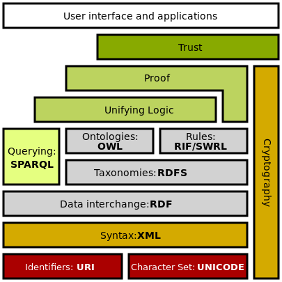

## 鸣谢

### 为什么需要知识图谱？什么是知识图谱？——KG的前世今生

https://blog.csdn.net/u011801161/article/details/78733954

### 知识图谱---基础概念（学习笔记）

本文是基于知乎专栏 https://zhuanlan.zhihu.com/knowledgegraph 的学习笔记，按自己理解简单叙述整理。

https://blog.csdn.net/qq_43522113/article/details/89237353

## 知识图谱是什么

**对于知识图谱搜索：**

1. 搜索一个关键词，它返回关于这个关键词的各方面信息

百度百科其实就是一个大的中文知识图谱，它把中文中各种各样的“知识”连接起来，可以理解为一个大的知识网络。大家都知道点开百度百科过后里面有许多词都是超链接，一点又进入另一个词条的界面，于是整个中文知识网络大概就有了了如下的结构：
 
 无数的知识点被相互串联起来并且互通。

2在知识图谱搜索中，电脑“理解”了你输入的内容，从而返回了更为精确的结果：

综上所述，知识图谱是个大的知识网络，而且能一定程度上“理解”人们输入的内容

两个节点，一条线，是知识图谱的基本单位，我们把这两个点叫做“实体”（entity），这条线叫做“关系”（relation）。像上述这样有方向的一段关系中，关系出发的那个节点叫做“主体”(subject)，中间的属性叫做“谓语”（predicate），指向的节点叫“宾语”(object)。形成如下的SPO三元组结构：
 

（当然中间的这条线也可以是双向的比如“夫妻”。这里暂不赘述。）
 无数这样的三元组构成了一个巨大的网络，就是我们的知识图谱。所以我们知道了如下概念：

1. 知识图谱是由无数知识相互连接形成的巨大网络。
2. 知识图谱的基本单位是一个个三元组，一个三元组可以表示两个实体之间的关系。
    所以我们可以说：知识图谱是表示实体之间关系的巨大网络。

而这些实体的关系，即是一个一个的小“知识”，所以叫“知识”图谱吧。

## SPO三元组

(Subject-Predicate-Object)。

目前，知识图谱并没有一个标准的定义(gold standard definition)。我在这里借用一下“Exploiting  Linked Data and Knowledge Graphs in Large Organisations”这本书对于知识图谱的定义：

> A knowledge graph consists of a set of interconnected typed entities and their attributes.

即，知识图谱是由一些相互连接的实体和他们的属性构成的。换句话说，知识图谱是由一条条知识组成，每条知识表示为一个SPO三元组(Subject-Predicate-Object)。

## 术语

### 知识图谱(Knowledge  Graph)

Google为了提升搜索引擎返回的答案质量和用户查询的效率，于2012年5月16日发布了知识图谱(Knowledge  Graph)。有知识图谱作为辅助，搜索引擎能够**洞察用户查询背后的语义信息**，返回更为精准、结构化的信息，更大可能地满足用户的查询需求。Google知识图谱的宣传语“things not strings”给出了知识图谱的精髓，即，**不要无意义的字符串，而是获取字符串背后隐含的对象或事物。**

### 语义网络(Semantic  Network)

语义网络由相互连接的节点和边组成，节点表示概念或者对象，边表示他们之间的关系

其实知识图谱的概念并不新，它背后的思想可以追溯到上个世纪五六十年代所提出的一种知识表示形式——语义网络(Semantic  Network)。语义网络由相互连接的节点和边组成，节点表示概念或者对象，边表示他们之间的关系(is-a关系，比如：猫是一种哺乳动物；part-of关系，比如：脊椎是哺乳动物的一部分)，如下图。在表现形式上，语义网络和知识图谱相似，但语义网络更侧重于描述概念与概念之间的关系，（有点像生物的层次分类体系——界门纲目科属种），而知识图谱则更偏重于描述实体之间的关联。

实体之间的关联

### 关联数据（Linked Data）

 除了语义网络，人工智能的分支——专家系统，万维网之父Tim Berners Lee于1998年提出的语义网（Semantic Web）和在2006年提出的关联数据（Linked Data）都和知识图谱有着千丝万缕的关系，可以说它们是知识图谱前身。

## 知识图谱的大致构建流程

1. 信息获取，形成结构化的数据；
2. 把数据按三元组形式连接起来；
3. 形成可用网络；

简单粗暴的三部其实包含了很多信息。第一步中涉及数据挖掘、自然语言处理等；第二步涉及结构化数据到RDF(Resource Description Framework)的转化；第三步涉及工程化的内容。

第一部分相当于一些准备工作，第三部分主要是应用，所以这里主要展开讲第二部分。实践内容在下一篇文章里。接下来先做一些概念铺垫。

### RDF，RDFS，与OWL

### **RDF**

 即资源描述框架，是一个用于表达万维网上资源信息的语言，常用来表达知识图谱中的这类三元组。基于它开发出的SPARQL(SPARQL  Protocol and RDF Query Language)可以用来查询这类结构的数据。就像sql(Structured Query  Language)被我们用来查询结构化数据一样。

如上所述，RDF由节点和边组成，节点表示实体、属性，边表示关系，其形式上表示为SPO三元组，一个三元组称为一条“知识”。
 那么RDF数据怎么储存和传输呢，主要可以把他们序列化（Serialization）为：
 RDF/XML，N-Triples，Turtle，RDFa，JSON-LD等形式。

### RDF形式化 表示三元关系

在知识图谱中，我们用RDF形式化地表示这种三元关系。RDF(Resource Description  Framework)，即资源描述框架，是W3C制定的，用于描述实体/资源的标准数据模型。**RDF图中一共有三种类型，International  Resource Identifiers(IRIs)，blank nodes 和 literals**。下面是SPO每个部分的类型约束：

1. Subject可以是IRI或blank node。
2. Predicate是IRI。
3. Object三种类型都可以。

IRI我们可以看做是URI或者URL的泛化和推广，它在整个网络或者图中**唯一定义了一个实体/资源**，和我们的身份证号类似。

**literal是字面量**，我们可以把它看做是带有数据类型的纯文本，比如我们在第一个部分中提到的罗纳尔多原名可以表示为"Ronaldo Luís Nazário de Lima"^^xsd:string。

**blank  node**	简单来说就是没有IRI和literal的资源，或者说**匿名资源**。关于其作用，有兴趣的读者可以参考W3C的文档，这里不再赘述。我个人认为blank  node的存在有点多余，不仅会给对RDF的理解带来额外的困难，并且在处理的时候也会引入一些问题。通常我更愿意用带有IRI的node来充当blank node，行使其功能，有点类似freebase中CVT(compound value type)的概念。最后的参考资料会给出一篇写blank  node缺陷的博客，有兴趣的读者可以看一看。

节点类型，资源和字面量。借用数据结构中树的概念，字面量类似叶子节点，出度为0。

字面量，是不能有指向外部节点的边的，况且之前的图并不能直观地体现知识图谱中资源/实体(用IRI表示)这样一个极其重要的概念。

### **RDFS**

 即“Resource Description Framework  Schema”，对RDF的数据进行预定义。相当于RDF的扩展，以解决RDF无法区分类和对象，也无法定义和描述类的关系/属性的问题。类似于把不同的“实体”分为大类。比如“成龙”“房祖名”都属于“人”这个类。“身高”“体重”都属于"身体属性"这个类。还可以根据需要把大类再归于更高级别的类，如“人类”“猫科动物类”都属于“哺乳类”。以此类推。

### **OWL**

 即“Web Ontology  Language”，对RDFS的扩展，添加可额外的自定义词汇，主要是实现高效的自动推理。如属性的传递性（如A位于B，B位于C,  那么A位于C），对称性（如A与B在一个班，那么B与A在一个班），唯一性（A是B的生母，C是B的生母，那么A=C），相反关系（A是B的父母，那么B是A的子女）等。括号里“那么”后面的内容即是推断出来的。OWL便是通过预定义实现这些自动推理。

# 总结

本文通过罗纳尔多这个例子引出了知识图谱的现实需求，继而给出了知识图谱的定义和相关概念，并介绍了知识图谱的RDF形式化表示。作为一篇科普文章，文中省略了许多技术细节。后续我会根据语义网技术栈（Semantic Web  Stack，如下图）来介绍知识图谱实现过程中所需要的具体技术。另外，可能会结合实践，介绍如何利用关系型数据库中的数据来构建一个知识图谱，并搭建一个简易的基于知识图谱的问答系统(KBQA)。

1. [W3C: RDF 1.1 Concepts and Abstract Syntax](https://www.w3.org/TR/rdf11-concepts/)
2. Exploiting Linked Data and Knowledge Graphs in Large Organisations
3. [Google: Introducing the Knowledge Graph: things, not strings](https://googleblog.blogspot.co.uk/2012/05/introducing-knowledge-graph-things-not.html)
4. [Problems of the RDF model: Blank Nodes](http://milicicvuk.com/blog/2011/07/14/problems-of-the-rdf-model-blank-nodes/)
5. [Compound Value Types in RDF](http://blog.databaseanimals.com/compound-value-types-in-rdf)
6. [Blank Nodes in RDF](https://www.researchgate.net/publication/276240316_Blank_nodes_in_RDF)